# DeepLynx Nexus — Architecture Diagram

```mermaid
graph TB
    %% ─────────────────────────────────────────────
    %% CLIENTS
    %% ─────────────────────────────────────────────
    subgraph Clients["Clients"]
        Browser["Browser"]
        LLM["LLM / Claude\n(via MCP)"]
    end

    %% ─────────────────────────────────────────────
    %% FRONTEND TIER
    %% ─────────────────────────────────────────────
    subgraph Frontend["Frontend  ·  Next.js 16 + React 19  (port 3000)"]
        UI_Auth["NextAuth 5\n(OKTA / JWT)"]
        UI_Pages["Pages\ndata_catalog · graph · project_insight\norg_management · event_management\ntimeseries_viewer · upload_center"]
        UI_Contexts["React Contexts\nOrg · Project · RBAC"]
        UI_Graph["Graph Viz\nReact Sigma + Graphology"]
        UI_Proxy["Next.js API Routes\n/api/insight/* proxy"]
        Docs["Docs Site\n(port 3001)"]
    end

    %% ─────────────────────────────────────────────
    %% API TIER
    %% ─────────────────────────────────────────────
    subgraph API["API  ·  ASP.NET Core .NET 10  (port 5000)"]
        MW["Middleware Stack\nNexusAuth · Sensitivity · UserContext · Auth"]

        subgraph Controllers["Controllers (39)"]
            Ctrl_Data["Data\nRecord · Edge · Class\nRelationship · Tag · File"]
            Ctrl_Admin["Admin\nOrg · Project · User · Group\nRole · Permission"]
            Ctrl_AI["AI / Analytics\nAiModelConfig · Query\nTimeseries · SavedSearch"]
            Ctrl_Auth["Auth\nToken · OAuth · OAuthHandshake"]
            Ctrl_Audit["Audit\nEvent · HistoricalRecord\nHistoricalEdge · Notification"]
            Ctrl_DS["Data Sources\nDataSource · ObjectStorage"]
        end

        SignalR["SignalR Hub\n(real-time notifications)"]
    end

    %% ─────────────────────────────────────────────
    %% MCP SERVICE
    %% ─────────────────────────────────────────────
    MCP["MCP Service  ·  .NET  (port 43656)\nProjectTools · RecordTools\n(Claude / LLM integration)"]

    %% ─────────────────────────────────────────────
    %% BUSINESS LAYER
    %% ─────────────────────────────────────────────
    subgraph Business["Business Layer  ·  deeplynx.business"]
        Biz_Data["Data\nRecordBusiness · EdgeBusiness\nClassBusiness · RelationshipBusiness"]
        Biz_File["Files (Strategy Pattern)\nFileBusiness → Factory\n→ Filesystem | Azure | S3"]
        Biz_Admin["Admin\nOrgBusiness · ProjectBusiness\nUserBusiness · GroupBusiness\nRoleBusiness · PermissionBusiness"]
        Biz_AI["AI / Analytics\nQueryBusiness · GraphBusiness\nTimeseriesBusiness · AiModelConfigBusiness"]
        Biz_Audit["Audit\nEventBusiness · HistoricalRecordBusiness\nHistoricalEdgeBusiness"]
        Biz_Auth["Auth\nTokenBusiness · OauthApplicationBusiness\nOauthHandshakeBusiness"]
    end

    subgraph Helpers["Helpers  ·  deeplynx.helpers"]
        Cache["Cache\n(Memory / Redis)"]
        Validators["Validators & Utils\nExistenceHelper · ValidationHelper\nKeyGenerator · FileNameSanitizer"]
    end

    %% ─────────────────────────────────────────────
    %% DATA ACCESS LAYER
    %% ─────────────────────────────────────────────
    subgraph DataLayer["Data Access  ·  deeplynx.datalayer"]
        EF["EF Core 10\nDeeplynxContext\n(29 DbSets)"]
        Models["DTOs\ndeeplynx.models\n*RequestDto · *ResponseDto"]
        Interfaces["Interfaces\ndeeplynx.interfaces"]
    end

    %% ─────────────────────────────────────────────
    %% INSIGHT (AI/RAG — optional submodule)
    %% ─────────────────────────────────────────────
    subgraph Insight["Insight  ·  Python AI/RAG  (port 5009)  [optional]"]
        FastAPI["FastAPI REST\n/upload · /query · /status"]
        RabbitMQ["RabbitMQ\n(async job queue)"]
        Worker["RabbitMQ Worker\nOCR → Chunk → Embed"]
        MinIO["MinIO\n(object storage, port 9100)"]
        LiteLLM["LiteLLM\n(OpenAI / HPC / Ollama / vLLM)"]
    end

    %% ─────────────────────────────────────────────
    %% INFRASTRUCTURE
    %% ─────────────────────────────────────────────
    subgraph Infra["Infrastructure"]
        PG["PostgreSQL 18\n(primary DB + pgvector)"]
        Redis["Redis\n(optional cache)"]
        Storage["File Storage\nFilesystem | Azure Blob | AWS S3"]
        OKTA["OKTA\n(OpenID Connect)"]
    end

    %% ─────────────────────────────────────────────
    %% FLOW CONNECTIONS
    %% ─────────────────────────────────────────────

    %% Client → Frontend
    Browser -->|"HTTPS"| UI_Pages
    Browser -->|"HTTPS"| UI_Auth
    LLM -->|"MCP protocol"| MCP

    %% Frontend internals
    UI_Auth -->|"JWT / session"| UI_Pages
    UI_Pages --- UI_Contexts
    UI_Pages --- UI_Graph
    UI_Auth -->|"OpenID Connect"| OKTA

    %% Frontend → API
    UI_Pages -->|"REST / axios"| MW
    UI_Proxy -->|"proxy"| FastAPI

    %% Frontend → Insight proxy
    UI_Pages -->|"AI search"| UI_Proxy

    %% API internals
    MW --> Controllers
    Controllers --> SignalR

    %% API → Business
    Ctrl_Data --> Biz_Data
    Ctrl_Admin --> Biz_Admin
    Ctrl_AI --> Biz_AI
    Ctrl_Auth --> Biz_Auth
    Ctrl_Audit --> Biz_Audit
    Ctrl_DS --> Biz_File

    %% MCP → Business
    MCP --> Biz_Data
    MCP --> Biz_Admin

    %% Business → Helpers
    Biz_Data --- Cache
    Biz_File --- Validators
    Biz_Audit --> SignalR

    %% Business → Data Layer
    Biz_Data --> EF
    Biz_Admin --> EF
    Biz_AI --> EF
    Biz_Auth --> EF
    Biz_Audit --> EF
    Biz_File --> EF

    %% Data Layer → DB
    EF -->|"EF Core / Npgsql"| PG
    Cache -->|"optional"| Redis

    %% File Storage
    Biz_File -->|"write/read files"| Storage

    %% Insight internals
    FastAPI -->|"enqueue job"| RabbitMQ
    FastAPI -->|"store doc"| MinIO
    RabbitMQ --> Worker
    Worker -->|"embed via"| LiteLLM
    Worker -->|"store vectors"| PG

    %% Insight → shared DB
    FastAPI -->|"query pgvector"| PG

    %% Styling
    classDef tier fill:#1e293b,stroke:#475569,color:#f1f5f9
    classDef service fill:#0f172a,stroke:#334155,color:#e2e8f0
    classDef infra fill:#18181b,stroke:#52525b,color:#fafafa
    classDef insight fill:#1a1a2e,stroke:#3b3b8c,color:#c7d2fe

    class Frontend,API,Business,Helpers,DataLayer tier
    class MCP,SignalR service
    class Infra,PG,Redis,Storage,OKTA infra
    class Insight,FastAPI,RabbitMQ,Worker,MinIO,LiteLLM insight
```



---

## Service Map

| Service | Stack | Port | Profile |
|---|---|---|---|
| `ui` | Next.js 16 / React 19 | 3000 | core |
| `docs` | Docs site | 3001 | core |
| `server` | ASP.NET Core .NET 10 | 5000 | core |
| `mcp` | .NET MCP service | 43656 | core |
| `nx-postgres` | PostgreSQL 18 | 5432 | core |
| `insight-fastapi` | Python FastAPI | 5009 | insight |
| `insight-rabbitmq` | RabbitMQ | 5672 / 15672 | insight |
| `insight-minio` | MinIO | 9100 / 9101 | insight |
| `insight-rabbitmq-runner` | Python worker | — | insight |

## Key Data Flows

### Standard CRUD
```
Browser → Next.js UI → ASP.NET API → *Business → EF Core → PostgreSQL
                     ↑
              JWT validated by NexusAuthenticationMiddleware
```

### AI Document Search
```
Browser → /api/insight/* (Next.js proxy) → FastAPI → pgvector → LLM stream → Browser
```

### Document Ingestion (Async)
```
Upload → FastAPI → MinIO (store) + RabbitMQ (enqueue)
                                        ↓
                              Worker: OCR → Chunk → Embed → pgvector
```

### Knowledge Graph
```
UI (React Sigma) → QueryController → GraphBusiness → EF Core → PostgreSQL
                                                               ↓
                                            Nodes + Edges JSON → force-directed graph
```

### Real-time Notifications
```
*Business.Create/Update → EventBusiness → SignalR Hub → WebSocket → Browser
```

### LLM / MCP Integration
```
Claude / LLM → MCP Service (port 43656) → ProjectTools / RecordTools → Business Layer → DB
```
