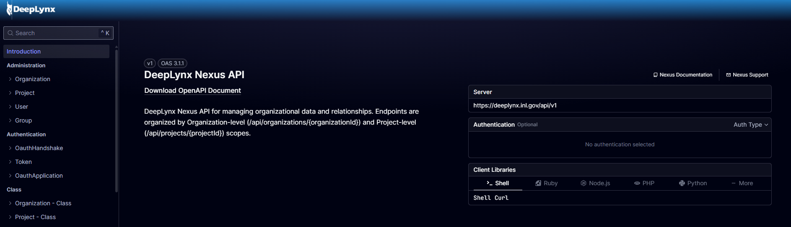
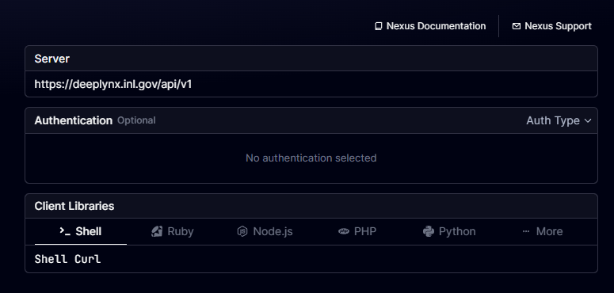
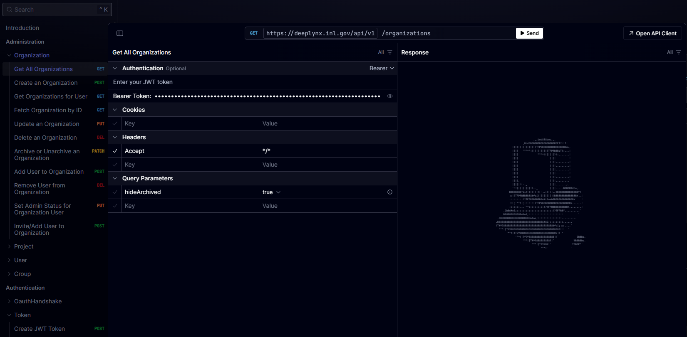
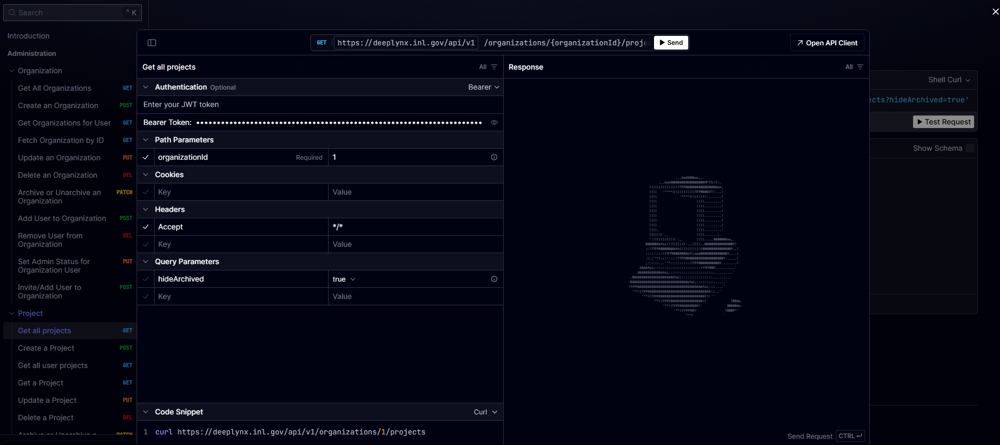

import { Footer, Layout, Navbar } from "nextra-theme-docs";
import { Banner, Head } from "nextra/components";
import { getPageMap } from "nextra/page-map";

# Querying Scalar

Scalar is an API client developers use to interact with the Nexus warehouse. It works just like any other API client you may have used, like Postman, or Insomnia. The Scalar API client is automatically generated by the development team, so it should remain an up to date resource on API documentation.

First, navigate to the Scalar API at [https://deeplynx.inl.gov/api/v1/scalar](https://deeplynx.inl.gov/api/v1/scalar).

If you'd like to work with a different instance of Nexus, consider these distinct environments:

**Nexus Sandbox**: https://deeplynx-test.dev.inl.gov/api/v1/scalar
The sandbox is good for prototyping and practicing with Nexus. This environment also has Nexus features still in beta.

**Nexus Production**: http://deeplynx.inl.gov/api/v1/scalar
The production instance is best for real data required by you and your applications. This environment is subject to rigorous testing and is designed for maximum uptime.

### Scalar Settings

If you're running a local Nexus instance, double check that you've selected the correct base URL on the Scalar landing page. Also, you can select a global client language, which provides language specific examples for querying Nexus.

### Example

You can search for Nexus endpoints categorically on the navigation tree on the left hand side of your screen. If you select an API endpoint, Scalar will snap to the test example.

> [!NOTE]
>
> Nearly all Nexus endpoints require an `Organization` and a `Project` to direct your request. You should start by querying for Organizations, and then for Projects in that Organization, to find the Project you'd like to work with. Subsequent requests for data in that project will require both Organization and Project IDs.

Expand the **Authentication** dropdown and select "Bearer", then paste the access token you created on the previous page in the field, like this. The request will return a JSON response with data about your Organizations.

> [!NOTE]
>
> Each API endpoint is different. Be sure to read each request's `Path Parameters`, and `Query Parameters`.
