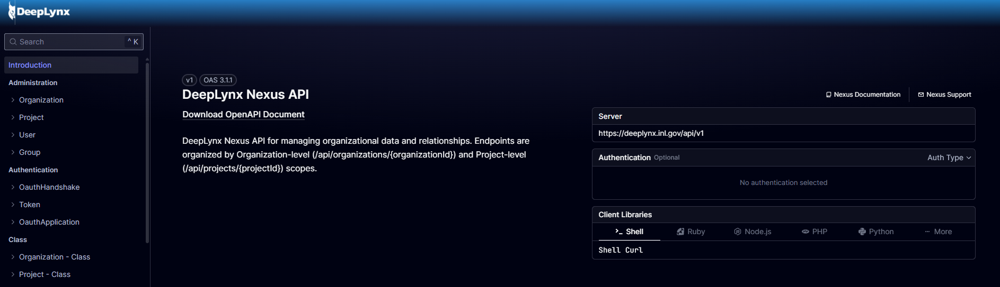
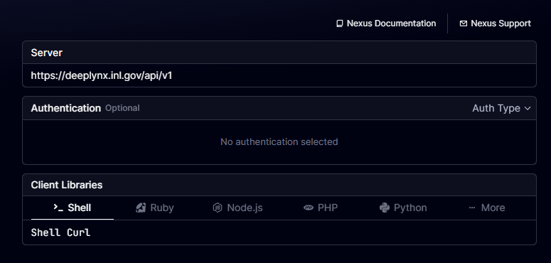
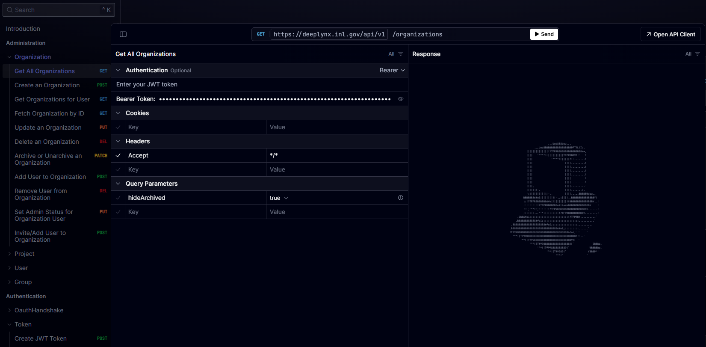
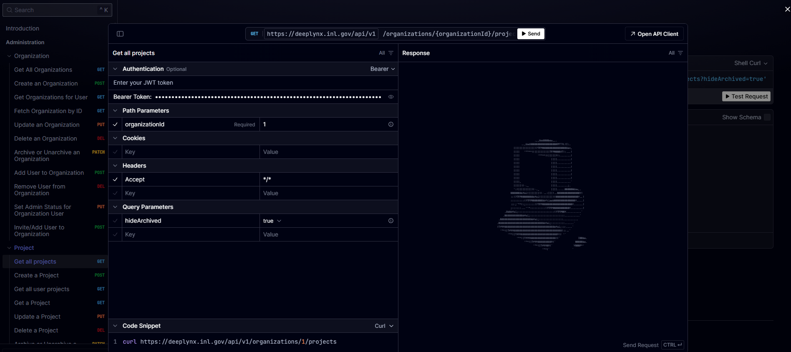

import { Footer, Layout, Navbar } from "nextra-theme-docs";
import { Banner, Head } from "nextra/components";
import { getPageMap } from "nextra/page-map";

# Querying Scalar

Scalar is an API client developers use to interact with the Nexus warehouse. It works like other API clients such as Postman or Insomnia. Scalar is generated from the Nexus OpenAPI documents, so it provides current documentation for each supported API version.

First, navigate to the production Scalar client at [https://deeplynx.inl.gov/api/scalar](https://deeplynx.inl.gov/api/scalar).

If you'd like to work with a different instance of Nexus, consider these distinct environments:

**Nexus Sandbox**: [https://deeplynx-test.dev.inl.gov/api/scalar](https://deeplynx-test.dev.inl.gov/api/scalar)

The sandbox is good for prototyping and practicing with Nexus. This environment also has Nexus features still in beta.

**Nexus Production**: [https://deeplynx.inl.gov/api/scalar](https://deeplynx.inl.gov/api/scalar)

The production instance is best for real data required by you and your applications. This environment is subject to rigorous testing and is designed for maximum uptime.

### Select an API Version

Scalar provides separate `v1` and `v2` OpenAPI documents in its version selector. Opening `/api/scalar` selects v1 by default. You can also open a document directly:

- **v1**: `/api/scalar/v1`
- **v2**: `/api/scalar/v2`

v1 remains supported and accessible, but it is frozen and deprecated. No removal date is currently implied. Use v2 for new integrations and forward development. New endpoints and breaking API changes, including standardized RFC 7807 error responses, are delivered in v2 or a later version.

The selected document determines the version segment in Scalar's request examples:

- v1 requests use `/api/v1/...`.
- v2 requests use `/api/v2/...`.

### Scalar Settings

If you're running Nexus locally, open Scalar at `http://localhost:5095/api/scalar`. Before sending a request, confirm both that Scalar points to the intended Nexus environment and that the version selector shows the API contract you want to use. You can also select a global client language to see language-specific request examples.

### Example

You can search for Nexus endpoints categorically on the navigation tree on the left hand side of your screen. If you select an API endpoint, Scalar will snap to the test example.

> [!NOTE]
>
> Nearly all Nexus endpoints require an `Organization` and a `Project` to direct your request. You should start by querying for Organizations, and then for Projects in that Organization, to find the Project you'd like to work with. Subsequent requests for data in that project will require both Organization and Project IDs.

Expand the **Authentication** dropdown and select "Bearer", then paste the access token you created on the previous page in the field, like this. The request will return a JSON response with data about your Organizations.

> [!NOTE]
>
> Each API endpoint is different. Be sure to read each request's `Path Parameters`, and `Query Parameters`.
