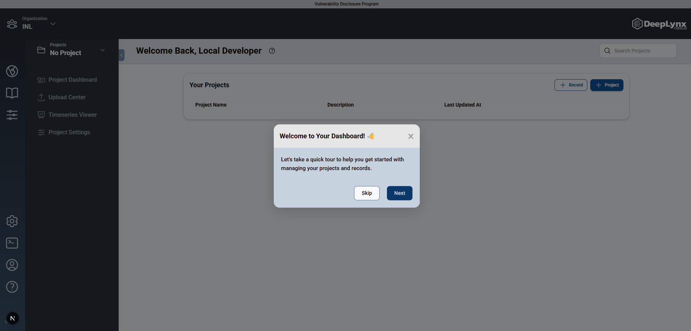

# Let's get Started

If you haven't already, create an account on [Nexus](https://deeplynx.inl.gov).

You can log in using your INL card. In authenticating with your INL card, you automatically become a member of the INL `Organization`. Welcome!

### Organizations

An organization is a logical hub to share data with researchers you collaborate with everyday. Everything you create will live inside this organization. You can read a deep dive about Nexus resources like Organizations, Projects, and Data Sources in the [technical overview](../deeplynx_overview/technical_overview.mdx).

### A Welcome Tour

Nexus will give you a quick tour to help familiarize you with the interface. To keep reading documentation, go to [Create a Project](./create_a_project.mdx)

