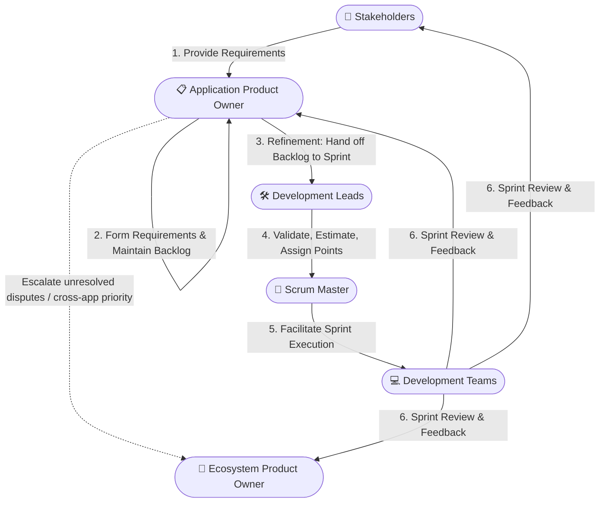

# DeepLynx Team Standards Document
*Version 1.0 — Adopted July 29, 2026*

---

## 1. Purpose and Scope

This document defines the standards, principles, and expectations that govern how our team does its work. It applies to all team members — engineers, data scientists, and researchers — and is intended to be a living agreement that new members adopt and all members help evolve. Contributions to the DeepLynx ecosystem and membership within the DeepLynx team are dependent on adhering to the standards and principles set forth in this document.

Our work spans requirements gathering and solution architecture, software development and deployment, data and AI-focused applications, and academic research and publication. These standards apply across all of those contexts, with particular emphasis on contributions to the **DeepLynx ecosystem**.

###  Why have these standards? 

- To make it easier for anyone on the team to contribute, even when they are unfamiliar with the domain or topics.
- To improve efficiency by catching mistakes and mismatched expectations early, when they're cheap to fix, rather than after a stakeholder demo, a production deploy, or a submitted paper.
- To let the team learn from each other's experience instead of relearning the same lessons independently.
- To give stakeholders, collaborators, and the DeepLynx team confidence in how we work, that our code is maintainable, our results are reproducible, and our research is robust.

If you read nothing else, read Section 2 (Core Principles). Everything else in this document is an application of those six ideas to a specific situation. When in doubt, default to whatever makes the work most understandable, maintainable, and trustworthy for the next person.

---

## 2. Core Principles

These principles underpin every specific standard in this document. When a situation arises that the standards don't directly address, use these to reason toward the right answer.

1. **Clarity over cleverness.** Code, documentation, and communication should be easy to understand. Prefer the readable solution over the technically impressive one.
2. **Shared ownership.** No one owns a piece of work in isolation. Every team member is responsible for the health of the whole codebase, the quality of the whole team's output, and the success of every deployment.
3. **Reproducibility by default.** Whether writing code, running an experiment, or producing a research result, the work should be reproducible by any team member without tribal knowledge.
4. **Transparency early.** Surface problems, blockers, design questions, and technical concerns as early as possible — in design, in review, in planning. Late surprises are more expensive than early ones.
5. **Automate the repeatable.** If you do something manually more than twice, ask whether it should be automated. This applies to testing, deployments, data pipelines, and reporting.
6. **Respect the reviewer's time.** Produce thoughtful, complete work before asking others to review it. A review is a collaboration, not a debugging session.

---

## 3. Roles, Requirements, and Delivery Process

Ecosystem work includes several individuals and groups: Stakeholders, Ecosystem Product Owner, Application Product Owners, Scrum Masters, Development Leads, and Development Teams. The chart below shows the general process for collecting requirements, forming them into design and tasking, receiving approval and prioritization, and ultimately executing the work and delivering the results. The following sections provide more detail.

### 3.1 Role Definitions

The roles below describe the functions required for ecosystem work, independent of who currently fills them. Because assignments can shift across projects and over time, current role holders are tracked separately in the table at the end of this section rather than hardcoded into the definitions.

- **Stakeholder**: Funds or has a vested interest in the outcome of the work, and provides the requirements that initiate and guide it. For DeepLynx, stakeholders primarily include those who fund projects (government offices, federal program managers, etc.), typically represented by principal investigators (PI) or project leads.

- **Ecosystem Product Owner (EPO)**: Owns the vision, roadmap, and priority of the DeepLynx ecosystem as a whole. Has final say on cross-application priority and vision, and resolves disputes between Application Product Owners that cannot be resolved between them directly.

- **Application Product Owner (APO)**: Owns the vision, roadmap, and priority for a specific application. Takes in requirements from stakeholders, resolves conflicts between stakeholder asks, and forms them into requirements that can be realized as epics and stories. Maintains the product backlog — including its epics and stories — for their application. *Owns documentation for app?*

- **Scrum Master**: Facilitates sprint execution by working with the development team, and leads the sprint review. May also participate in requirements gathering and design activities.

- **Development Leads**: Participate in sprint refinement, validating the intent of backlog items handed off by the product owner, ensuring understandability for the development team, and assigning story points. Consult the broader development team as needed. Communicate progress and completed results back to stakeholders and the product owners.

- **Development Team**: Executes tasked work during the sprint and supports development leads and the scrum master in delivering results.

#### Current Role Assignments

The table below should be kept up to date as role assignments change. Where a role is filled by a group rather than an individual, list the group name. If a role is unfilled or unclear for a given project, mark it as *TBD* rather than leaving it blank.

| Application | Product Owner | Stakeholder(s)  | Scrum Master | Development Lead |
|---|---|---|---|---|
| **DeepLynx Ecosystem** | Jeren Browning | Peter Suyderhoud, Chris Ritter | Chris Rubel | Jason Kuipers |
| **Nexus** | Natalie Hergesheimer | Peter Suyderhoud, Victor Walker, Kunal Thaker | Chris Rubel | Jaren Brownlee |
| **Bridge** | Andrew Morin | Ryan Stewart | Trevor Edwards | Michael Harding |
| **Compass** | Victor Walker | Paul Adamson (NNSA) | Kevin Kuhn (NETL) | Eric Bohney |
| **Visualize** | Porter Zohner* | Emerald Ryan, Kaleb Houck, Autumn Combs | Trevor Edwards | Porter Zohner* |
| **Insight** | Ross Kunz | Peter Suyderhoud | Chris Rubel | Denver Conger | 
| **Run/Airflow** | Garrick Evans* | Peter Suyderhoud | Trevor Edwards | Garrick Evans* | 

*Add a row per active ecosystem application. Update this table whenever a role assignment changes, and note the date of the last update below.*

**Last updated:** July 28, 2026 

### 3.2 Engaging Stakeholders
*Primary responsibility: Application Product Owner*
- Identify the primary stakeholder and any secondary stakeholders before beginning requirements work. Stakeholders for DeepLynx primarily include those who fund projects using DeepLynx (government offices, federal program managers, etc.) and are mostly represented through the principal investigators or project leads of these efforts.
- The Application Product Owner is responsible for engaging stakeholders to gather requirements, and for resolving conflicts between stakeholder asks before they are formed into requirements.
- Document stakeholder-facing language (requirements) separately from technical language (design and tasking). Requirements should be expressible in terms the stakeholder understands.
- When stakeholder needs and technical constraints conflict, bring both parties (stakeholders and broader development team) into the conversation rather than resolving the conflict unilaterally.

### 3.3 Requirements Documentation
*Primary responsibility: Application Product Owner*
- All significant work items (epics) should trace back to a written requirement, even if informal.
- Requirements should specify the *what* and *why*, not the *how*. Implementation decisions belong in the ecosystem design documentation, not requirements.
- Use a consistent format for requirements (e.g., user stories, use cases, or functional/non-functional specifications) and record them in the team's shared project management tool.
- Requirements should be reviewed and acknowledged by the relevant stakeholders.

### 3.4 Architecture and Design
*Primary responsibility: Product Owners and Development Leads*
- The DeepLynx team maintains centralized documentation covering design principles from the highest level down to the component level of each ecosystem application. This documentation must be reviewed and updated whenever an architecture decision or design change is made.
- The Application Product Owner forms stakeholder requirements into epics and stories and maintains them in the product backlog. Development leads consult on design and technical feasibility as needed during this process.
- Design documentation should address: problem statement, constraints, design principles, alternatives considered, recommended approach, and open questions.
- Documentation should be stored in the central DeepLynx Nexus repository, linked from INL-accessible tooling (e.g., Confluence), and linked from the relevant work items in work management tools (e.g., Jira).
- Designs require review by at least one peer before implementation; cross-cutting changes to the DeepLynx ecosystem require broader team review.

### 3.5 Sprint Planning, Execution, and Review
*Primary responsibility: All*
- **Refinement:** At the sprint refinement meeting, the Application Product Owner meets with development leads to hand off tasking from the product backlog to the sprint backlog. Development leads use this session to refine the draft work, validate intent, ensure the work is understandable to the development team, and assign story points.
- **Execution:** The scrum master and development leads ensure work is progressing throughout the sprint.
- **Review:** The scrum master leads a sprint review, to which the Product Owners and stakeholders are invited. Completed work is reviewed with an opportunity for feedback and course correction.
- Completed work is documented in pull requests and release notes. Any adjustments made during development should be captured in the design documentation.
- Proposed work, release notes, etc. should be communicated regularly and clearly to stakeholders and the team. Development leads and team members should be proactive in reviewing scope and avoiding inadvertently affecting another project's scope, deliverables, or promised functionality. If a concern arises, raise it with your development lead.
- Development leads communicate and deliver results back to stakeholders and the product owner, supported by the development team as needed.
- Communication should happen at key points rather than only at the end of work: when significant work is proposed or scoped, when scope or timeline materially changes, and when work is released or delivered. Waiting until a release to surface changes makes it harder for other projects to plan around them.
- Use the team's shared, discoverable channels for this communication (e.g., project management tool comments/tickets, a shared release notes location, or team-wide messaging channels) rather than one-off conversations or DMs, so the information remains findable after the fact. Until tooling is standardized across the team, development leads are responsible for making sure updates reach both stakeholders and any other teams whose work might be affected.
- Release notes should be written so a stakeholder or another team can understand *what changed and why it matters to them*, not just a technical changelog.

---

## 4. Code Standards

### 4.1 General Principles
- Code is written to be read by humans first, executed by machines second.
- Consistency within a file or module takes priority over personal preference. When contributing to an existing codebase, match the style already in use unless there is a documented reason to change it.
- All code contributed to the DeepLynx ecosystem must follow the style and contribution guidelines defined in that project, including AI-generated code. This document does not override those; it supplements them for team-internal expectations.

### 4.2 Tech Stack
- The DeepLynx ecosystem uses a consolidated set of technologies and languages to support cross collaboration and minimize the breadth of knowledge that is demanded of developers to contribute effectively across these applications. 
- The ecosystem uses .NET/C# for backend applications. React is used for frontend applications. Rust has been approved for the DeepLynx Bridge app due to technical requirements. Deviations from these technologies must be explicitly approved by the ecosystem development leads and ecosystem and application product owners and then documented.
- Give careful consideration to the inclusion of new dependencies to any app within the ecosystem. Dependencies should be minimized to avoid loss of functionality due to software deprecation or sunsetting of projects. Pay attention to licenses of dependencies which may affect the usage of DeepLynx (especially copyleft licenses like GPL and its derivatives). 

### 4.3 Style and Formatting
- Use the linter and formatter configured for each project. Do not bypass or disable them without documented justification.
- Commit formatted code. Formatting changes should not be mixed with functional changes in the same commit.
- Avoid magic numbers and strings. Use named constants with meaningful identifiers.
- Limit function and method length. If a function is doing more than one thing, consider splitting it.

### 4.4 Naming
- Names should be descriptive and unambiguous. Optimize for the reader who has no context.
- Abbreviations should only be used when they are universally understood within the domain (e.g., `id`, `url`, `api`) or are defined earlier in the same scope.
- Be consistent with naming conventions within a project (e.g., snake_case vs. camelCase). Follow the convention of the language and the project, not personal preference.

### 4.5 Documentation and Comments
- Every module, class, and public function/method should have a docstring or equivalent documentation block describing its purpose, inputs, outputs, and any important side effects.
- Comments should explain *why*, not *what*. If you need a comment to explain what the code is doing, consider whether the code itself should be clearer.
- TODOs in code must include the work item (Jira) ticket URL or number, author's name or initials, and a description of what remains. `TODO(#1234-jb): replace with config-driven lookup once schema is stable.`
- Remove dead code. Don't comment it out and leave it. Use version control to recover it if needed.

### 4.6 Error Handling
- Handle errors explicitly. Do not silently swallow exceptions.
- Log errors with enough context to diagnose the issue without needing to reproduce it.
- Telemetry (logs, metrics, and traces) should exist outside of the application and be centrally available. Be aware of any regulatory or project requirements that should drive retention policies.
- Distinguish between errors that are expected (e.g., invalid user input) and errors that are unexpected (e.g., a database connection failure). Handle them differently.
- Do not use error handling as a substitute for input validation.

### 4.7 AI Usage for Development
- AI tools (code assistants, chat-based models, etc.) are welcome aids for design and development, but the developer using them remains fully responsible for the correctness, security, and quality of anything they submit — "the AI suggested it" is not a justification during review.
- Do not paste proprietary code, credentials, stakeholder data, or other sensitive/non-public information into external AI tools that are not approved for that data, per INL's data handling and information security policies. When in doubt about what's permissible, ask before pasting.
- Review and understand AI-generated code before committing it, the same way you would review a snippet copied from a search result or forum post. Do not merge code you can't explain.
- AI-generated code is held to the same standards as hand-written code in this document — style, testing, documentation, and review requirements (Sections 4–6) all still apply in full.
- AI suggestions can be a useful sounding board during design (e.g., surfacing alternatives, catching edge cases), but design decisions and their rationale (§3.4) should still reflect the team's own reasoning, not be delegated wholesale to a tool's output.
- Be skeptical of confident-sounding but incorrect output, especially for unfamiliar APIs, libraries, or domain-specific logic. Verify against real documentation rather than trusting the tool's recall.
- If an AI tool materially shaped a non-trivial design or implementation decision, it's worth a brief mention in the relevant PR description or design doc — not for attribution, but so a future reader understands how the decision was reached.

### 4.8 Data and AI-Specific Code
- Data processing pipelines should be idempotent wherever possible.
- Model training code should log hyperparameters, data versions, and evaluation metrics in a reproducible and retrievable way.
- Raw data should never be modified in place. Maintain a clear distinction between raw, intermediate, and processed data.
- Randomness in experiments must be seeded and the seed recorded.
- Feature engineering logic should live in code, not in notebooks or spreadsheets, so it can be versioned and reused.

### 4.9 Code and Feature Organization

- Organize code by feature or domain, not by technical layer, wherever the project's framework allows it.
- Before adding a new feature, check whether similar functionality already exists elsewhere in the project. Extend or reuse before duplicating.
- Code used by a single feature stays with that feature. Code used by two or more features moves to a shared location.
- If you're unsure where something belongs, ask rather than guess.

### 4.10 Performance Considerations
- Consider the performance implications of a design before implementation, especially for code that runs frequently, at scale, or on the critical path of a user-facing action. Performance is a design concern, not just an optimization pass after the fact.
- Avoid common sources of avoidable slowdown: unnecessary database round-trips (e.g., N+1 query patterns), unbounded loops over large or unbounded datasets, and repeated work that could be cached or computed once.
- Know the performance characteristics of the data you're working with. Code that performs well on test or sample data may not perform well at production scale — validate against realistic data volumes as much as possible.
- Prefer clear, correct code first. Optimize only where there's a demonstrated need (a known bottleneck, a measured regression, or a defined performance requirement), and document why the optimization was necessary so a future reader doesn't undo it by "simplifying."
- For user-facing features, define what acceptable performance looks like (e.g., response time, load time) as part of the requirements or design, not after the fact.
- If a change could meaningfully affect the performance of a shared or ecosystem component, note this in the design documentation and PR description so reviewers can evaluate it specifically.

---

## 5. Version Control

### 5.1 Branching
- The `main` branch is always in a deployable state. Do not commit directly to it.
- Development work should be started on new branches taken from the latest on the `develop` branch.
- Create a new branch for each feature, fix, or experiment. Branch names should include the work item reference (e.g. Jira ticket number: `DL-1234`).
- Keep branches short-lived and tied to a single work item or scope. Long-lived branches accumulate merge complexity and drift from the team's shared understanding of the codebase.
- Follow the branching conventions defined in each project's contribution guidelines.

### 5.2 Commits
- Each commit should represent a single logical change. Avoid "catch-all" commits that bundle unrelated changes. If a pull request later needs to be scoped back to smaller changes, this will make modifying pull requests simpler.
- Write commit messages in the imperative mood: `Add pagination to results endpoint`, not `Added pagination` or `Pagination`.
- Commit messages should explain the change and, when non-obvious, the reason for it.
- Reference relevant work items or issues in commit messages where applicable.

### 5.3 Pull Requests and Code Review
- All code merged to `develop` must go through a pull request with at least one approving review from a development lead who did not author the change.
- Pull requests should be focused and reviewable. If a PR is too large to review effectively in a single session, it should be broken into smaller parts.
- The PR description should explain what changed, why, and how to test it. It should follow any PR template provided. Include links to the relevant requirement, issue, or design document.
- Reviewers are expected to provide constructive, specific feedback. Authors are expected to respond to all comments before merging — either by making the change, or by explaining why not.
- Do not merge your own PR without review. Work with the development leads for any exceptions during documented emergencies.
- Automated checks (tests, linting, CI pipelines) must pass before a PR can be submitted.
- Merge latest develop into your branch before merging into develop.
- Infrastructure changes (e.g., Docker configuration, CI/CD pipeline updates, environment or dependency changes) should be submitted in separate PRs from code changes. This allows the infrastructure changes to be tested and validated independently before code that depends on them is merged.  

---

## 6. Testing

### 6.1 General Expectations
- Every non-trivial piece of logic should have automated tests.
- Tests are part of the deliverable, not an optional add-on. A feature is not complete until it has tests.
- Tests should be independent of each other and of external state. A test that only passes in a specific order, or only on a specific machine, is not a reliable test.
- If modifying code that interacts with the database, have a mock representation of data in your local database to test against. This catches errors often and early.
- Never put production data into test environments (non-production environments). Where possible, use synthetic data in these environments that is representative of the structure of production data.

### 6.2 Test Coverage and Types
- Unit tests are expected for all core logic. Integration tests are expected for components that interact with external systems (databases, APIs, services).
- For user-facing features, end-to-end (E2E) tests are expected in addition to unit and integration tests. E2E tests should cover the primary user flows — the paths most users take and the paths where a failure would be most disruptive — rather than attempting to exhaustively cover every possible interaction.
- The team's standard tool for E2E testing is **Playwright** (see §10). New user-facing features should include Playwright coverage for their primary flows as part of the definition of done.
- For data pipelines and ML models, tests should cover data shape, schema compliance, and expected output ranges, not just function execution.
- Test names should clearly describe what is being tested and what the expected outcome is.

### 6.3 Test Maintenance
- Failing tests are a blocker. Do not merge code that breaks the test suite.
- Flaky tests should be fixed or removed promptly. A test that intermittently fails provides no reliable signal. This applies to E2E tests as well — a flaky Playwright test that "sometimes" fails on timing or load should be fixed (e.g., using Playwright's built-in waiting/retry mechanisms) rather than worked around with arbitrary sleeps or ignored.
- Tests should be updated when the behavior they cover changes. Deleting tests to make CI pass is not acceptable.

---

## 7. Deployment and Operations

### 7.1 Deployment Practices
- All deployments must go through an automated pipeline.
- Environment-specific configuration (connection strings, secrets, feature flags) must never be hardcoded. Use environment variables or a secrets management system.
- Secrets and credentials must never be committed to version control.
- Infrastructure changes should be treated like code changes: reviewed, documented, and automated where possible.

### 7.2 Monitoring and Observability
- Applications deployed to production should have logging, metrics, and alerting configured before go-live.
- Logs should be structured (e.g., JSON), include a timestamp and correlation ID, and avoid logging sensitive data. Contact the security operations lead immediately in the event of a breach of sensitive data.
- Define success metrics for applications and monitor them from deployment onward.

### 7.3 DeepLynx Ecosystem Contributions
- Changes to shared DeepLynx components must be coordinated with affected stakeholders. Do not introduce breaking changes without a documented migration path and advance notice. Consult the ecosystem design documentation (§3.4) to identify known stakeholders before making changes.
- APIs exposed through DeepLynx should be versioned. Deprecate old versions explicitly rather than removing them silently.
- If any feature is to be deprecated, give the community and stakeholders advance notice. Deprecated features should continue to be supported for a duration to allow users time to switch to new features.
- Deployment of DeepLynx-connected services should be validated against the target ecosystem environment, not only in isolation.

### 7.4 Release Management
- Standard (minor/feature) release timing is determined by the scrum master in coordination with the product owner. Typical release frequency is a two-month cadence. Stakeholders must be given at least one month's notice ahead of each release, consistent with 7.3.
- Release dates may shift to accommodate testing or unresolved blocking issues. Any such changes should be communicated to stakeholders as early as possible.
- Application releases must follow Semantic Versioning (MAJOR.MINOR.PATCH):  
     - MINOR — backward-compatible feature additions, released on the standard cadence.
     - PATCH — backward-compatible fixes, released outside the standard cadence per the guidelines below.
     - MAJOR — significant feature sets or milestones. Because the API is versioned independently (see below), a MAJOR application release does not necessarily indicate a breaking API change; any breaking change, on either the application or the API, must follow the migration path and advance notice requirements in 7.3.
- API versioning is tracked separately from the application version and does not follow the same MAJOR.MINOR.PATCH sequence. Deprecated API versions remain supported for at least 3 MINOR application release cycles before being dropped.
- Version numbers must be incremented consistently across all published artifacts (container images, documentation, etc.) for a given release.
- Patch releases fall outside the standard two-month cadence and are reserved for security vulnerabilities or critical functional defects where an absolutely necessary feature is broken and no reasonable workaround exists. Patch releases must not be used to ship new features, non-critical fixes, or convenience changes.
- Emergency patch releases must be approved by the product owner and scrum master before deployment. Approval requires sign-off confirming the fix addresses the stated issue and has been tested, along with a brief written record of what was fixed and why it could not wait for the standard release.
- All patch releases, once approved, must still go through the automated deployment pipeline (7.1). If an undocumented emergency deployment occurs outside this process, the post-incident review requirement in 7.1 applies.
- Automate critical vulnerability and exposure (CVE) updates and scanning where possible through the use of tools like GitHub's Dependabot, SonarCube, etc.

---

## 8. Collaboration and Communication

### 8.1 Team Norms
- Be present and engaged in team ceremonies (standups, planning, retrospectives). If you cannot attend, communicate in advance and async.
- Surface blockers as soon as they arise. Do not wait for a scheduled meeting to raise an issue that is blocking your progress or the team's. A **blocker** is something that is directly preventing you from making progress (e.g., a missing access/permission, a broken environment, a dependency on another person's unfinished work, an unanswered decision you need to move forward) — raise this immediately, regardless of how long you've been stuck.
- Default to over-communicating rather than under-communicating when working across roles. However, before sending a message, consider who actually needs it and choose your channel accordingly:
  - If the information or decision only affects your immediate team or project, use that project's channel or a direct message.
  - If it affects multiple applications, shared components, or people outside your immediate team, use the broader ecosystem channel so those affected can see it without being individually looped in.
  - When unsure, err toward the more visible channel for anything that could affect someone else's planning, priorities, or work — but avoid defaulting to the largest channel for things that are only relevant to a small group, as this creates noise that makes the important cross-cutting messages easier to miss.
- Assume good intent in written communication. Default to async resolution for low-stakes disagreements; default to a conversation for high-stakes ones.

### 8.2 Documentation
- Document decisions, not just outcomes. Future team members will need to understand why something was built the way it was. This includes the constraints and rejected alternatives specified in (§3.4).
- Ecosystem design documentation is kept close to the code or work it describes. Wikis that drift from reality are worse than no documentation.
- A piece of work is not complete until its documentation is updated or written.

### 8.3 Knowledge Sharing
- Team members are expected to share relevant learnings — from new tools, techniques, papers, or project retrospectives — through the team's agreed channel (generally Teams channels or ecosystem meetings).
- Onboarding new team members is a shared responsibility. Everyone should expect to invest time in helping new members understand our work and our standards.

---

## 9. Research and Publication

### 9.1 Authorship and Attribution
- Authorship on papers and presentations should reflect meaningful intellectual contribution. Discuss authorship order and attribution early in any research effort.
- Contributions from collaborators outside the team (stakeholders, external partners) should be acknowledged appropriately.
- All team members contributing to a publication effort should have an opportunity to review the work before submission.

### 9.2 Research Reproducibility
- Experiments underlying a publication must be reproducible from the documented code, data references, and configuration. If data cannot be shared publicly, document the acquisition process clearly.
- Code associated with publications should be published in a repository with a clear README, license, and tagged release corresponding to the submission or publication version.
- Model weights, datasets, and evaluation scripts should be archived in a retrievable location and referenced in the paper.

### 9.3 Responsible Disclosure and Ethics
- All work involving human subjects, sensitive data, or consequential AI systems must be reviewed for ethical implications before proceeding. Follow institutional and organizational review processes.
- Limitations of models, systems, and findings must be reported honestly in publications and presentations.
- Do not publish or present work that misrepresents the capabilities, accuracy, or generalizability of a system.

###  9.4 Scope and Approval 
- Research must be INL-sponsored, and collaborating with outside researchers must be approved prior to start. Conducting any research outside of INL-sponsorship is considered an outside activity. Refer to Section 4.1 of the Personal Conflicts of Interest Policy which is specific to outside activities.
- Work conducted as part of INL-sponsored efforts is attributed to INL.
- When in doubt about whether an activity falls inside or outside your sponsored scope, raise it with your department manager or the COI office before proceeding.

---

## 10. Tooling

This section should be updated by the team to reflect current agreed-upon tools.

| Category | Tool / Convention |
|---|---|
| Source control | Git, hosted on GitHub |
| Code review | Pull requests via GitHub |
| CI/CD | GitHub Actions |
| Documentation | Kept within GitHub and linked from Confluence |
| Project tracking | Jira |
| Communication | Teams |
| End-to-end (E2E) testing | Playwright |
| Secrets management | Delinea |

---

## 11. Updating This Document

This document is maintained by the team, for the team. Any team member may propose a change.

- Propose changes via a pull request and ensure development leads and the product owner are aware.
- Changes require discussion and consensus — not just approval from leadership.
- Significant changes should be reviewed at a team meeting before adoption.
- All members should be notified when the document is updated.
- The document version and adoption date should be updated with each accepted revision.

---

## Acknowledgment

By joining the team, each member agrees to uphold the standards in this document and to contribute to their ongoing improvement.

*This document was last reviewed and adopted by the team on July 29, 2026.*
