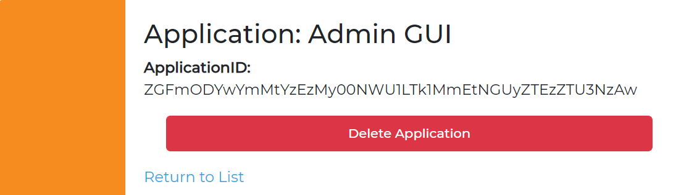
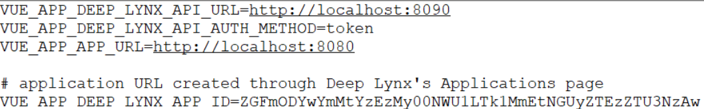
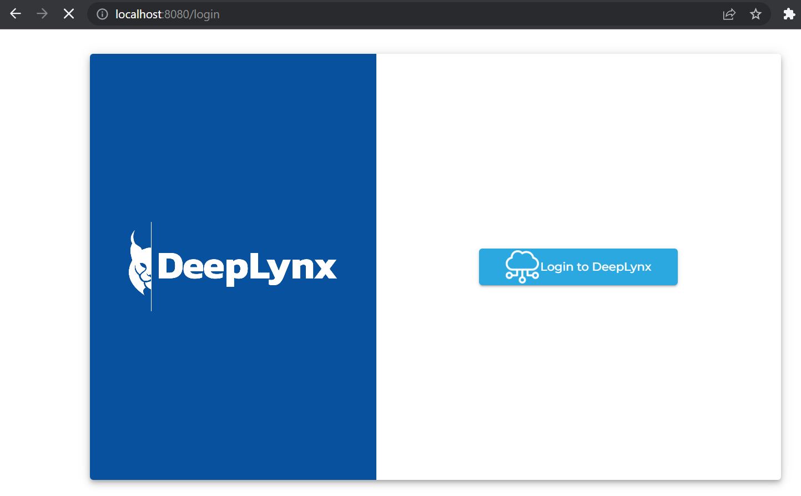
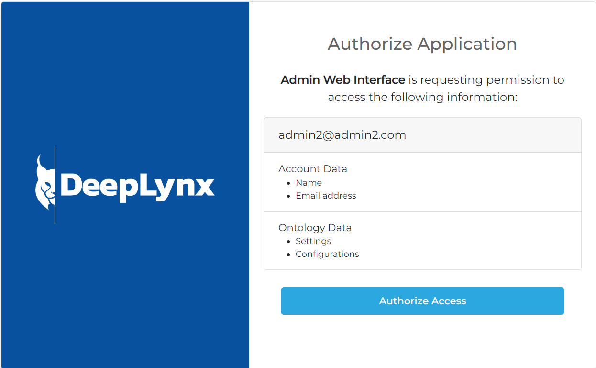

DeepLynx ships with a self-contained administration and query UI in the form of a Vue Single Page Application (SPA). This application is **experimental** and is constantly undergoing changes. This does not constitute a feature full and complete environment, but rather a test bed for various functionalities of DeepLynx. It is hoped however, that this admin UI will eventually become the client-facing front of DeepLynx.

## Setting up the UI
In order to run the UI some preliminary steps must be made

1. In order for the UI's authentication and user management portion to work correctly it must first be registered with DeepLynx. Follow the instructions [here](https://gitlab.software.inl.gov/b650/Deep-Lynx/-/wikis/Creating-a-DeepLynx-App) for how to create your application. Once you have your application ID modify the UI's `.env` file (which you created by copying `.env-sample` so that the value of the variable `VUE_APP_DEEP_LYNX_APP_ID` is equal to your newly created application ID.

2. Modify your `.env` file
Verify that your `.env` file contains valid settings. To help you achieve this here are the required environment variables and a description.

| | |
|-------| ------|
|`VUE_APP_DEEP_LYNX_API_URL`| this is the URL for the DeepLynx api itself, defaults to `http://localhost:8090` |
| `VUE_APP_DEEP_LYNX_API_AUTH_METHOD` | either `token` or `basic`. If `basic` include the additional parameters listed below this variable in the `.env-sample` file. **Note:*** The admin UI DOES NOT FUNCTION without authentication being present on DeepLynx.|
|`VUE_APP_APP_URL` | the url of the UI application, defaults to `http://localhost:8080`|
|`VUE_APP_DEEP_LYNX_APP_ID`| the application ID you received when registering the UI with your instance of DeepLynx |

3. Run `npm install`

4. Build with `npm run build

5. Use the built-in web server by using `npm run serve`

6. Attempt to log-in. Below demonstrates the screen you will see if using the token log-in.

7. Authorize Access

