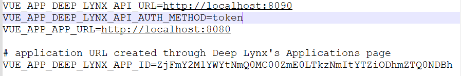

The first step in running the administration web app is to create a DeepLynx Application. Instructions for that are found [here](DeepLynx-Enabled-OAuth-Application). 

## Setting up the UI
1. If running in an IDE, create a new terminal as the Administration Web App is a separate app from the DeepLynx repository.

2. Navigate to Admin Web App inside the main DeepLynx repository.

3. Rename the `.env-sample` file to `.env`.

4. Once you have your application ID modify the UI's `.env` file so that the value of the variable `VUE_APP_DEEP_LYNX_APP_ID` is equal to your newly created application ID.

5. Verify that your `.env` file contains valid settings. To help you achieve this here are the required environment variables and a description.

| | |
|-------| ------|
|`VUE_APP_DEEP_LYNX_API_URL`| this is the URL for the DeepLynx api itself, defaults to `http://localhost:8090` |
| `VUE_APP_DEEP_LYNX_API_AUTH_METHOD` | either `token` or `basic`. If `basic`, include the additional parameters listed below this variable in the `.env-sample` file. **Note:** The admin UI DOES NOT FUNCTION without authentication being present on DeepLynx.|
|`VUE_APP_APP_URL` | the url of the UI application, defaults to `http://localhost:8080`|
|`VUE_APP_DEEP_LYNX_APP_ID`| the application ID you received when registering the UI with your instance of DeepLynx |

6. Run `npm install` in the /Deep-Lynx/AdminWebApp directory

7. Either build with `npm run build` and manually open the resulting file or use the built-in web server by using `npm run serve` in the /Deep-Lynx/AdminWebApp directory

8. Verify correct setup and deployment by going to `{{your_app_url}}` (defaults to `localhost:8080`). If everything was set up correctly, you will see this screen:

9. Click "Authorize Access" and you should see the container selection screen that you would normally see on the 8090 port.