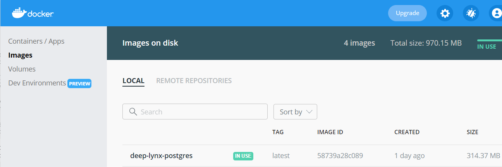
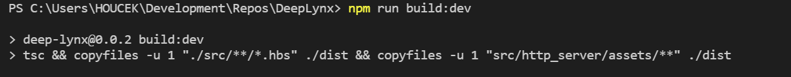
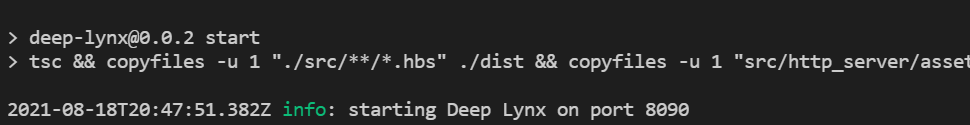

If each of the following numbered steps are completed, then DeepLynx will be installed correctly. Common installation gotchas are discussed [here](Gotchas). Installation can be verified [here](Verifying-Installation).

#### Installation Requirements
The following tools are required in order to successfully install DeepLynx.

-   [node.js](https://docs.npmjs.com/downloading-and-installing-node-js-and-npm) ^16.x
-   [Typescript](https://www.typescriptlang.org/download) ^4.x.x
-   [npm](https://docs.npmjs.com/downloading-and-installing-node-js-and-npm) ^6.x
-   [yarn](https://classic.yarnpkg.com/lang/en/docs/install/) ^3.6.x
-   [Rust](https://www.rust-lang.org/tools/install) ^1.x.x (set to default stable)
-   [Docker](https://docs.docker.com/engine/install/) ^18.x - _optional_ - for ease of use in development

### **Steps**  
You must follow these steps in the exact order given. Failure to do so will cause DeepLynx to either fail to launch, or launch with problems.

1. NodeJS must be installed. You can find the download for your platform here: https://nodejs.org/en/download/ **note** - Newer versions of Node may be incompatible with some of the following commands. The most recent version tested that works fully is 16.13.0 - the latest LTS version.  

2. Clone the DeepLynx [repository](https://github.inl.gov/Digital-Engineering/DeepLynx/tree/main).

3. Navigate to the `server` directory.

4. Run `yarn install` to set up all the node library dependencies.

5. Copy and rename `.env-sample` to `.env`.

6. Update `.env` file. See the `readme` or comments in the file itself for details.

7. To build a dockerized PostgreSQL database, follow step **a**. To use a native PostgreSQL database, follow step **b**. Then continue to step 8.
- 7a) Building the database using Docker:  
     - Ensure Docker is installed. You can find the download here: https://www.docker.com/products/docker-desktop.  
     - Run `npm run docker:postgres:build` to create a docker image containing a Postgres data source.  
     - Mac users may need to create the directory to mount to the docker container at `/private/var/lib/docker/basedata`. If this directory does not exist, please create it (you may need to use `sudo` as in `sudo mkdir /private/var/lib/docker/basedata`).  
     - Verify that image is properly created. See the screenshot below from Docker Desktop.

     - Run `npm run docker:postgres:run` to run the created docker image (For Mac users, there is an alternative command `npm run mac:docker:postgres:run`).
- 7b) Building the database using a dedicated PostgreSQL database:  
     - Ensure PostgreSQL is installed. You can find the download here: https://www.postgresql.org/download/. Please see [this page](DeepLynx-Requirements) for the latest requirements on PostgreSQL version.  
     - Run pgAdmin and create a new database. The database name should match whatever value is provided in the `CORE_DB_CONNECTION_STRING` of the `.env` file. The default value is `deep_lynx`.  
     - Ensure a user has been created that also matches the `CORE_DB_CONNECTION_STRING` and that the user's password has been set appropriately. The default username is `postgres` and the default password is `deeplynxcore`.  

8. Run `yarn run build` to build the internal modules and bundled administration GUI. **Note** You must re-run this command if you make changes to the administration GUI.

* NOTE: If you are on some sort of encrypted network, you may encounter an error similar to the following when attempting to set up any rust libraries: `warning: spurious network error... SSL connect error... The revocation function was unable to check revocation for the certificate.` This can be solved by navigating to your root cargo config file (`~/.cargo/config.toml`) file and adding the following lines. If you do not have an existing config.toml file at your root `.cargo` directory, you will need to make one:

```
# in ~/.cargo/config.toml
[http]
check-revoke = false
```



9. Run `yarn run watch` or `yarn run start` to start the application. See the `readme` for additional details and available commands. **This command starts a process that only ends when a user terminates with Cntrl+C or Cntrl+D - you will see a constant feed of logs from this terminal once you have started DeepLynx. This is normal.** Changes to the source code of DeepLynx will be captured if you run the application with the `yarn run watch` command.


**Note:** DeepLynx ships with a Vue single page application which serves as the primary UI for the DeepLynx system. You can run this [separately](Administration-Web-App-Installation) (and it's recommended to do so if you're developing it).

**The bundled admin web GUI can be accessed at `{{your base URL}}` - default is `localhost:8090`**

### **Configuration**

This application's configuration relies on environment variables of its host system. It is best to rely on your CI/CD pipeline to inject those variables into your runtime environment.

In order to facilitate local development, a method has been provided to configure the application as if you were setting environment variables on your local machine. Including a `.env` file at the projects root and using the `yarn run watch`, `yarn run start`, or any of the `yarn run docker:*` commands will start the application loading the listed variables in that file. See the `.env-sample` file included as part of the project for a list of required variables and formatting help.