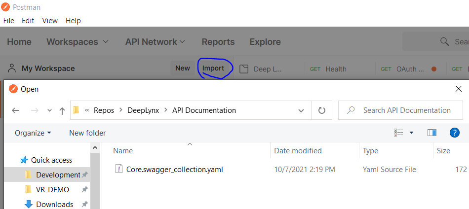

While developing DeepLynx, the team has often found it advantageous to use tools for certain actions. Below is a list of those tools, how they're used in DeepLynx development and a link to acquire them. Most are either free or have a free tier. 

Please follow any software installation guidelines your organization might have before attempting to download any of these tools.

### [Postman](https://www.postman.com/)

Postman "is an API platform for building and using APIs". Postman allows you to interact with DeepLynx's HTTP server manually, without having to use the command line or the official web app. It is a powerful tool that will allow you to learn how DeepLynx's HTTP server works, as well as build rapid prototypes of integrations. To use Postman with DeepLynx, import a new collection from the `Core.swagger_collection.yaml` file.

### [Stoplight Studio](https://stoplight.io/)

Stoplight Studio is a tool for creating and editing OpenAPI (swagger) specifications. It allows you to easily see and modify API routes/paths and models (for modeling elements such as a request body or return). It provides a user-friendly view for making changes to the underlying OpenAPI document, but edits can also be made to the document directly and the tool makes it easy to find the section of the document you need and link elements across the document. It also calls out any errors or warnings in the document. Additionally, you can interact with the DeepLynx HTTP server and perform API requests from the tool.

### [pgAdmin](https://www.pgadmin.org/)

pgAdmin is a database administration tool specifically built for PostgreSQL. Because DeepLynx's underlying data layer is PostgreSQL, this tool is especially effective when needing to work with the data layer directly. This tool can also be used to dump the database, gain information on individual schemas, and provides performance measurement tools.

### [TablePlus](https://tableplus.com/)

TablePlus is a general database administration tool. While not specific to PostgreSQL, it is still a powerful tool for administrating DeepLynx's data layer. This tool can also be used to dump the database, gain information on individual schemas, and also provides a way to view DeepLynx's caching layer (if using Redis).

### [Vue.js Devtools](https://devtools.vuejs.org/guide/installation.html)

The Vue.js devtools are a very handy set of console tools for your browser. They are especially useful when developing the official web app, which is written in Vue.js. The tools allow for faster debugging than the standard browser dev console, ability to view events generated by the framework, and allows for performance measurement.