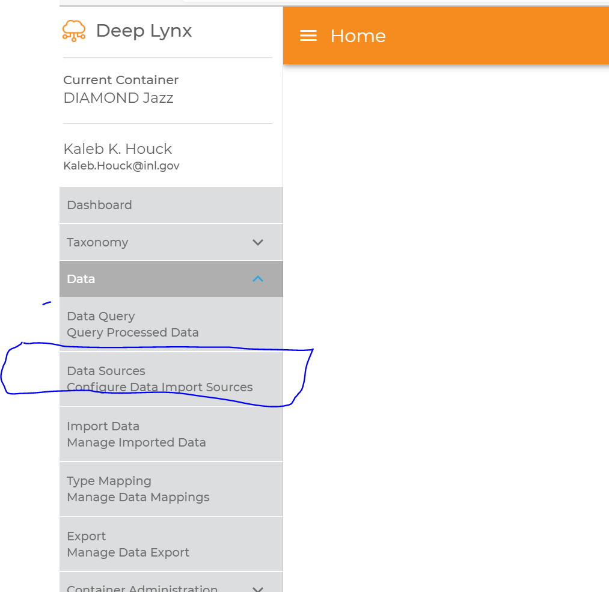
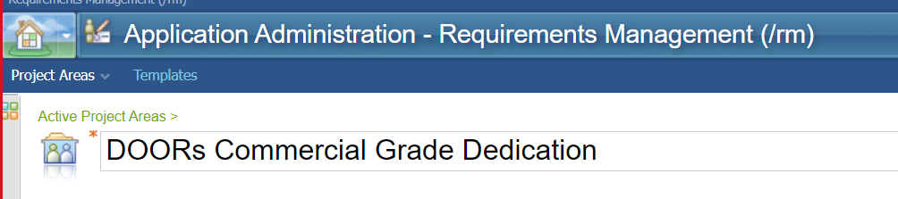
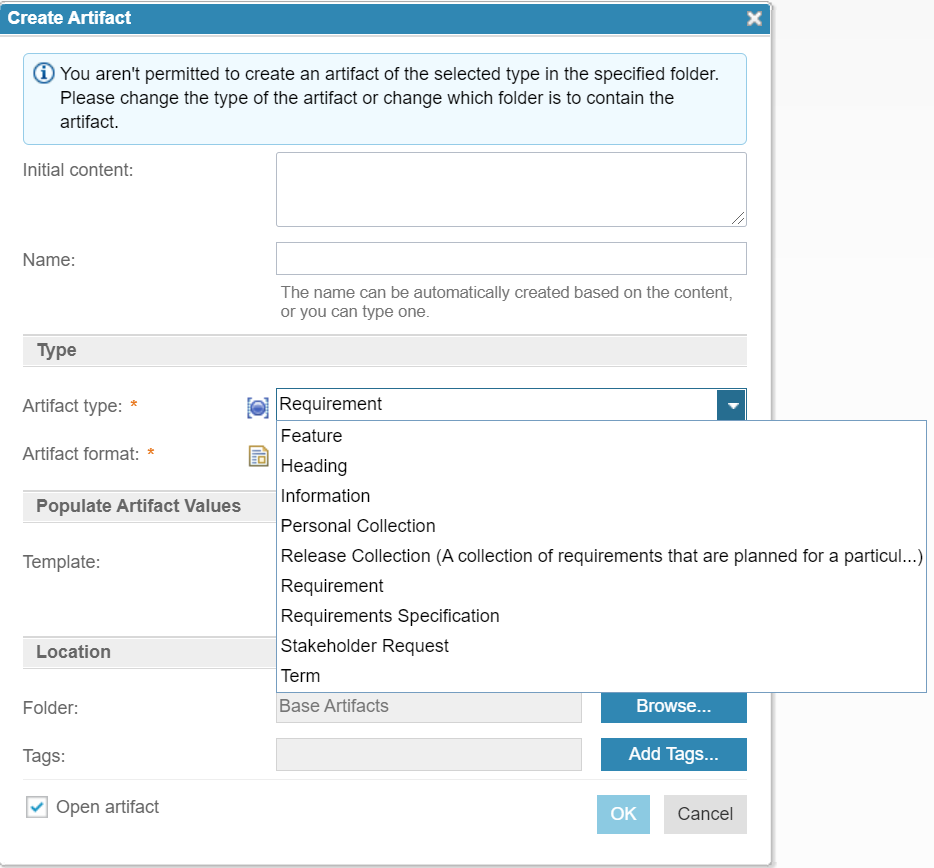
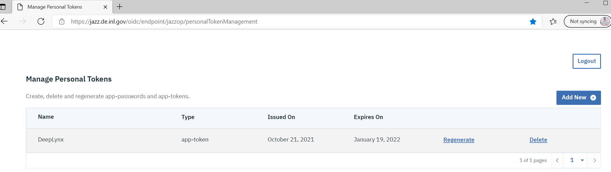
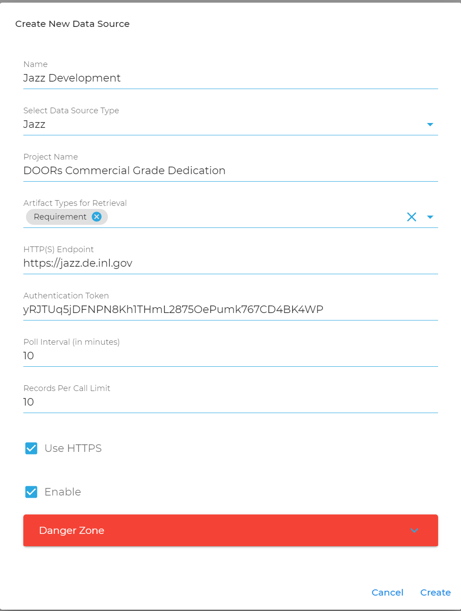
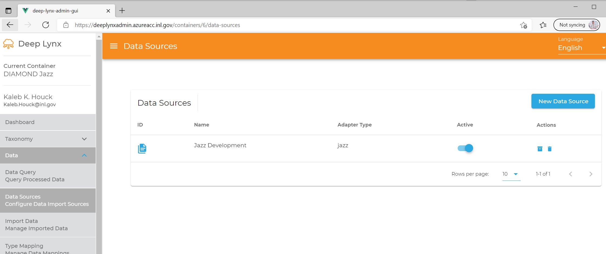

To start the download of data from Jazz we must first create a data source.

The following breakdown the steps:

---

1. What button to create a data source.

---

2. Where to find the project name.

---

3. Where to find the artifact types.

---

4. Where to get a personal access token.

---

5. What a representative data source creation dialogue should look like.

---

6. Finally, what a Jazz data source creation success looks like.

---