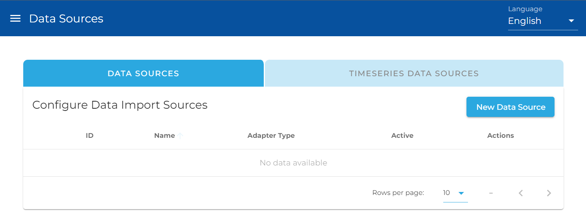
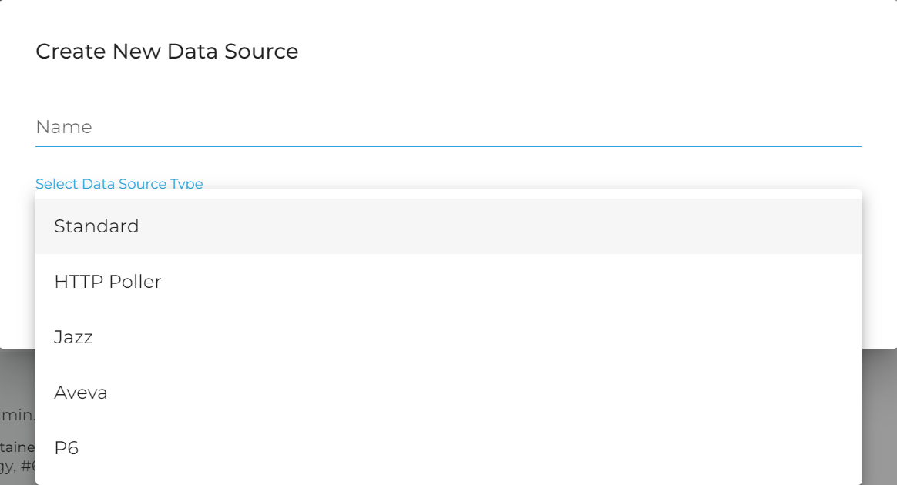
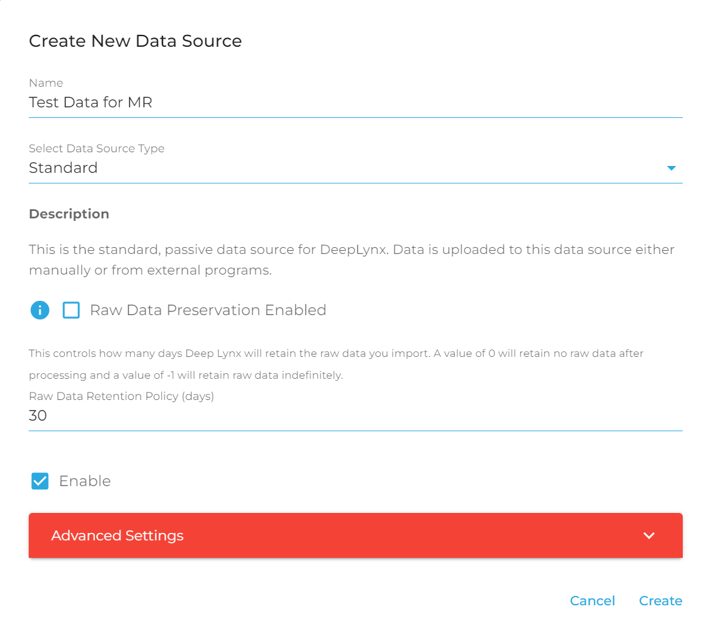
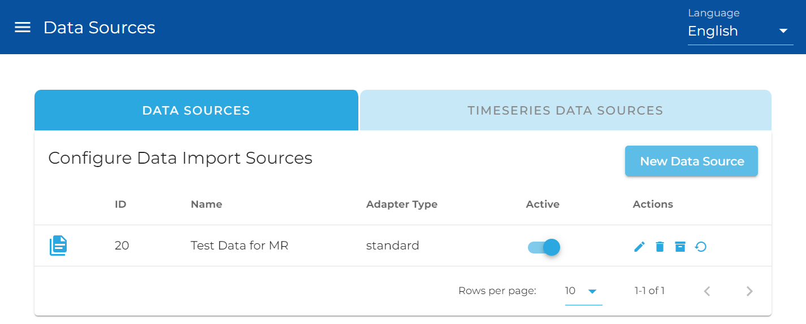

**How to ingest and process data using DeepLynx**  
  
This guide assumes you have:
1. Created a container 
2. Upload or created your own ontology.
3. Set up the Classes, Class Properties, and Relationships. This guide also assumes basic knowledge of HTTP and REST APIs and that the user has access to the schema of the DeepLynx database.  
  
Note on naming conventions: DeepLynx stores the names for classes, relationship types, and relationships directly as submitted via an ontology. However, underscores are used to replace spaces in the property names of class properties to create snake case (e.g. `manufacturer_name`). If you are defining the data structure of an application, it may be useful to keep in mind that the properties of nodes and edges will be returned in this format.  
  
### Create a Data Source

In order to process data, you must first tell DeepLynx where and how to retrieve that data. Creating a Data Source instructs DeepLynx where and how to retrieve the data, keeps data separate from other ingestion sources, and allows for mapping specific to that Data Source. Data Sources can be found in the "Data" section of the Admin Webapp.





In order to create a Data Source, you must POST information to the `containers/:id/import/datasources` endpoint. Each method below will contain a sample payload. API documentation included in the project also contains sample payloads.

There are five Data Sources available at time of writing: Standard, [HTTP Poller](HTTP-Data-Source), [Jazz](Jazz-Data-Source), Aveva, and [Timeseries](Timeseries-Data-Sources). This article covers the creation of Standard data sources. For more information on the other data sources, click their names above to go to the related article.





**Standard**: This data source allows a user to [upload data directly to DeepLynx](Data-Source-Imports) or [create test data within the DeepLynx UI](Creating-Test-Data).

Here is an example of creating a standard data source: 





You can also create a standard data source via the API by POSTing to `/containers/:container_id/import/datasources` with a payload similar to this:

```
{
    "adapter_type":"standard",
    "name": "Testing",
    "active": true,
}
```