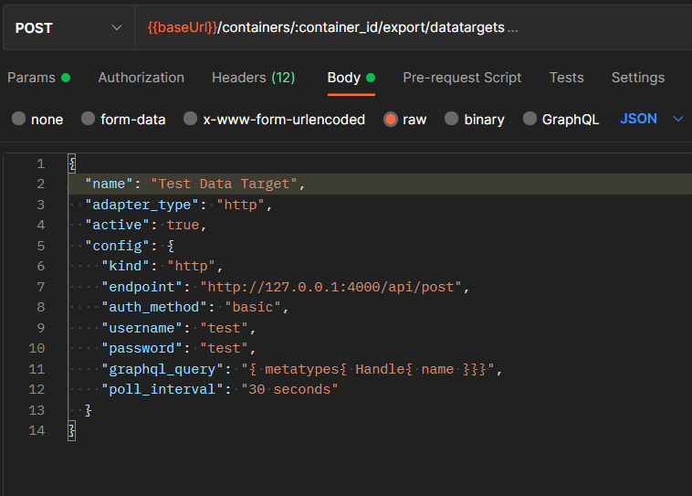

# Data Targets  

## Requirements  

- Completed Getting Started
- Created a container

## Usage
Data Targets are used when a query result needs to be sent to an external endpoint on a regular interval.  
To create a DataTarget the user specifies the query they want to use, their target endpoint and the interval and DeepLynx will automatically run the configuration at the interval set.  
** Currently this can only be done my manually by configuring the body of an http post request **  
(future implementations will have an option for pushing to queue on interval or on button click)

### Data Target Types
- HTTP  

  
### Creating Data Targets
To create data targets you will need to use Postman or another http client (In the future, there will be a GUI for creation)  
- The post request is found under `containers/{container id}/export/datatargets/` POST Create Data Target  
- Edit parameters to specify container  
- Edit request body  
