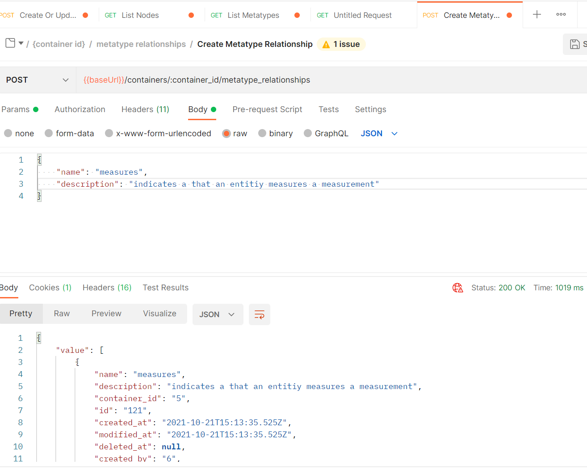
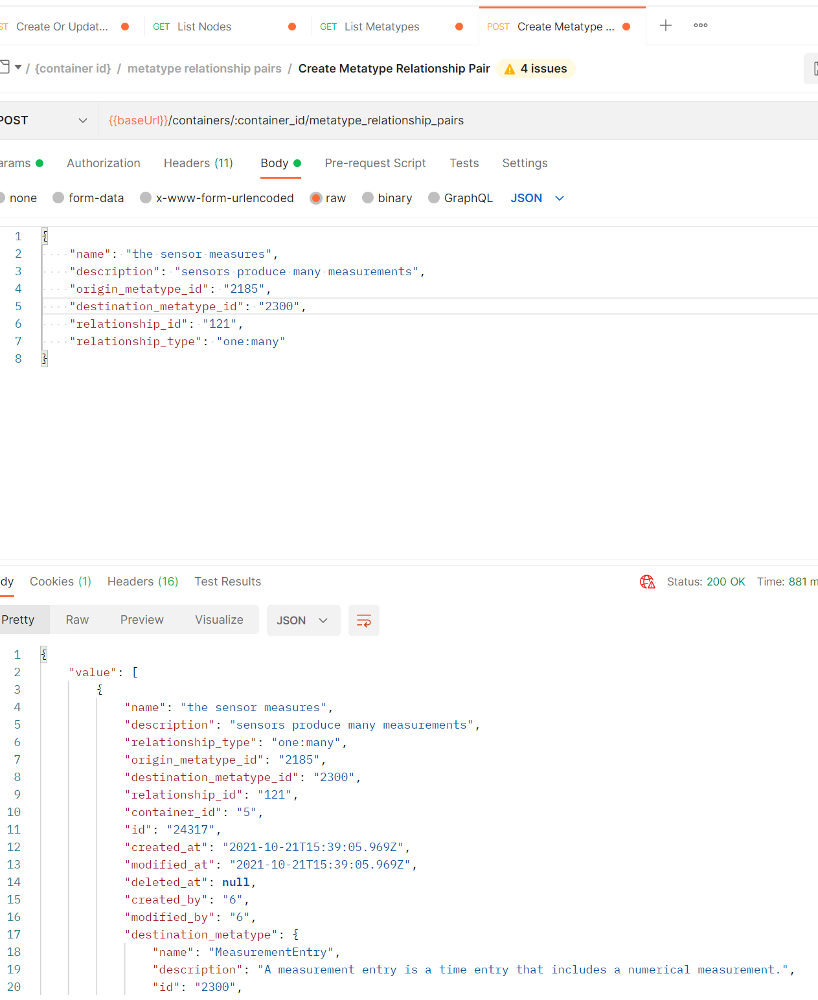

Relationships are entities that provide the 'type' of an Edge. They can be created through changes to your ontology or simply through the REST API.

Below we will create a Relationship and then associate it to two Classes to create a new type of Edge.

Now finally we can create a new type of Edge.

