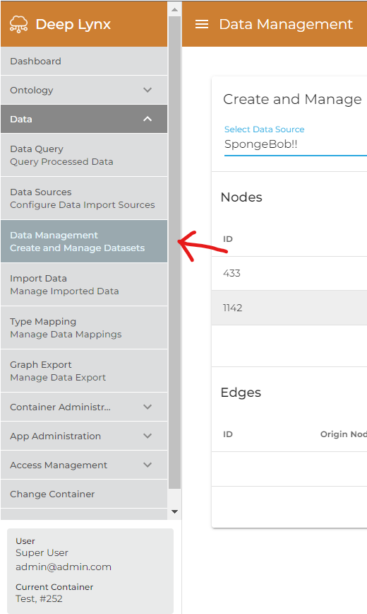
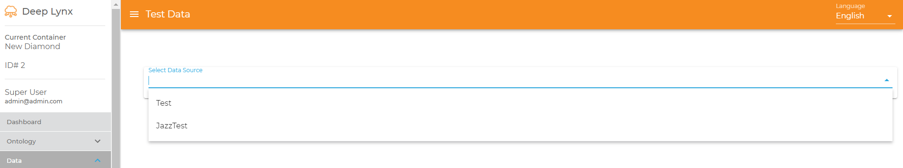
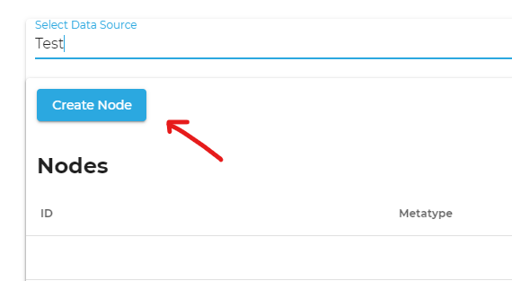
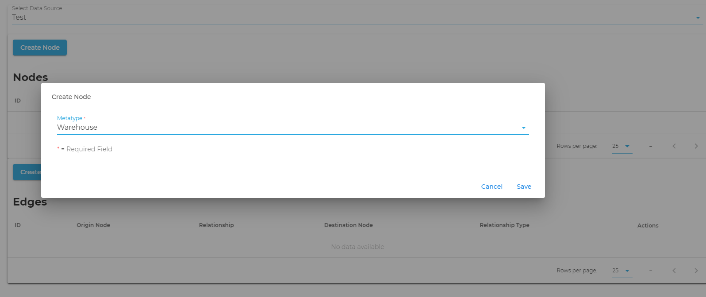
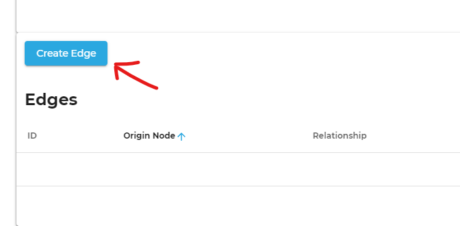
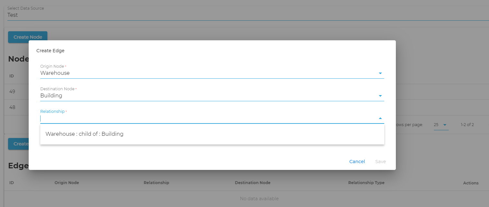
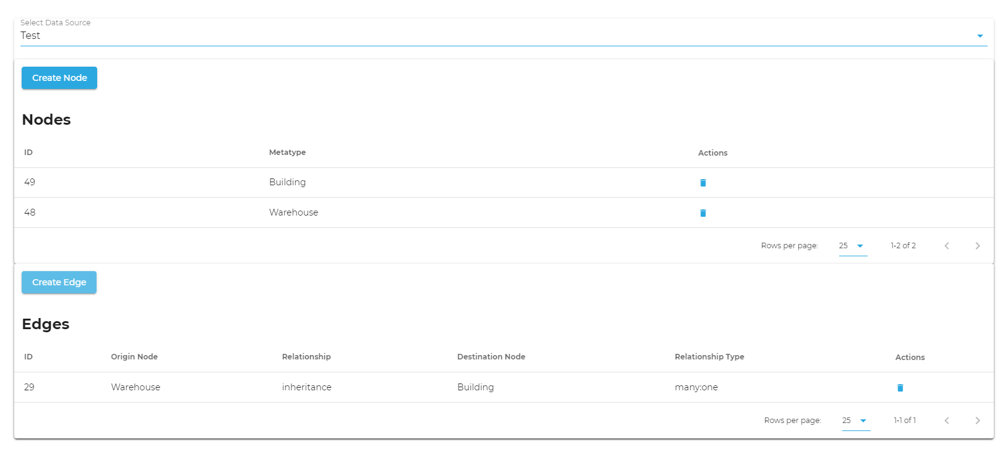

**Requirements**
1. Have created container with specified ontology * [Creating an Ontology](Creating-an-Ontology)
2. Created a Data Source * [Create a Data Source](Create-a-Data-Source)

**Creating Test Data Through DeepLynx**

Creating Nodes and Edges inside DeepLynx is easy. In this article, we will go over the process using the Test Data Creation UI within DeepLynx.

1. Navigate to the Data Management tab under Data on the left hand menu. 
   

2. Select your desired data source. 
   

3. To create an edge, you need to have two nodes already created, so let's do that. Click on "Create Node" and select your desired class, then click on save. 
   

4. Repeat a second time if needed.
   
5. Now that we have two nodes, let's create an edge. Click on the create and edge button and choose your origin and destination nodes. After these are selected, the relationships will filter to valid results 
   

6. Thats all! You should see two nodes and one edge in the tables like below. 
   
