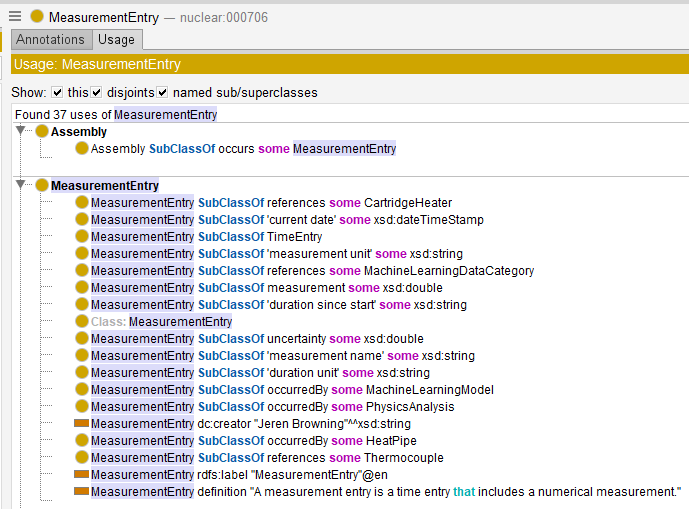
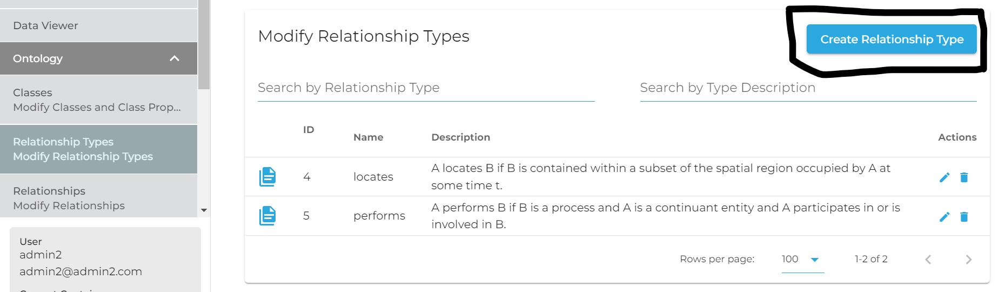
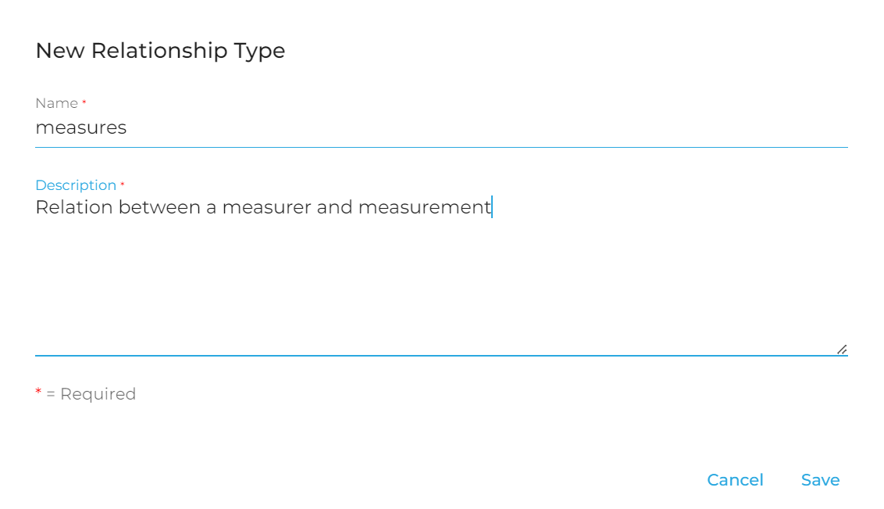
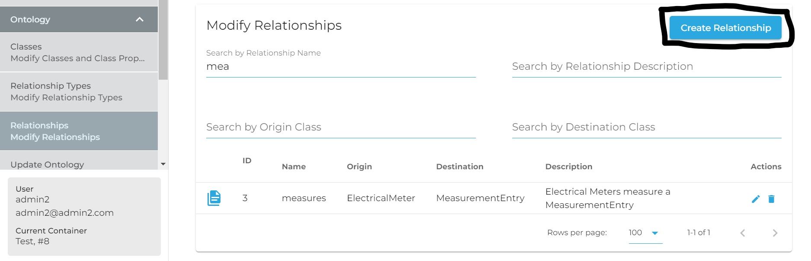
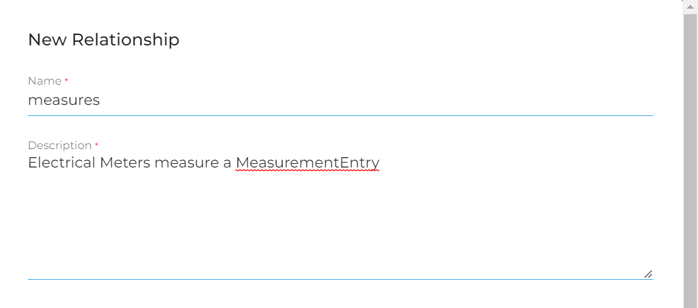
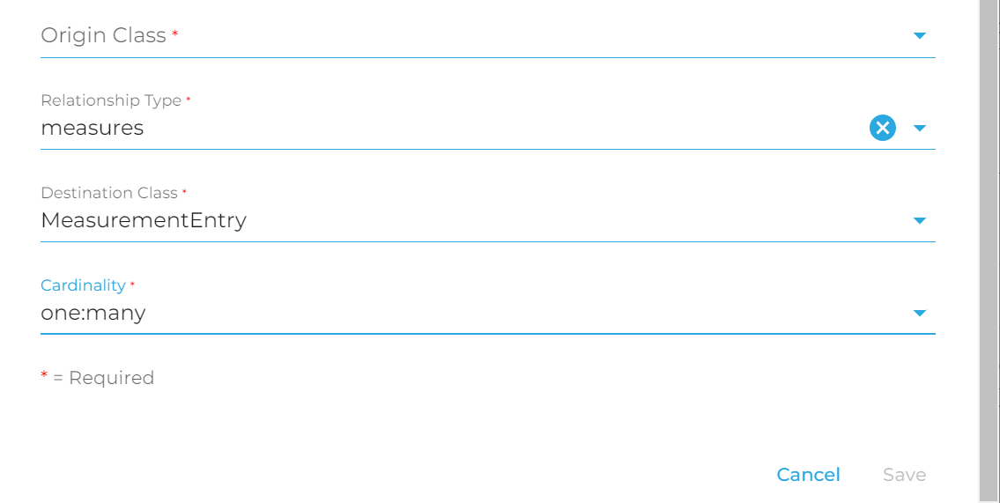
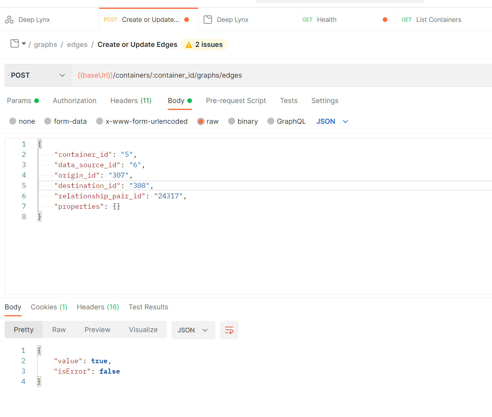

An edge is what relates two nodes together. In this Wiki page our goal will be relating one or many  MeasurementEntry's to a Electric Meter. In short the Electric Meter can have multiple measurements. 

1. First it is important to see if the ontology has an existing relationship.

In this example there is not.

The ontology itself can be modified in [Protege](https://protege.stanford.edu/), in this case updating DIAMOND, or a relationship can be established in DeepLynx. In this case, the assumption will be that DeepLynx is the path we will take.

2. Second is to create a relationship type.

3. Third is relating that relation type to two classes

4. Now we create the edge between one of our Electric Meter nodes and one of our MeasurementEntry nodes

