## Importing an Ontology

Using an .owl file or URL, a container may be created from an existing ontology (.owl) file. If you previously completed installing the Admin GUI, you may use that to import an the owl file. This is the recommended method of importing an ontology. Please note that this is also available as an HTTP endpoint you can interact with directly. Please see the [API documentation](https://gitlab.software.inl.gov/b650/Deep-Lynx/-/blob/master/API%20Documentation/Core.swagger_collection.yaml) included in the DeepLynx codebase for more information.

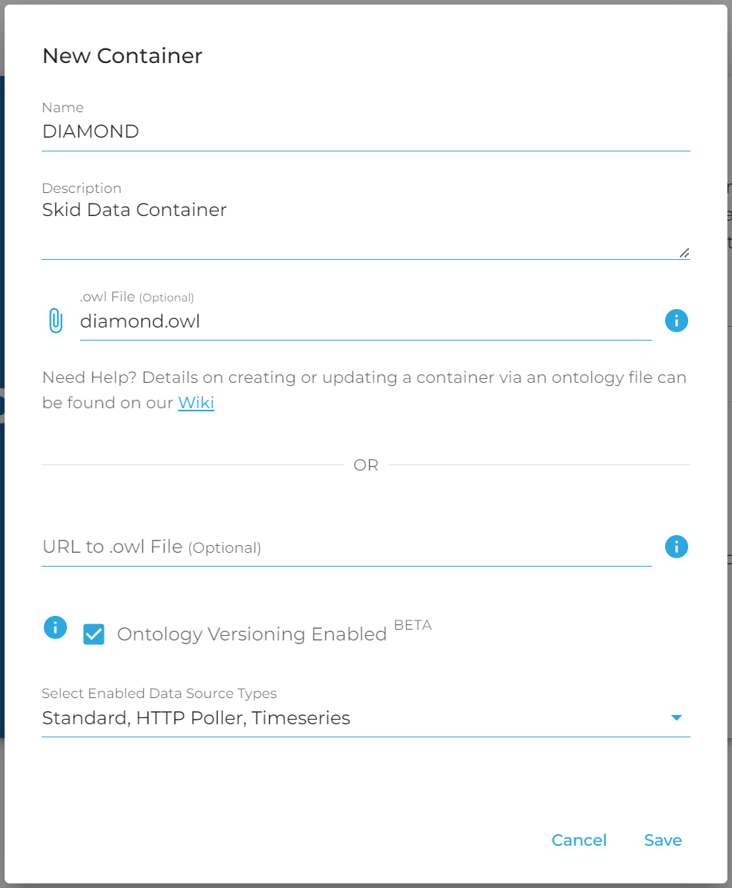

This functionality is also provided through an API endpoint `/containers/import`. Either a local file or URL pointing to a `.owl` file may be provided. Please note that if the URL is pointing to a file in GitHub, you must provide the link to the `raw` version of the file.

The URL should be provided through a path parameter. Additionally, the name of the container to be created must be provided and a description may be provided as well. The description can be either a string of text or the XML element that should be interpreted as containing the description, such as `obo:IAO_0000115`.

The ontology must be in a certain format to be properly parsed and stored in DeepLynx. Please adhere to the following guides:

* An ontology (.owl) file can be saved in various formats. The currently supported format in DeepLynx is `RDF/XML Syntax`. **Please ensure that you are attempting to upload an ontology in this format**. There are tools available like Protege that can be used for converting between different ontology file formats. 
* Each class, relationship, and data property should have at most one definition annotation. 
* It is expected that the `obo:IAO_0000115` annotation is used for class definitions. Please open a GitLab issue if this will not work for your needs.
* Classes, relationships (object properties), and data properties **must have** the `rdfs:label` annotation which provides the name of the item to be created.  
* Certain special characters cannot be parsed correctly. A container import attempts to remove such characters, but please open a GitLab issue if you are unable to import the ontology file due to this sort of issue. In general, please avoid the use of special characters outside the range of [a-zA-Z0-9_-] and space (in names and labels).

**Example - Populating DeepLynx with the DIAMOND Ontology**
There is an active ontology used for nuclear applications that can serve as a functional example. This below example points to the raw version of the [DIAMOND ontology](https://raw.githubusercontent.com/idaholab/DIAMOND/master/diamond.owl).

In your `.env` file, you should be able to determine your endpoint. Following our configuration included in the repo it would be: `localhost:8090/containers/import`

A tool that would allow you to test your locally hosted install would be [Postman](https://www.postman.com/downloads/). You can import the [API documentation](https://gitlab.software.inl.gov/b650/Deep-Lynx/-/blob/master/API%20Documentation/Core.swagger_collection.yaml) into Postman in order to explore and test various imports.

## Manually Creating an Ontology
If there isn't an ontology for the data structure you need, you can create your own ontology. The tool used as a standard is [Protege](https://protege.stanford.edu/).

Creating an ontology in DeepLynx requires knowing both how an ontology is described in DeepLynx terms and the individual API calls needed to transform that description into a stored ontology. These steps will familiarize you with the steps and terms necessary to create an ontology ready to accept data. See the [API documentation](https://gitlab.software.inl.gov/b650/Deep-Lynx/-/blob/master/API%20Documentation/Core.swagger_collection.yaml) included in the DeepLynx codebase for more information on the individual API calls, their required properties, and response bodies.

### Manually Creating an Ontology through the API

1. Create a Container
A Container is like a bucket - in DeepLynx it contains your ontology definitions as well as the data that you've ingested under that ontology. Containers have information about data sources, class mapping, user permissions, and more. A valid, active Container is required before a user can create an ontology, manage data sources, or ingest data.

Creating a container is easy, simply POST this required information to `{baseURL}/containers`.

```
{
    name: "Test Container",
    description: "Test Container Description"
}
```

2. Create Classes (sometimes referred to as metatypes)
The next step in creating your ontology is uploading your classes and their properites

Creating a Class is easy, simply POST this required information to `{baseURL}/containers/{container-id}/metatypes`. (keep in mind that you cannot create two Classes with the same name.)
```
{
    name: "Test Class",
    description: "Test Class Description"
}
```
Once you've successfully created a Class, you can add its properties by adding Class Properties to it by POSTing a similar request body below to `{baseURL}/containers/{container-id}/metatypes/{class-id}/keys`. Please see the API Documentation for more information on the request body and the optional parameters not shown here.

```
{
	"name": "Quantity",
	"required": true,
	"property_name": "quantity", // property_name maps to the json property name of an incoming data object
	"description":"Name of ",
	"data_type": "number",
	"defaultValue": 0
}
```

3. Create Relationship Types
The next step in creating your ontology is uploading your relationship types.

Creating a Relationship Type is easy, simply POST this required information to `{baseURL}/containers/{container-id}/metatype_relationships`. (keep in mind that you cannot create two Relationship Types with the same name.)

```
{
    name: "Test Relationship",
    description: "Test Relationship Description"
}
```

Once you've successfully created a relationship type, you can add its properties by adding Relationship Properties (sometimes referred to as relationship keys) to it by POSTing a similar request body below to `{baseURL}/containers/{container-id}/metatype_relationships/{metatype-relationship-id}/keys`. Please see the API Documentation for more information on the request body and the optional parameters not shown here.

```
{
	"name": "Quantity",
	"required": true,
	"property_name": "quantity", // property_name maps to the json property name of an incoming data object
	"description":"Name of ",
	"data_type": "number",
	"defaultValue": 0
}
```

4. Create Relationships (associate Classes using Relationship Types)
Now that you've created Classes and Relationship Types, along with their properties, you can start creating relationships. In order to do this you must have the three things - the parent Class ID, the child Class ID, and a Relationship Type ID of the type you wish this relationship to be. With this information you can now create a Relationship.

Once you have that relationship information POST it to `{baseURL}/containers/{container-id}/metatype_relationship_pairs`

```
{
	"name": "Relationship Pair Test",
	"description": "Relationship Pair Test Description",
	"origin_metatype_id": "",		// origin class ID
	"destination_metatype_id": "",	// destination class ID
	"relationship_id": "",			// relationship type ID
	"relationship_type": "many:many" // aka cardinality
				// valid values are many:many, one:one, one:many, many:one
}
```

### Manually Creating an Ontology through the UI

Instead of creating the ontology through the API, you may also choose to create your ontology through the user interface through the following steps:

1. Create a container

In your browser, navigate to `{yourDeepLynxURL}`. This defaults to `localhost:8090`. Log in using your credentials and then you should see the following screen.


Select "Create New Container" and only fill out the "name" and "description" fields. Click Save.

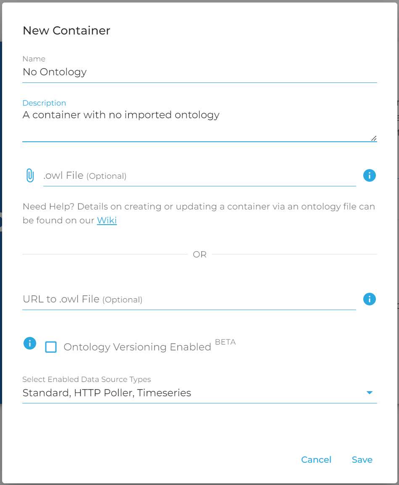

2. Create Classes

In the hamburger menu on the left-hand side of the dashboard, click "Classes" under "Ontology".

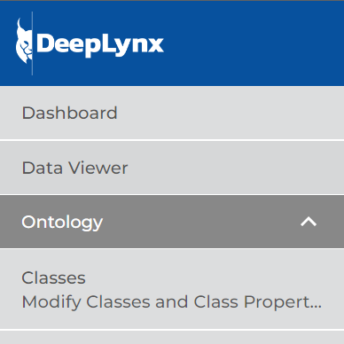

In the top-right corner of the screen, click "Create Class". You will see the following dialogue box. Create your class and then click "save". 

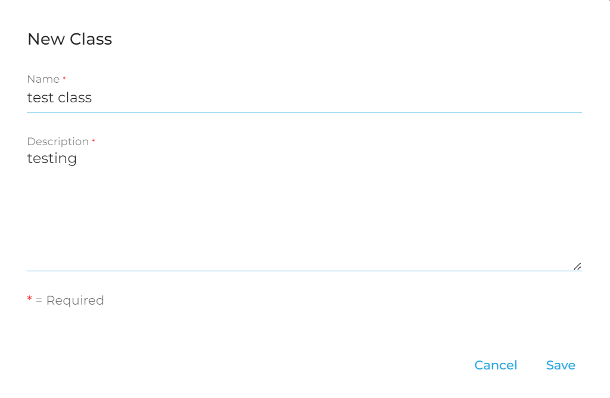

Once the class is saved, there should be a banner that pops up notifying you that your class has been created successfully. To add properties, you can either click the pencil icon under "Actions" in your class listing, or click "Edit Class" in the banner.

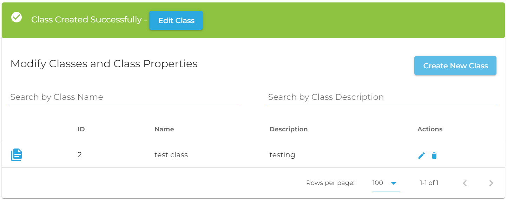

In the dialogue box that opens, click "new property" to create each class property. Note that the Property Name (the second field in the screenshot below) must not contain spaces, although it can contain underscores. Record the name and data type of the property, as well as a description and whether or not it is required. Scroll down and click "save "Create" when you're finished. Once you have added all the necessary properties, click save in the bottom right of the "Edit <ClassName>" dialogue box.

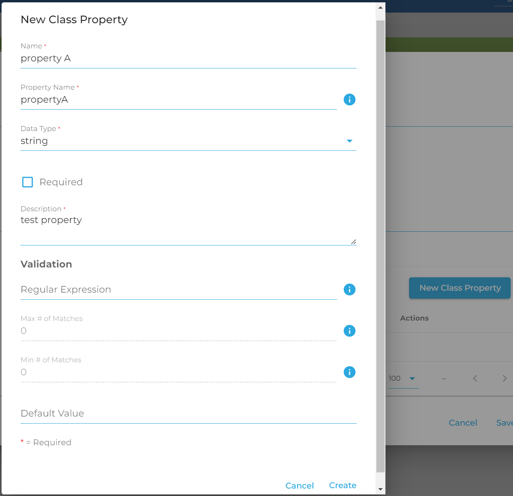

3. Create Relationship Types

In the hamburger menu on the left-hand side of the dashboard, click "Relationship Types" under "Ontology".

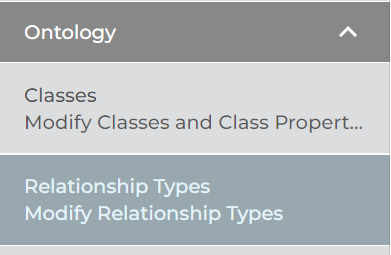

In the top-right corner of the screen, click "Create Relationship Type". You will see the following dialogue box. Create your relationship type and then click "save". 

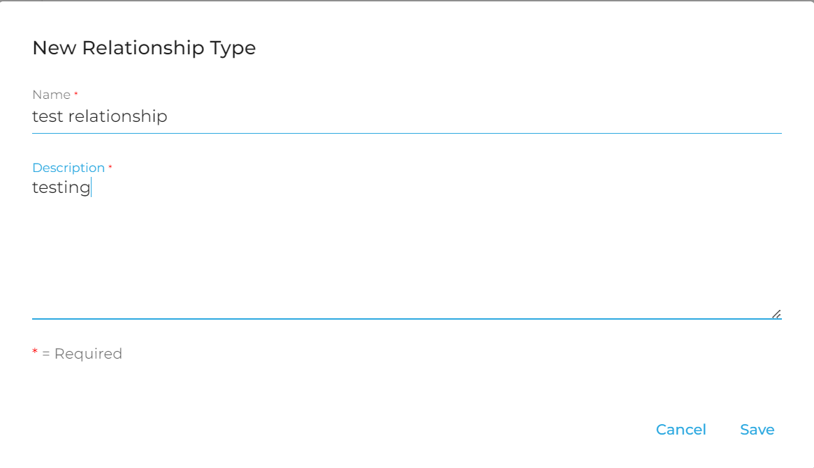

Once the relationship is saved, there should be a banner that pops up notifying you that your relationship has been created successfully. To add keys, you can either click the pencil icon under "Actions" in your relationship listing, or click "Edit Relationship Type" in the banner.

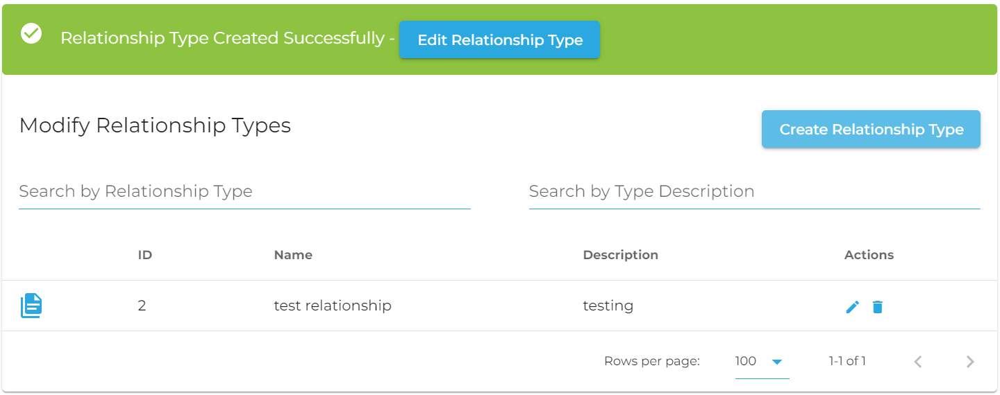

In the dialogue box that opens, click "new property" to create each relationship property. Note that the Property Name (the second field in the screenshot below) must not contain spaces, although it can contain underscores. Record the name and data type of the property, as well as a description and whether or not it is required. Scroll down and click "save "Create" when you're finished. Once you have added all the necessary properties, click save in the bottom right of the "Edit <RelationshipTypeName>" dialogue box.

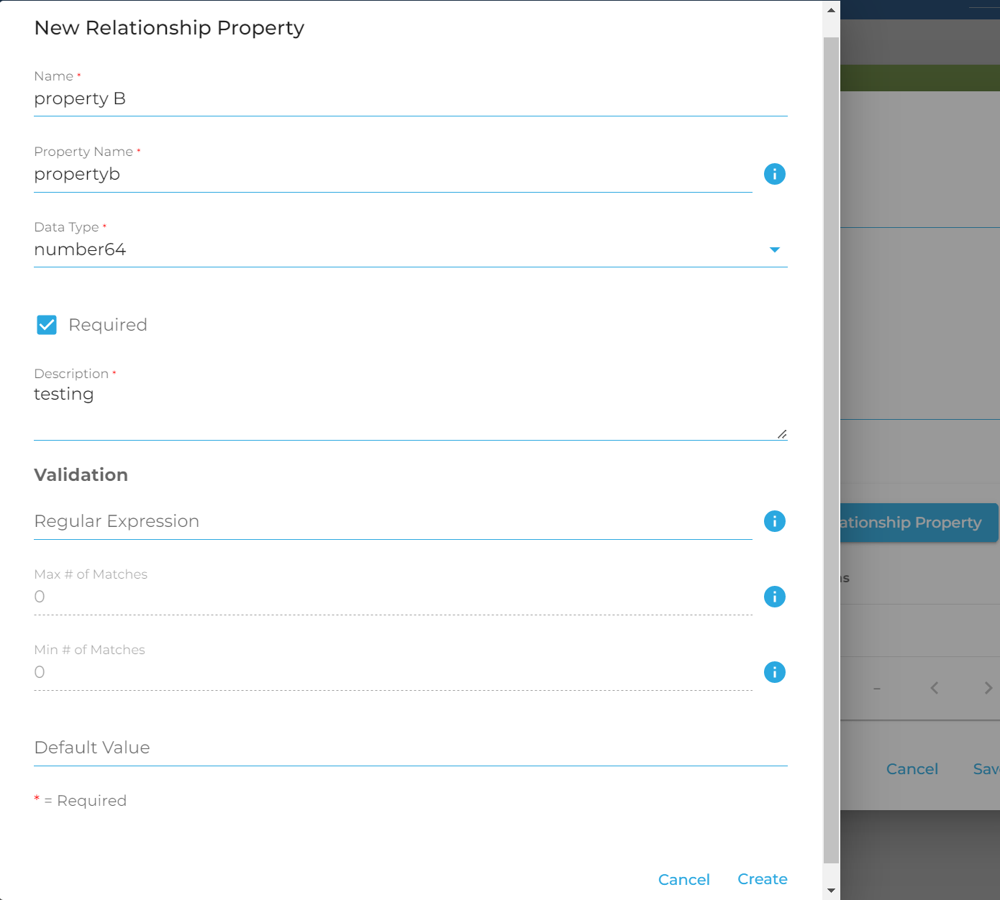

4. Create Relationships (associate Classes using Relationship Types)

In the hamburger menu on the left-hand side of the dashboard, click "Relationships" under "Ontology".

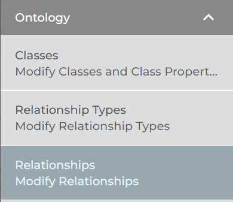

In the top-right corner of the screen, click "Create Relationship". You will see the following dialogue box. After adding a name and description, select the appropriate classes you want to link and the relationship type which links them. Note that a class can relate to itself or other classes. Select the cardinality: `one:one`, `many:many`, `one:many` or `many:one`. Click "Save".

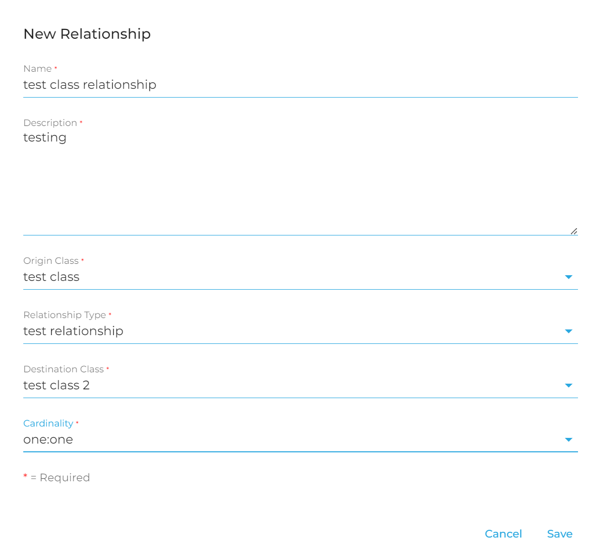

Once you have imported or created your ontology, you can proceed with importing data, or creating test data of your own.