# Adapter Management with Custom Data Source Templates

## Introduction
Historically, DeepLynx adapter development has been bottle-necked by the need to create domain objects and other data structures relating to the specific data source type before users could set up and use their newly developed adapter. For example, if a user wanted to use the P6 adapter, the DeepLynx team would first have to go into the codebase itself and provision a P6 data source structure specific to the needs of the adapter. While adding the code required for each new data source type isn't a super heavy lift, this is not a sustainable pattern, especially if third parties end up developing their own adapters for DeepLynx. The "Custom Data Source Template" feature in DeepLynx allows users to create new Data Source types without having to wait on the DeepLynx team to create a hard-coded implementation. This not only helps with the speed of the adapter implementation process, but also provides a degree of flexibility in adapter design. Any changes to the adapter's required fields can easily be reflected with a quick change to the corresponding data source template. This page is designed to show users how to leverage the new data source template system through both the API and the UI.

## Quick Links

- [Viewing and Managing Data Source Templates](#viewing-and-managing-data-source-templates)
    - [via the GUI](#viewing-via-ui)
    - [via the API](#listing-via-api)
- [Creating and Updating Data Source Templates](#creating-and-updating-data-source-templates)
    - [via the GUI](#creating-via-ui)
    - [via the API](#creating-via-api)
- [Importing Data Source Templates from another Container](#importing-data-source-templates-from-other-containers)
    - [via the GUI](#importing-via-ui)
    - [via the API](#importing-via-api)
- [Authorizing Access to your Container (GUI only)](#authorizing-your-adapter-for-deeplynx-access)
- [Deleting Data Source Templates](#removing-adapter-templates)
    - [via the GUI](#deleting-via-ui)
    - [via the API](#deleting-via-api)
- [Creating Custom Data Sources using Data Source Templates](#creatingediting-a-custom-data-source-using-a-data-source-template)
    - [via the GUI](#data-source-via-ui)
    - [via the API](#data-source-via-api)

## Viewing and Managing Data Source Templates

### Viewing via UI

#### Enabling Custom Data Sources

In order to see the Data Source Template management page, "Custom" data sources must be an enabled data source in your DeepLynx container. Enabled data sources are set during container creation, and can later be altered in the container settings page. See the screenshots below:

Enabling Custom Data Sources upon container creation

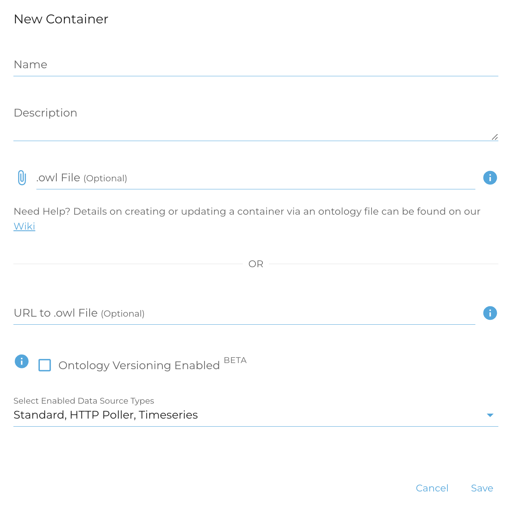

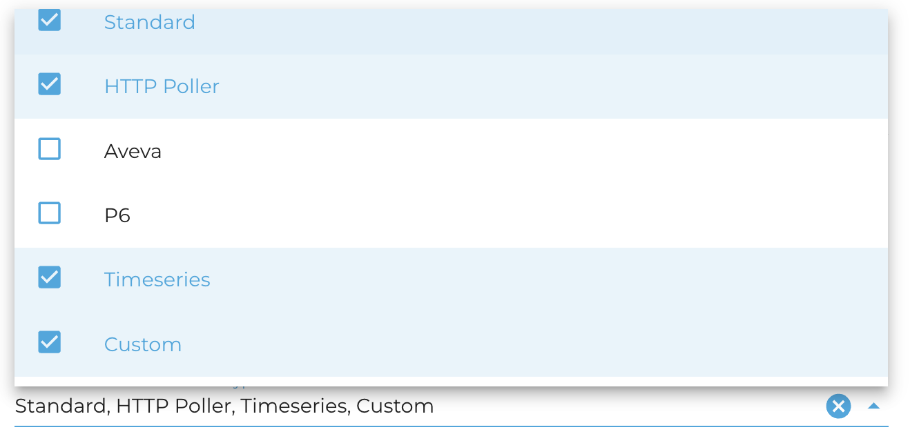

Enabling Custom Data Sources in the container settings page


#### The Data Source Template management page

Once the "Custom" data source type has been enabled, the Data Source Template management page can be located by navigating to the "Data Sources" tab under "Data Management" in the sidebar. It will be the 3rd tab on the page:

Data Sources page without Template management tab

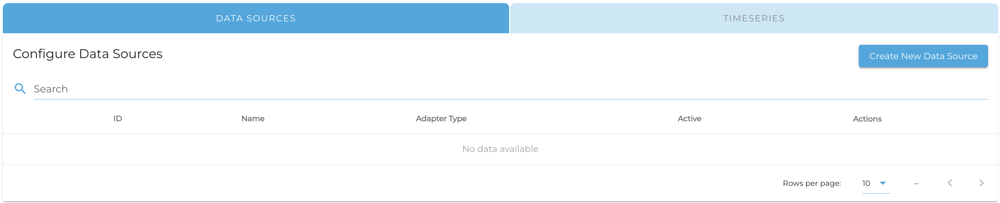

Data Sources page with Template management tab

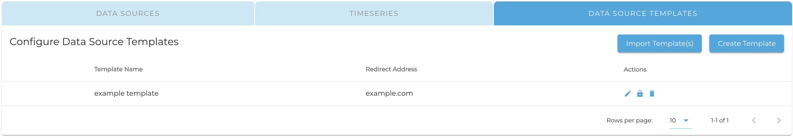

This page lists all available Data Source Templates for your container. There are various actions that can be performed from this page, including [creating/editing templates](), [importing templates from other containers](), [authorizing templates for DeepLynx use](), and [deleting templates]().

### Listing via API

To see the available data source templates stored on your container through the API, you can send a GET request to the adapter template endpoint, `{deepLynxURL}/containers/:containerID/data_source_templates`. This endpoint should return an array of Data Source Templates, or an empty array if there are no existing templates in the given container. Any fields that were specified with `"encrypt": true` will have their field value returned as a hash, while any fields specified with no encryption or `"encrypt": false` will return their plaintext values. The other actions found in the UI page have corresponding API instructions in the appropriate sections below.

## Creating and Updating Data Source Templates

### Creating via UI

To create a new Data Source Template, click the "Create Template" button. To edit a template, select the pencil icon for the appropriate template under "Actions". You will see a page like the one below:

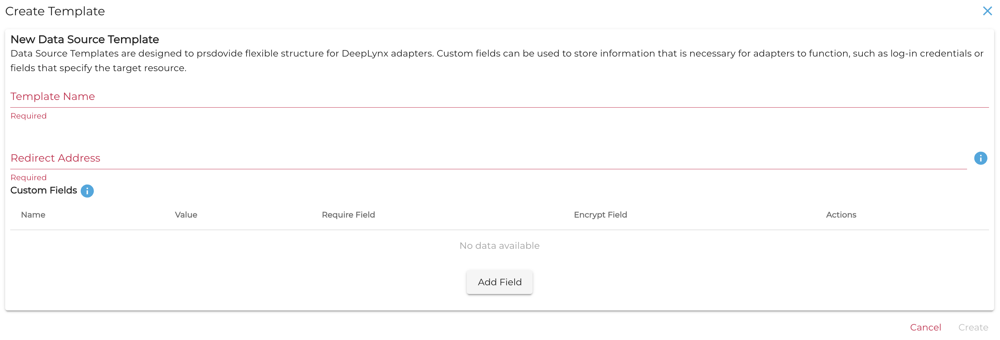

**Template Name** is used to identify which template to begin from when using a Data Source Template to create a new Custom data source. **Redirect Address** indicates the web address where your adapter is located. Supplying this address allows DeepLynx to initiate the adapter authorization process, giving your adapter permission to access this DeepLynx container and send it data. The **CustomFields** are meant to encapsulate any additional information your adapter may need to function, such as target server, log-in credentials, project ID, etc. The *required* and *encrypt* fields are used to enforce user input and security rules once this template is used in a data source.

### Creating via API

In order to create a new data source template through the API, send a POST request to this address: `{deepLynxURL}/containers/:containerID/data_source_templates`. The body of the POST request should be an array of Data Source Templates with the following fields:

#### Adapter Template Structure
| Field Name | Description | Data Type | Required/Optional |
| ---------- | ----------- | --------- | ----------------- |
| id | Unique Identifier for the data source template. If ID is present and matches an existing data source template, the stored template will be updated. IDs are automatically added upon creation if not present in the payload. | string(UUID) | optional |
| name | The name by which the data source template will be identified. This name can be used for both human users and adapters to identify which data sources should be receiving data from which adapters. Additionally, adapters should create their service keys using the note "{name}_adapter_auth" so DeepLynx can verify that the adapter has been authorized to access the container. | string | required |
| redirect_address | The address where the adapter itself (NOT the target server) can be reached. This address will be used by DeepLynx to initiate the adapter authorization process, which gives your adapter permission to access your DeepLynx container and send data to the appropriate data source(s). | string(url) | required |
| custom_fields | This array of objects allows you to specify any additional fields beyond that users may need to supply to your adapter to make it run properly. Data is limited to the string data type for the time being. Adapters should contain parsing logic to convert the data in these fields to the expected data type. Sensitive fields, such as username and password or token, should be marked as `encrypt: true`. | [{name: string, value: string, required: boolean, encrypt: boolean}] | optional |

Below is an example payload that you might use to create two new adapter templates:

```
[
    {
        // assuming a template of this id is found, it will be replaced
        "id": "98eb71e9-2556-4309-824b-068be12650c9",
        "name": "P6",
        "redirect_address": "localhost:8181",
        "custom_fields": [
            {
                "name": "project_id", 
                // "value" can be anything, but try to include
                "value": "123", // a useful example value
                "required": true // indicates that value must be filled in
            }, {
                "name": "username",
                "value": "your_username_here",
                "required": true, // all encrypted fields are required
                "encrypted": true
            }, {
                "name": "password",
                "value": "your_password_here",
                "required": true,
                "encrypted": true
            }
        ]
    },
    {
        "name": "Windchill",
        "adapter_address": "www.windChillAdapter.com:8282",
        "custom_fields": [
            {
                "name": "token",
                "value": "123",
                "required": true,
                "encrypted": true
            }
        ]
    }
]
```

Note that templates sent in with an existing ID will be interpreted as needing to be updated. The new payload will overwrite the existing adapter template. Additionally, within the context of a container, name uniqueness will be enforced. That means that if, for example, there was already an existing template with the name "Windchill", the data source template in the above payload would overwrite the existing Windchill template.

## Importing Data Source Templates from other Containers

If you have Data Source Templates that exist in other containers which you want to re-use in a new container, you can import them via the UI or the API. **NOTE**: any imported data source templates will overwrite exiting templates of the same name/id in the new container.

### Importing via UI

Upon selecting the "Import Template(s)" button, you will see the following dialog. Select a container to import templates from:

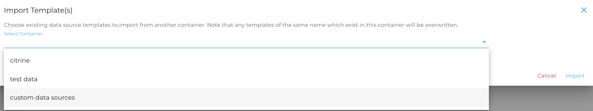

Then check the boxes for whichever templates you want to use, and click "Import":

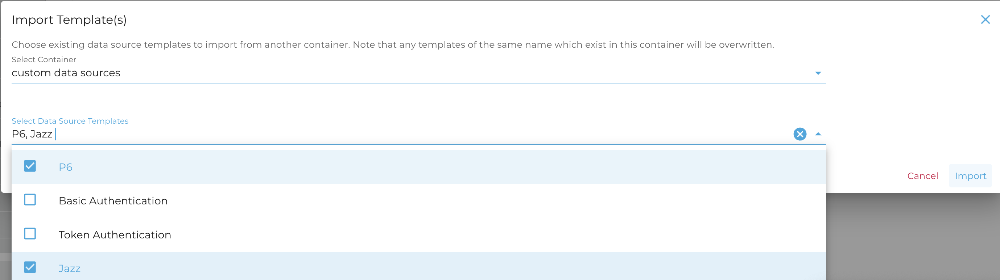

### Importing via API

Via the API, the import can be performed by listing data templates (GET `{deepLynxURL}/containers/:containerID/data_source_templates`) from one container, copying the relevant templates, and pasting them into the body of a POST request to the new container (`{deepLynxURL}/containers/:containerID/data_source_templates`).

## Authorizing your Adapter for DeepLynx access

Based on the redirect address supplied in the data source template, you can prompt an authorization redirect by using the "Authorize" button (lock icon) in the DeepLynx UI. After a brief confirmation dialog, clicking "Authorize" will launch a new tab at the `${redirectAddress}/redirect/${containerID}` endpoint of your adapter, triggering a handshake with the adapter which grants it access to the container.

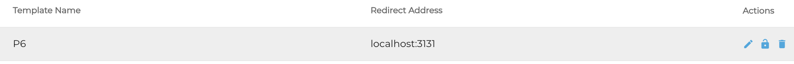

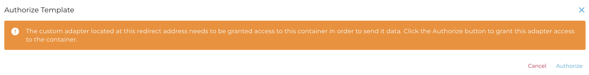

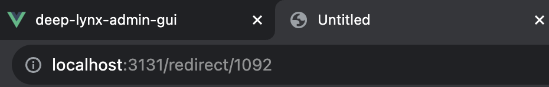

## Removing Adapter Templates

### Deleting via UI

To delete a data source template from a container via the UI, simply select the trash can icon for the appropriate template. A warning like the one below will pop up. Click "Delete":

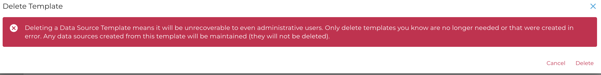

### Deleting via API

Data source templates can be deleted by sending a DELETE request to `{deepLynxURL}/containers/:containerID/data_source_templates/:templateID`. Deleting data source templates from a container is an action that cannot be undone.

## Creating/Editing a "Custom" data source using a Data Source Template

### Data Source via UI

To create a data source using your data source template, choose the "Custom" data source type from the dropdown, as shown below. This will showcase a secondary drop-down which allows you to choose a pre-existing data source template to start from, or to create a new template on the spot.

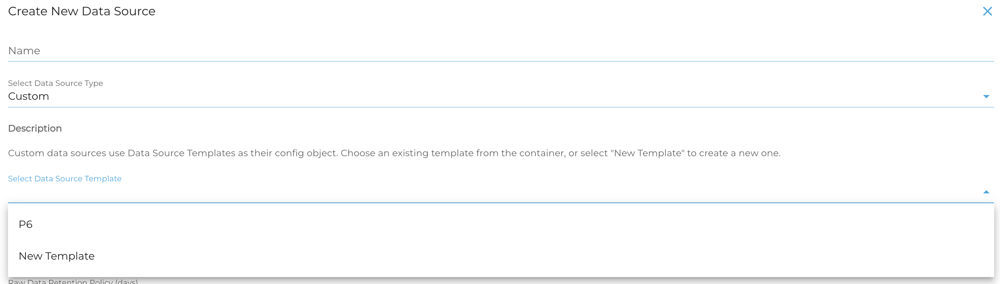

#### New Template

Creating a new template via the data source screen is the exact same as creating one via the Data Source Template management page. The primary difference is the "Save Template to Container" checkbox at the bottom of the card. Select this checkbox if you want this new template to be saved off to the container as a future dropdown option.

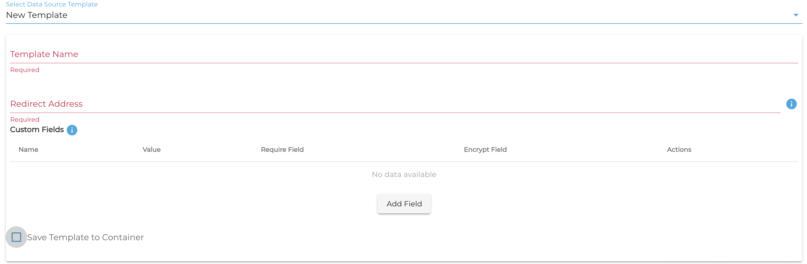

#### Existing Template

Using an existing template to create your data source gives users built-in guidelines on what fields should look like or contain. Note that fields with the "encrypt" box checked are shown in this view in their encrypted form. Replace the template values with the actual values you will be using for this data source.

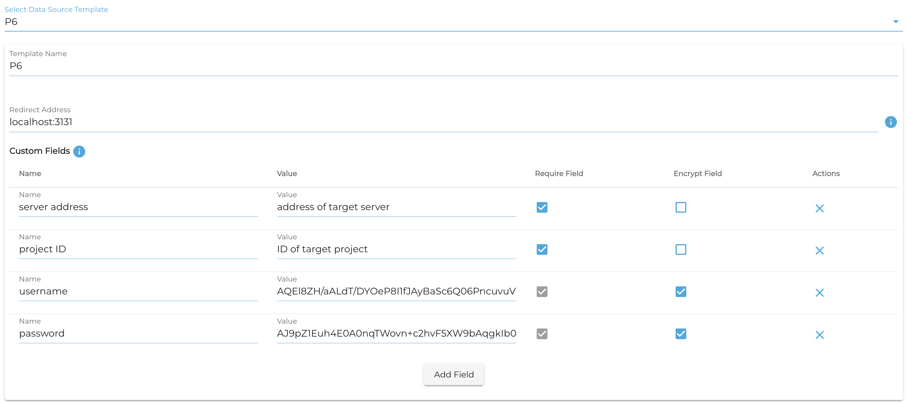

#### Editing Data Sources

When editing a custom data source template, the values for **ALL** custom fields will be removed for security purposes. This means that, if editing your data source for any reason, you will need to re-enter the values of all custom fields.

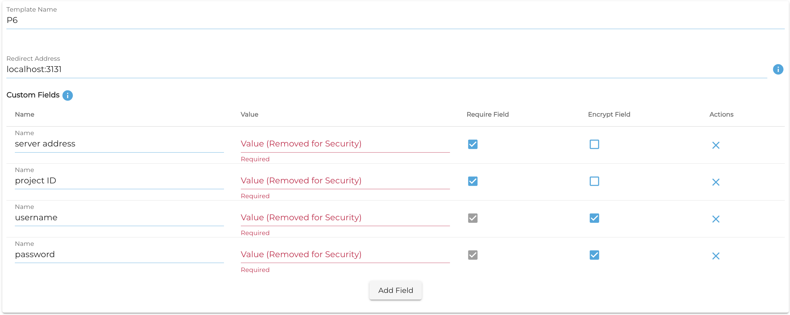

### Data Source via API

Creating a custom data source via the API is very similar to creating a data source of any other type. The primary difference is the inclusion of "template" in the config object. `template` stores a DataSourceTemplate which will dictate the structure of your data source- which fields should and should not be included. Note that custom data sources store a copy of the template instead of a reference to it. This is necessary due to the validation ramifications of changes to the initial template- if the data source template stored on the container were updated, all data sources with a reference to that template would need to be disabled and invalidated. Instead, custom source validation is determined on an individual basis using the data source's copy of the given template, and the source will not be invalidated if the container's copy of the template is changed. The UI will contain a drop-down of existing data source templates to save to the data source upon creation. Any subsequent edits to the data source template made on the data source will **NOT** be reflected on the container's copy of the template.

To create a data source via the API, you can send a payload similar to the following to this endpoint: `{deepLynxURL}/containers/:containerID/import/datasources`. Note the comments that outline some nuances in the process:
```
{
    "name": "test custom",
    "adapter_type": "custom",
    "active": true,
    "config": {
        "kind": "custom",
        "data_type": "json",
        "data_retention_days": 30,
        "raw_retention_enabled": false,
        "template": { // this dictates the structure of the config object
            "name": "P6 adapter",
            // this is the address DeepLynx will use to authorize the adapter
            "redirect_address": "localhost:8181",
            "id": "98eb71e9-2556-4309-824b-068be12650c9",
            "custom_fields": [
                {
                    "name": "project_id",
                    "value": "123",
                    "required": true
                }, {
                    "name": "username",
                    "value": "myActualUsername",
                    "required": true,
                    "encrypted": true
                }, {
                    "name": "password",
                    "value": "myActualPa$$w0rd!",
                    "required": true,
                    "encrypted": true
                }
            ]
        }
    }
}
```

Note that listing the data sources for a container will result automatically in the exclusion of **ALL** values of your custom_fields (you will only see the name, required, and encrypted for each field). In order to fetch the values of the custom fields from your adapter, be sure to use the `decrypted=true` query parameter by sending a GET request to this address: `{deepLynxURL}/containers/:containerID/import/datasources?decrypted=true`.