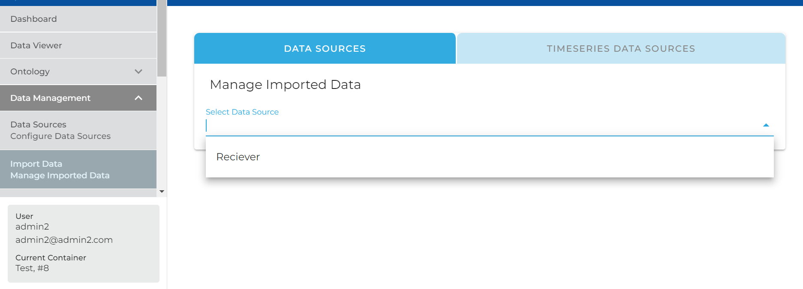
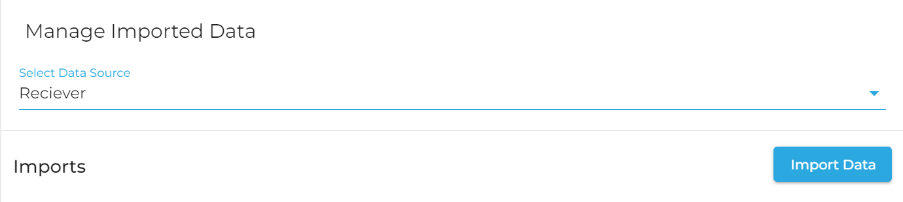
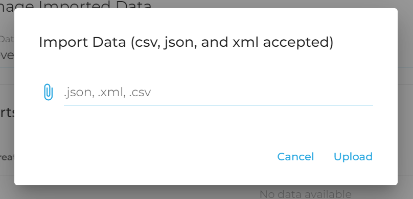

**Note**: This page assumes you've read up on Data Sources and have successfully created a Standard Data Source. If this does not sound familiar to you, please read up on [Standard Data Sources](Create-a-Data-Source) prior to using this information.

## Imports

Every time you send data to DeepLynx we call this an "import" or "data import". Each import consists of individual pieces of data, separated and available for view. The rest of this guide is how to create an import with the Standard Data Source type. 

### Via the API

You can send your data to DeepLynx via it's RESTful api. Simply make a POST request to `/containers/:container_id/import/datasources/:data_source_id/imports`. This POST request should be one of the following:

* Raw body consisting of an array of JSON objects - set Content-Type header to application/json
* JSON file who's root object is an array of other objects
* CSV file
* XML file

As long as your payload is considered valid and DeepLynx can work with it, you will receive a 200 STATUS OK with a payload consisting of the newly created data import which contains this data.

### Via the GUI

1. Navigate to Data -> Import Data.
2. Select your Data Source from the Dropdown
3. As long as it's enabled, you should see a button for uploading data 
4. Follow the form and upload your csv, json or xml file. 