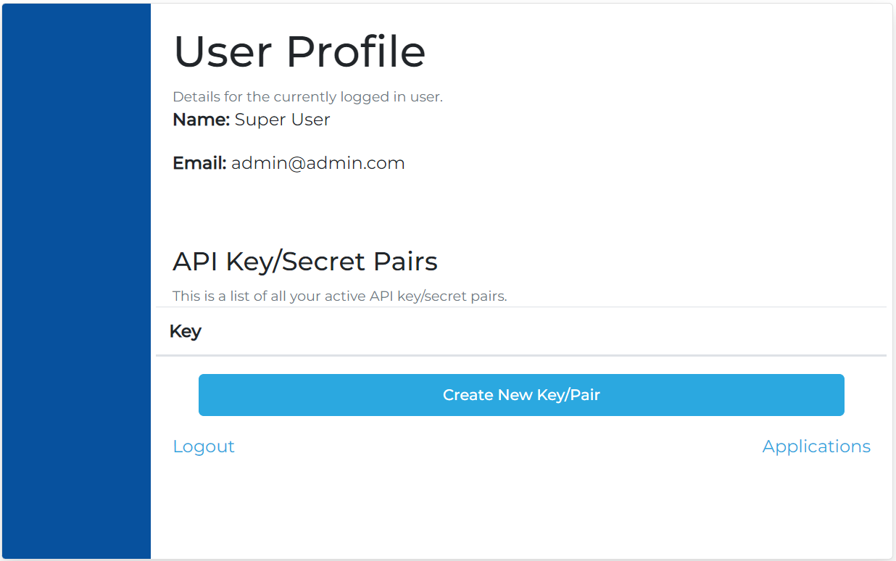
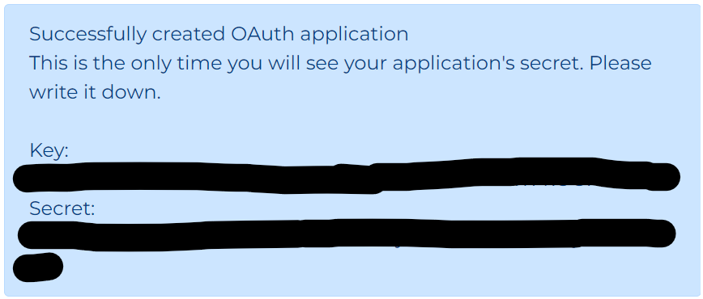

## Creating a DeepLynx enabled OAuth application

You can create a DeepLynx enabled application under your personal DeepLynx account at any time. DeepLynx is a fully compliant OAuth2 identity provider. Developers can use DeepLynx as an identity service for other applications.

An application is needed if you plan to have your outside integration/code/application communicate with DeepLynx on behalf of a user and your application interacts with the user it acts for. 

If your application cannot or does not have user interaction, e.g an application that simply sends data to DeepLynx periodically then see [Generating and Using API Keys](Generating-and-Using-API-Keys-Token)

## Create a DeepLynx Enabled Application
1. Login to DeepLynx (go to `{yourDeepLynxUrl}/oauth` in your browser) and navigate to the Profile page (it should be the page you see immediately after login)

Login Page

Profile Page

2. In the bottom right-hand corner click on "Applications", you will be redirected to a page listing all current applications you've created for integration into DeepLynx.

3. Click "Create New" and fill out the form on the subsequent page

4. On successful creation you will be redirected back to the Application list page - but you should see a banner at the top of the page. That banner includes the ID and Secret for your newly created application. WRITE THEM DOWN as this is the only time you'll see that application's secret. There is NO WAY to retrieve an application's secret after this page.
