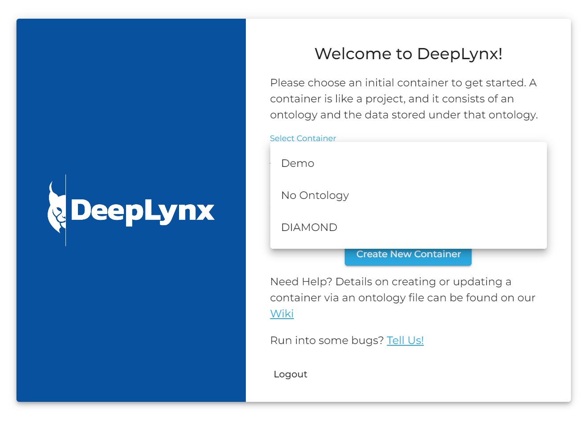
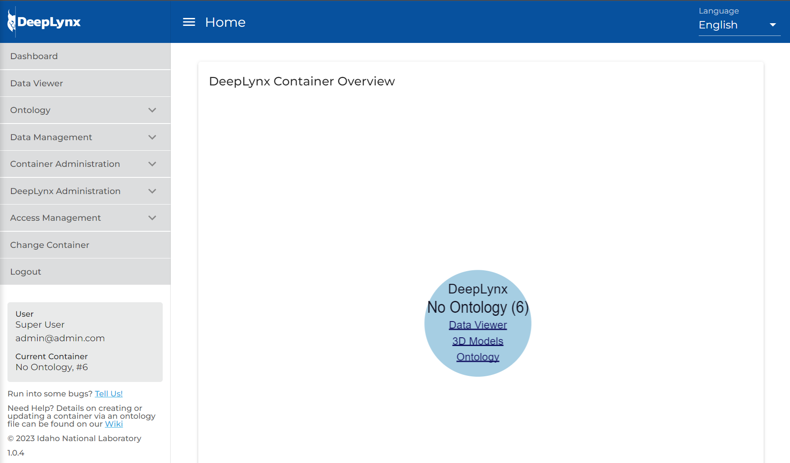
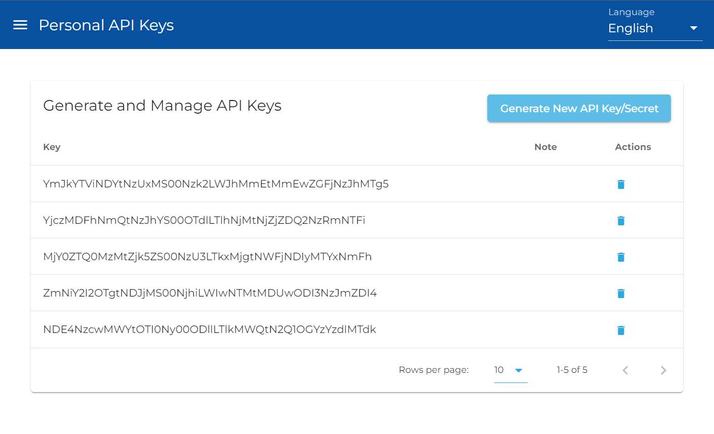
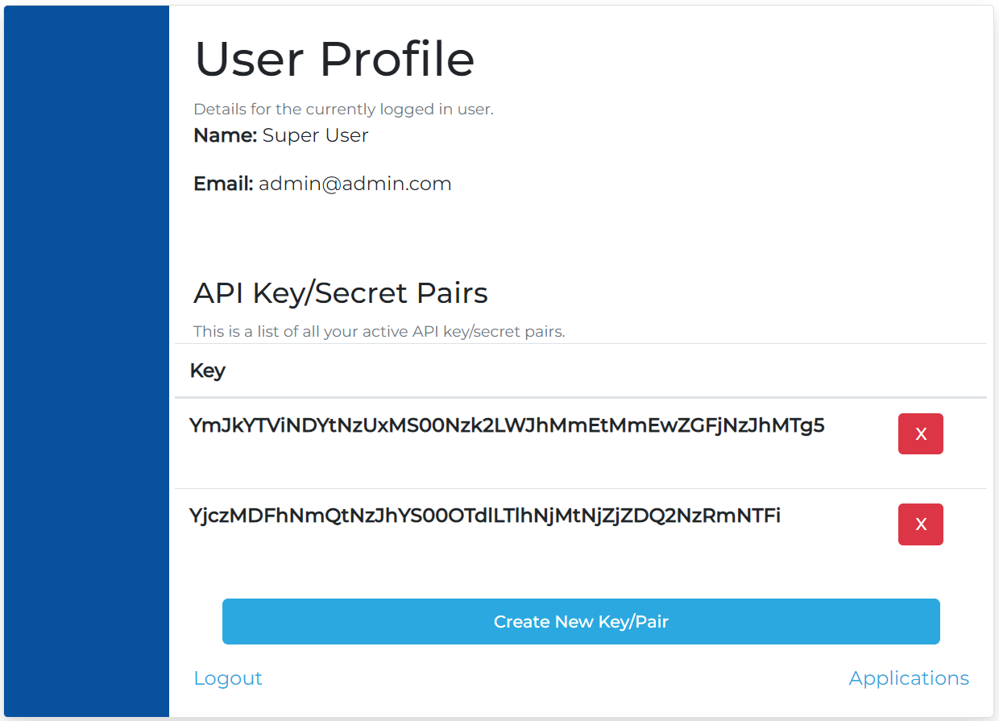
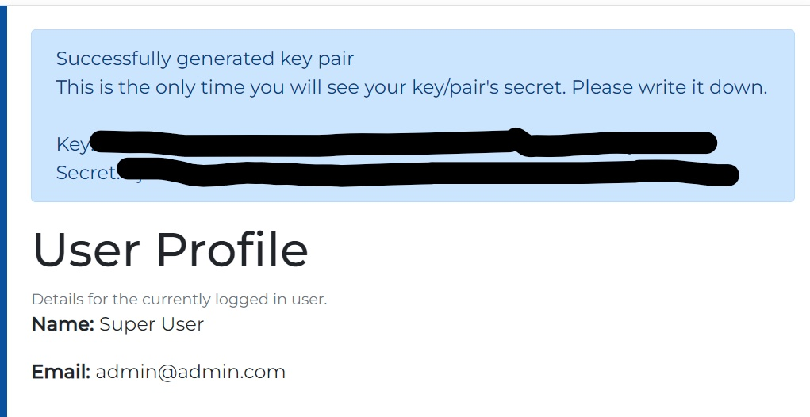
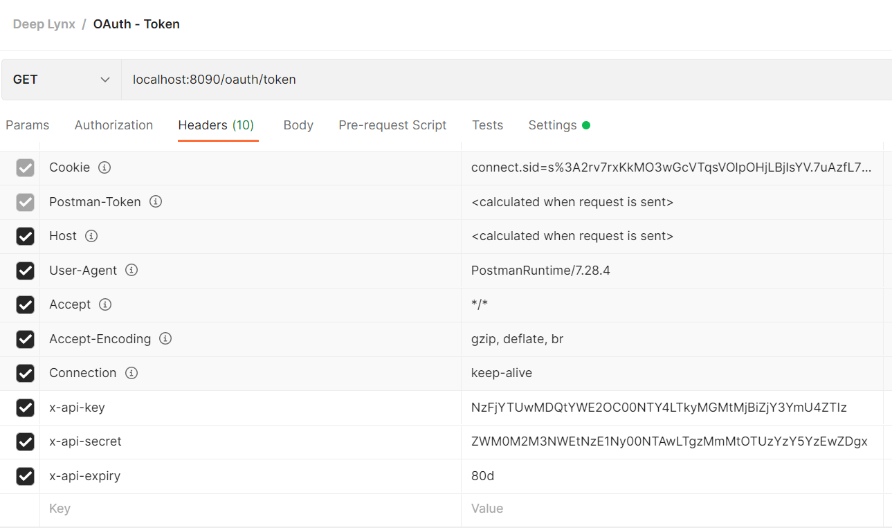
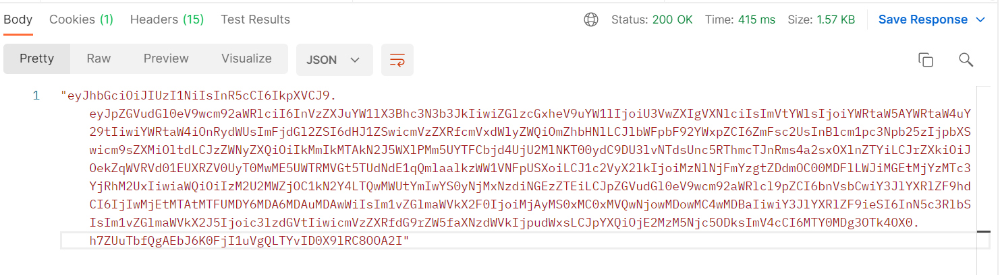
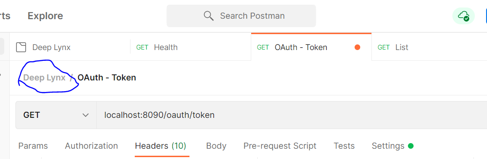
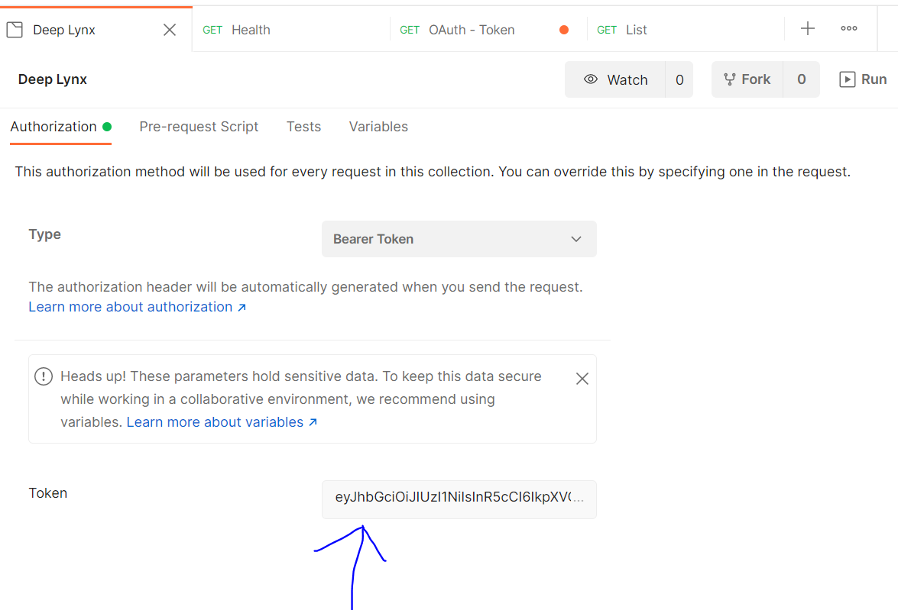

A user may generate as many API Key/Secret pairs as they choose. These Key/Secret pairs will be used to gain an access token to DeepLynx in order to access the API on behalf of the user. Generally Key/Secret pairs are used by third-party integrations that do not require, or cannot have, user interaction. API Key/Secret pairs make it possible for an application to independently fetch an access token for interacting with DeepLynx on behalf of the user.

## Generating API Key/Secret pairs
### Method 1
1. Navigate to DeepLynx (default is `localhost:8090` if running locally).
2. Select or create a new container - 
3. Once you've logged in and selected a container you should see an entry on the sidebar titled "Access Management" 
4. Select "API Keys"
5. In the upper-right hand corner click "Generate API Key" - 

### Method 2
1. Login to DeepLynx (go to `{yourDeepLynxUrl}/oauth` in your browser) and navigate to the Profile page (should be the page you see on login)
2. Push the "Create New Key/Pair" button (**Note: these are currently different than application pairs**)

3. User is then redirected back to the profile page - if key/secret pair creation is successful a banner will appear on top with the new key and secret pair. WRITE THEM DOWN as this will be the only time you will see a key/secret pair's secret.

## Using an API Key/Secret pair
Now that you have a valid key/secret pair you can request an access token.

1. Create and send a GET request to `/oauth/token`. The POST request must have the following headers set:

| | |
| ------------- | ------------- |
| `x-api-key` | The API key from your key/secret pair |
| `x-api-secret` | The API secret from your key/secret pair |
| `x-api-expiry` | A string describing time span in [vercel/ms](https://github.com/vercel/ms) format - e.g `2 days`, `10h`, `7d`

2. If you receive an errant response with the warning "SSL Error: Self signed certificate in certificate chain", you may have to turn off certificate verification in Postman. This can be done in the settings pane of your request.

3. Use the response value as a [Bearer Token](https://swagger.io/docs/specification/authentication/bearer-authentication/) when making any further API calls against DeepLynx

4. (**Optional**) If you will be doing Development work using this token and Postman you can save some effort. You can make it so the token automatically gets added to your requests.

 

Note: No extraneous characters such as " or {} should be present in your bearer token.