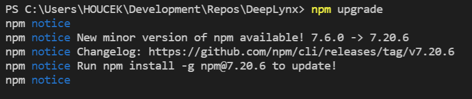
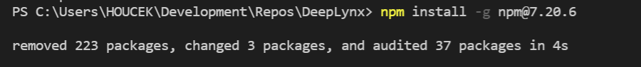
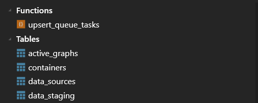
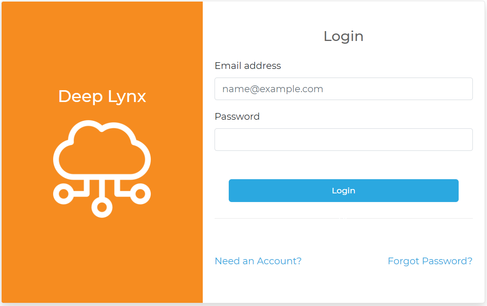
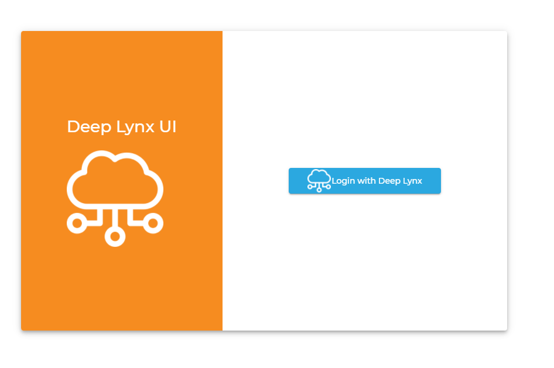

In order to get DeepLynx set up in a local environment for development and testing purposes, please follow these steps and requirements:

**Requirements**

- node.js 8.x, 10.x, 12.x, 14.x, 15.x, and 16.x
- Typescript ^4.x.x
- npm ^7.x
- Docker ^18.x - *optional* - for ease of use in development
- Private RSA key. This is used for encryption of sensitive data. If you need help on generating a private key, we recommend using `openssl` to do so. Here is a [tutorial](https://www.scottbrady91.com/OpenSSL/Creating-RSA-Keys-using-OpenSSL).

***Data Source Requirements***

- **Required** - PostgreSQL ^11.x 
- Redis ^6.x - required only if not using the in-memory cache system. We highly recommend that you use Redis over in-memory in a production environment, especially if you're planning on running DeepLynx in a clustered environment.

**Steps**  
1. NodeJS must be installed. You can find the download for your platform here: https://nodejs.org/en/download/ **note** - Newer versions of Node may be incompatible with some of the following commands. The most recent version tested that works fully is 16.13.0 - the latest LTS version.  

2. Clone the DeepLynx [repository](https://gitlab.software.inl.gov/b650/Deep-Lynx/-/tree/master).

3. Run `npm upgrade && npm install` in your local DeepLynx directory.

4. Copy and rename `.env-sample` to `.env`.

5. Update `.env` file. See the `readme` or comments in the file itself for details. If you are not using Docker, ensure that you update the ENCRYPTION_KEY_PATH environment variable in `.env` to reflect the absolute path of a RSA private key.

6. Run `npm run build:dev-with-web` to build the internal modules and bundled administration GUI.

  
7. **optional** - If you would like to use Docker rather than a dedicated PostgreSQL database, please follow these steps:  
     - Ensure Docker is installed. You can find the download here: https://www.docker.com/products/docker-desktop.  
     - Run `npm run docker:postgres:build` to create a docker image containing a Postgres data source.  
     - Mac users may need to create the directory to mount to the docker container at `/private/var/lib/docker/basedata`. If this directory does not exist, please create it (you may need to use `sudo` as in `sudo mkdir /private/var/lib/docker/basedata`).  
     - Verify that image is properly created. See below.

     - Run `npm run docker:postgres:run` to run the created docker image (For Mac users, there is an alternative command `npm run mac:docker:postgres:run`).  
8. Run `npm run migrate` to create the database and schema within a PostgreSQL database configured in the `.env` file.  

9. A private key file is required to start DeepLynx. This file is used for various processes related to user management, data export, etc. A key file can be created by simply using the [OpenSSL](https://www.openssl.org/) library. A command such as `openssl genrsa -out private-key.key 2048` will create a private key that will be safely ignored by the `.gitignore`. After the private key file is created, please provide the path to it with the `ENCRYPTION_KEY_PATH` environment variable.  
10. Run `npm run watch` or `npm run start` to start the application. See the `readme` for additional details and available commands.  

**Note:** DeepLynx ships with a Vue single page application which serves as the primary UI for the DeepLynx system. While you can run this [separately](https://gitlab.software.inl.gov/b650/Deep-Lynx/-/wikis/Administration-Web-App-Installation) (and it's recommended to do so if you're developing it) we suggest you use the `npm run start-with-web` command or `npm run build:dev-with-web` and `npm run start` to build and deploy the included Vue app alongside DeepLynx. This process may take a few minutes each time.

**The bundled admin web GUI can be accessed at `{{your base URL}}/gui`**

**Installation Gotchas**

* When running `npm run migrate` you should see some kind of output regardless of success or failure. If you see no output, but the program exits without errors do not assume the migrate ran correctly. Check your node version as silent errors of this type are generally present when running an unsupported node version.

* If you have installed a version of PostgreSQL and are attempting to use the Docker version of PostgreSQL included in this repository, you will need to insure that your local copy of Postgres is not currently running. It will prioritize itself over the Docker PostgreSQL.

* If you're planning on uploading actual files you **must** have the `FILE_STORAGE_METHOD` set. If you're using the `filesystem` storage method, insure that you have also set `FILESYSTEM_STORAGE_DIRECTORY` and that it points to a directory that the DL instance has read/write permissions to.
* You must provide a valid RSA private key to DeepLynx so that it can store encrypted information. DeepLynx will only error on those operations if you're missing the key, so you might not catch that until later.

* If you are having difficulties authenticating in the Admin Web GUI (when using it in a non-bundled moded) - insure that you've setup the OAuth Application correctly and that the Admin Web GUI is configured correctly. Find more information [here](https://gitlab.software.inl.gov/b650/Deep-Lynx/-/wikis/Admin-UI).

* When attempting to access the bundled admin web GUI at `{{your base URL}}/gui` fails, insure that you have either run `npm run build:dev-with-web` prior to running `npm run start`, or simply use `npm run start-with-web` to combine theses steps.

* When using the Dockerfile you must insure you update the environment variables inside the Dockerfile itself with the proper values.

### Verifying DeepLynx is working correctly
Here are a few simple ways you can verify that your installation of DeepLynx is working correctly. 

* Tools like [Postman](https://www.postman.com/) can be used for verifying HTTP response/requests and [TablePlus](https://tableplus.com/) or [PgAdmin](https://www.pgadmin.org/) can be used when verifying database structure or values.

* Send a simple GET request to your DeepLynx instance's health check endpoint. This is located at `{host}/health` and should return a 200 OK HTTP status response if DeepLynx is up and running correctly. (You can find where DeepLynx is exposing it's HTTP server by checking the `ROOT_ADDRESS` and `SERVER_PORT` environment variables - by default it should be `localhost:8090`). 

* Navigate to your DeepLynx's login page (default is http://localhost:8090/). If you had your environment variables instruct DeepLynx to create a default User, attempt to login with said User.

* If you're using the bundled admin web gui navigate to `{{your base url}}/gui` - you should see  the following screen 

### Next Steps
Now that DeepLynx is up and running, it is time to create a demo environment.

The following steps are needed to create a demo environment:
1. [Create an Application](https://gitlab.software.inl.gov/b650/Deep-Lynx/-/wikis/Creating-a-DeepLynx-App) **Needed only if not using the bundled web app** 
2. [Setup Admin GUI](Admin-UI) **Needed only if not using the bundled web app**
3. [Load the DIAMOND Ontology](Creating-an-Ontology)
4. [Creating Test Data](Creating-Test-Data-Through-DeepLynx)