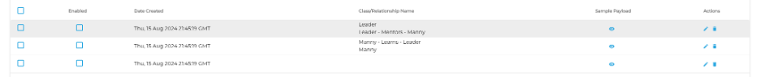
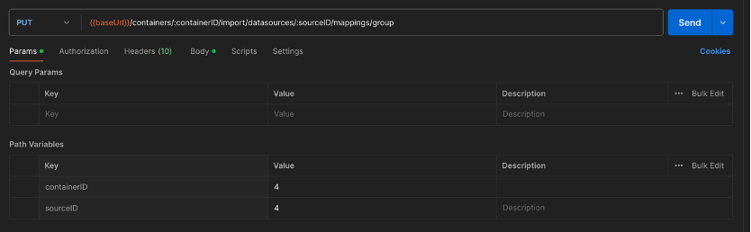
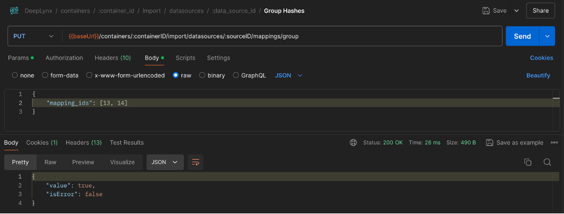
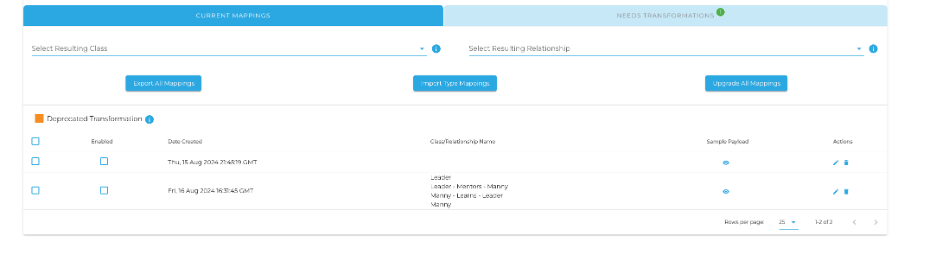
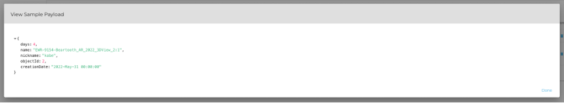
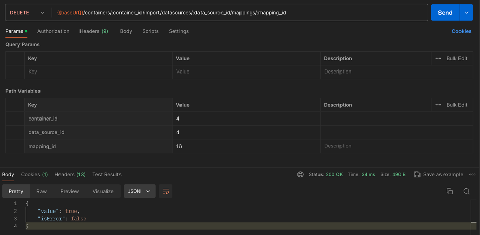
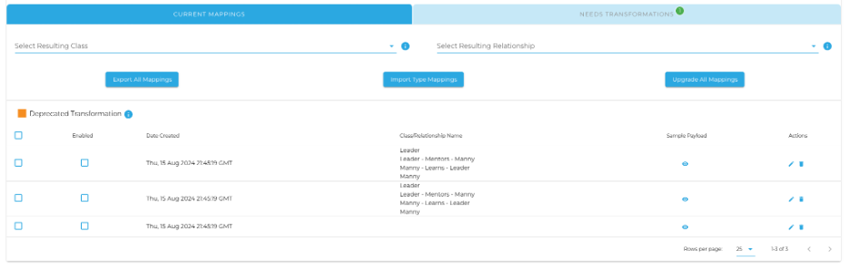

This grouping and ungrouping feature allows a user to combine mappings and their associated transformations as well as separate them. This feature gives a user the capability to create a new mapping that not only obtains the greatest common payload among the two mappings, but also inherits all transformations from mappings used in the grouping. Below we will observe an example of grouping and ungrouping mappings. 

## Grouping Mappings 

```
[
   {
      "objectId": 1,
      "name": "EWR-9154-Beartooth_AR_2022_3DView_1:1",
      "nickname": "kobe",
      "creationDate": "2022-May-31 00:00:00"
   },
   {
      "objectId": 2,
      "name": "EWR-9154-Beartooth_AR_2022_3DView_2:1",
      "creationDate": "2022-May-31 00:00:00",
      "days": 4
   },
   {
      "objectId": 3,
      "name": "EWR-9154-Beartooth_AR_2022_3DView_3:1",
      "creationDate": "2022-May-31 00:00:00",
      "speciality": true
   }
]
```

Let’s say we have the following example of three shapes.  This JSON would create three distinct shapes within DeepLynx. Now let’s say we have the following DeepLynx data source with these three type mappings and these following transformations associated with two of the mappings. 





Given these mappings, let’s say a user wishes to group the first two mappings (the two mappings with transformations). In order to do this, they would need to direct themselves to the route “{{baseUrl}}/containers/:containerID/import/datasources/:sourceID/mappings/group” via the Postman API. The user would then need to send a put command along this route in order to group these two mappings together. The route requires the following parameters to be inputted (container ID and data source id): 





After these parameters are adjusted accordingly, the route also requires an array of the type mapping ids that are to be grouped, to be passed into the body, as shown below. Once this information is passed in, the user may click send to group the two mappings together: 





On success, Postman should return output stating that value is true and that isError is false. Then, refreshing the type mappings page, there should now only be two shapes, one with the transformation combined from the grouping. 





Along with the grouping of transformations, the payloads should also be visibly grouped to show the greatest common payload (all unique keys):





Now, let’s ungroup the grouped mapping we created. 


## Ungrouping Mappings 

Now that we have grouped a mapping, lets ungroup it via the Postman API. A delete command will need to be sent via the following route “{{baseUrl}}/containers/:container_id/import/datasources/:data_source_id/mappings/:mapping_id”. This route requires information regarding the container id, data source id and mapping id (the type mapping id of the newly formed grouped mapping) via the parameters. Once this information has been inputted, the user may click send. On success, a message should be outputted stating that value is true and isError is false: 





Upon sending this delete command, the user should refresh the type mappings page and can confirm the mapping was ungrouped since there is now three shapes again, two of them having the same (combined) transformations as the grouped mapping: 





The payloads have now also reverted back to their original mappings prior to grouping. 