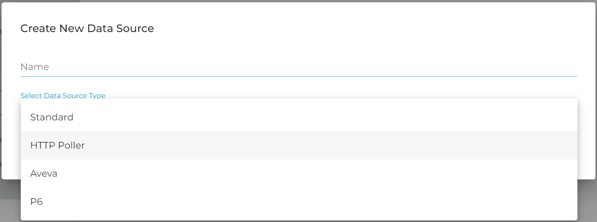
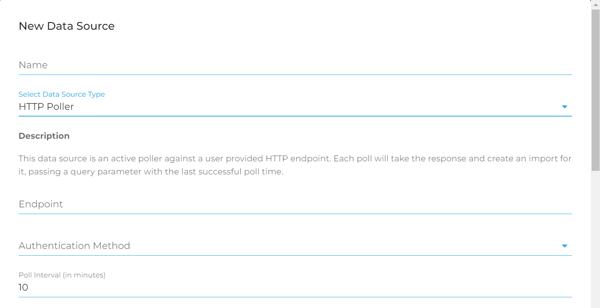
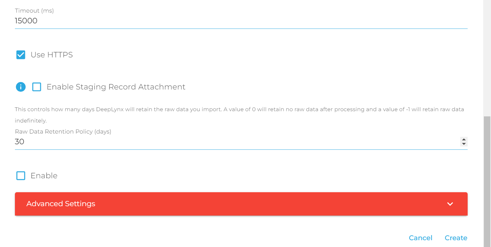

# HTTP Poller Data Source

This data source type allows DeepLynx to play a more active role in ingesting data. Unlike the Standard Data Source, the HTTP Poller Data Source allows DeepLynx to actively retrieve data from an HTTP endpoint and ingest that data automatically. 

### Creating a HTTP Poller Data Source

1. Navigate to Data -> Data Sources. In the upper left-hand corner select the button that says "New Data Source"
2. From the dropdown select HTTP  Poller
3. Fill out the values in the following screen to the best of your ability. The form is fairly self explanatory so please pay attention to each field and it's help information  

### Running the HTTP Poller Data Source

Once enabled, the HTTP data source will _automatically_ run at the given interval specified in the creation step. No user intervention is required apart from enabling and disabling the data source.

Each time the data source runs, a GET request will be sent to the URL specified in the data source creation. DeepLynx expects that the response to this GET request to be either an array of JSON objects, a JSON file with an array of objects, a CSV file, or XML file. DeepLynx will download and create an import for the request.

Each subsequent request to the endpoint will include a query parameter called `lastImportTime` whose value is a timestamp of the last **successfully** run poll. In this manner you can configure your endpoint to return an initial set of data on first call, when the query parameter is not present, and then only send changes or new data on any subsequent calls.

Data follows the same import and mapping process as all other data sources.