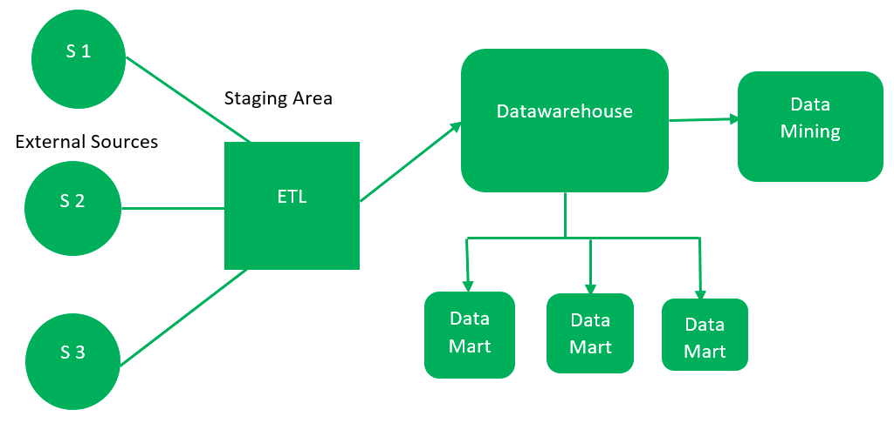

An important thing to understand when working with DeepLynx is how a data warehouse functions. Here is a brief diagram illustrating how most data warehouses are organized. **Note**: Source systems refer to outside systems such as P6 and Aveva Everything 3D.

The DeepLynx program performs all operations illustrated above.

Where DeepLynx is unique is that as part of our ETL pipeline we map the data coming in to a user defined ontology. That ontology allows us to unify all data from all sources under a single schema - which is then stored in a graph like manner.