# Jazz/Doors Next Generation DeepLynx Data Source

In an effort to unify requirement gathering and management, as well as create the ability to more easily organize and attach requirements to actual data, DeepLynx has recently been modified to include a Jazz/Doors Next Generation Data Source. Data Sources are the method by which DeepLynx retrieves or receives data for processing and mapping to a user defined ontology. This new Data Source type, referred to hereafter as "Jazz Data Source" or simply "Jazz Source", allows users to request and retrieve data from Jazz/Doors Next Generation on an interval and map that to an existing ontology. This data source is also the foundation upon which connections between requirements data and other data, such as 3D models, are built on.

## Requirements

In order to function properly each application must meet the following requirements. If you are unsure if your environment meets these requirements, please contact the administrators in charge of deployment and management of Jazz or DeepLynx.

- DeepLynx Version 0.1.2 or greater
- Jazz Authentication Server Version 7.0.2 or greater
- DeepLynx instance must be able to communicate over HTTP to the Jazz/Doors servers – more information can be found in the [Jazz/Doors documentation](https://jazz.net/library/article/1197).

## Initial Setup

In this section we will walk through each step of getting the Jazz Data Source up and running, as well as explain each piece of information you will need to input into DeepLynx. Please note that after you have created a Jazz Data Source, it may be hours before you start to see data flowing into DeepLynx. This is normal, especially for projects with tens of thousands of requirements. If after a few hours you still do not see data flowing into DeepLynx, check your data source for errors (on the Data Sources list screen) or contact your DeepLynx administrator to check and see if something went wrong.

1. Navigate to your instance of DeepLynx. Login and you should see the following screen. 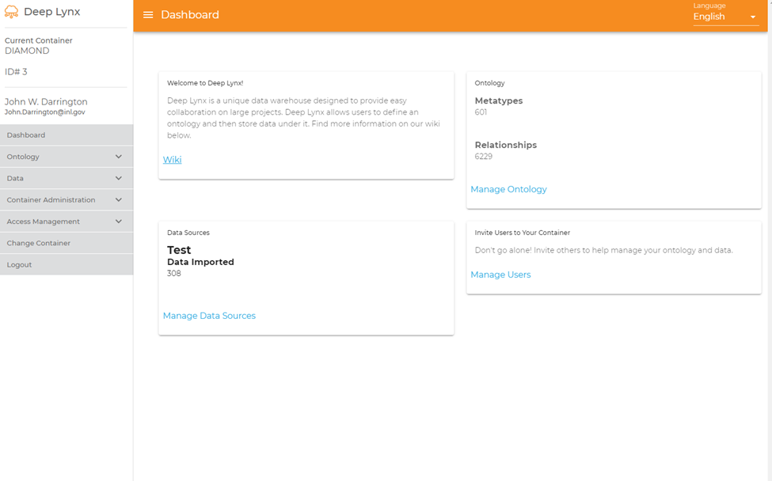
2. Once you have reached this screen, find the section on the right-hand side called &quot;Data&quot;. Click this to reveal a menu like below. 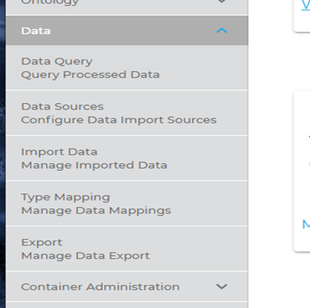
3. Select Data Sources. You should now see the following screen. 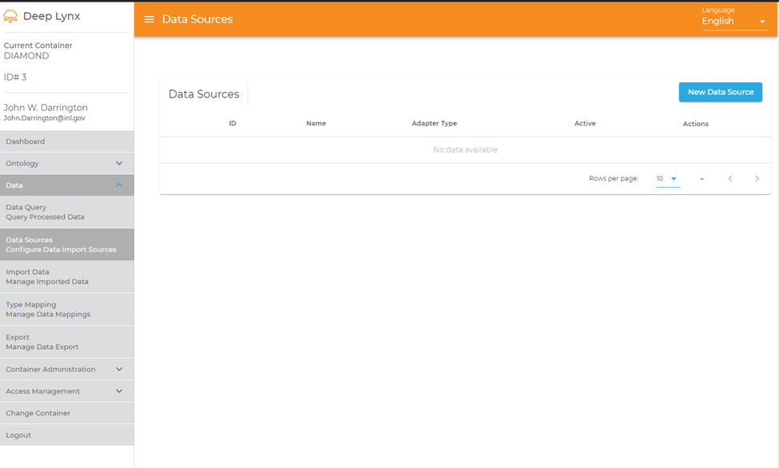
4. Click the button labled &quot;New Data Source&quot; in the upper right hand area. A new dialog box should appear. In that box, enter a memorable name for your source and then select &quot;Jazz&quot; from the drop-down. 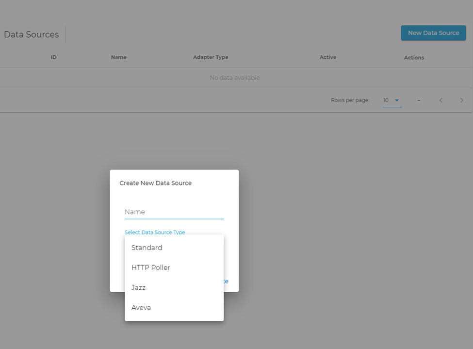
5. You must now fill out each of the new sections in the image below. Please refer to the below section on _Jazz/DNG on Dev Server_ for more info about how to populate the required fields.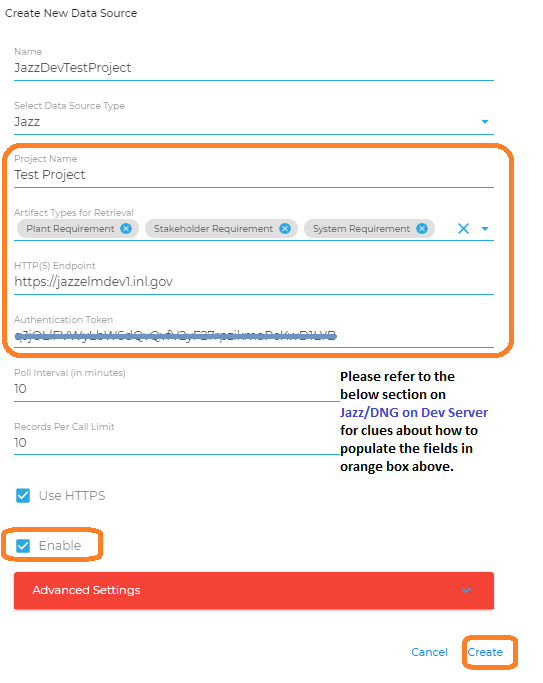

6. **Project Name:** This must be the EXACT name of the project you wish to retreive requirements from. Note that at this time you cannot retrieve requirements from multiple projects at once with a single Data Source. You must instead create a Data Source for each project you wish to pull information from

7. **Artifact Types for Retrieval:** These refer to the types of requirements your project houses. In order to fetch requirements data, you must enter each potential type of requirement here. Hit enter after typing each one. You may find the object types by navigating to the fllowing sections below.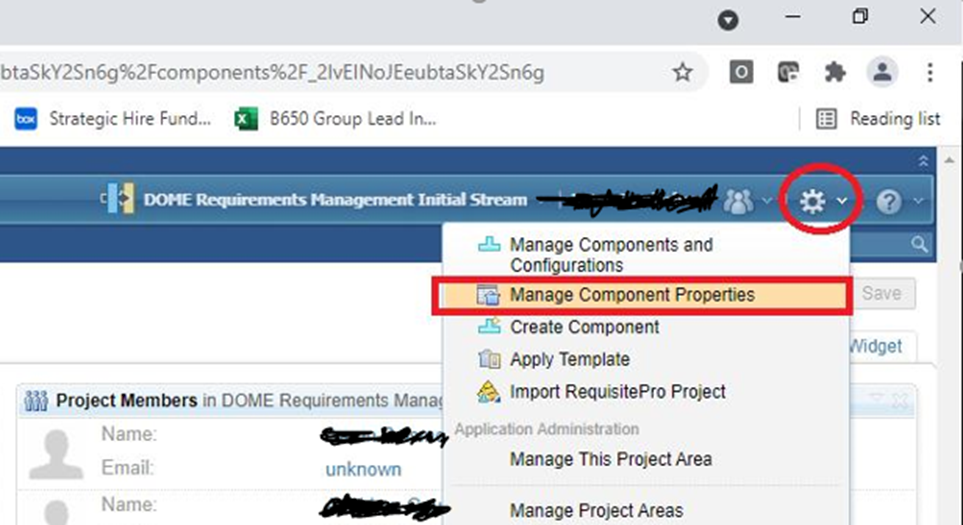

Once there you should see a section on the left-hand side similar to this. 

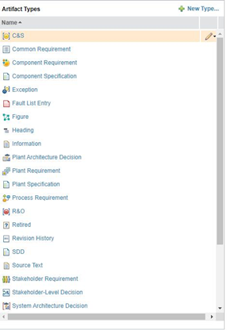 

_Please also refer to the below section on "Jazz/DNG on Dev Server" step 3._

8. **HTTP(S) Endpoint:** The URL for the Jazz server itself. If you do not know this information, contact the administrator in charge of your deployment. Note that this **must not contain a trailing `/`.**
    - For Jazz/DNG Server in dev, use: https://jazzelmdev1.inl.gov
    - For Jazz/DNG Server in prod, use: https://jazz.de.inl.gov
    - _Note:_ Be sure NOT to include any trailing `/`.

9. **Authentication Token:** This is the personal access token you must generate using the Jazz authentication server. You can find more information on how to obtain this information at [this link](https://jazz.net/wiki/bin/view/Deployment/EnableJASAppPasswords).

    - For tokens on Jazz/DNG Server in dev, visit [here](https://jazzelmdev1.inl.gov:9643/oidc/endpoint/jazzop/personalTokenManagement).
    - For tokens on Jazz/DNG Server in prod, visit [here](https://jazz.de.inl.gov/oidc/endpoint/jazzop/personalTokenManagement).
    - For demo, see below section on _Jazz/DNG on Dev Server_.

10. **Poll Interval** : The frequency DeepLynx should query the server for requirements changes in minutes. We recommend at least 10 minutes in order to avoid swamping your server with too frequent of traffic.

11. **Records Per Call Limit:** Jazz requirement data can be rather large, as such we limit how many requirements we fetch per call to the Jazz server. It is recommended you leave this at its default setting of 10.

12. **Use HTTPS** : Uncheck only if your Jazz server is not using HTTPS for its transport protocol. Your administrator in charge of deployment will know more.

13. **Enable:** Check to have DeepLynx immediately start retrieving data from your newly created data source.

## [Jazz/DNG on Dev Server](https://jazzelmdev1.inl.gov/)

1. Log into: https://jazzelmdev1.inl.gov/jts/dashboards/
2. Select the project of interest: _(e.g. "Test Project")_
   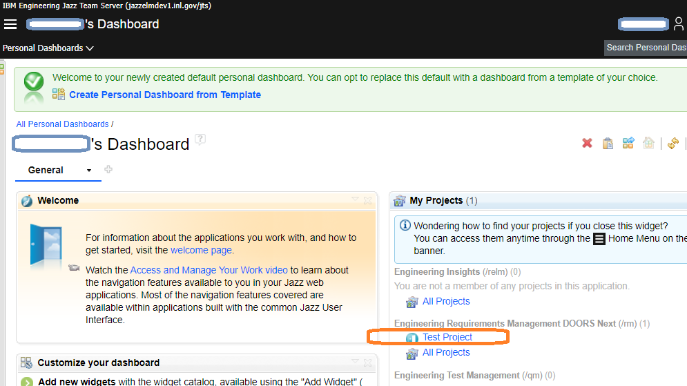

3. Select "_Manage Project Properties_" and click on the "_Artifact Types_" tab to see all available _Artifact Types_ in the currently selected project
   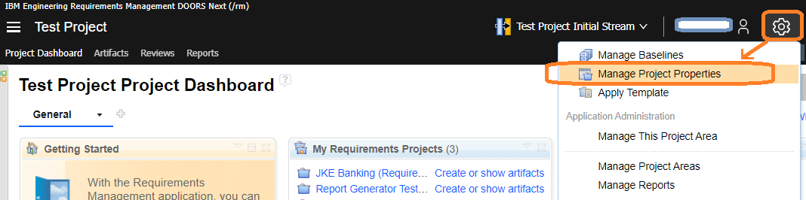
   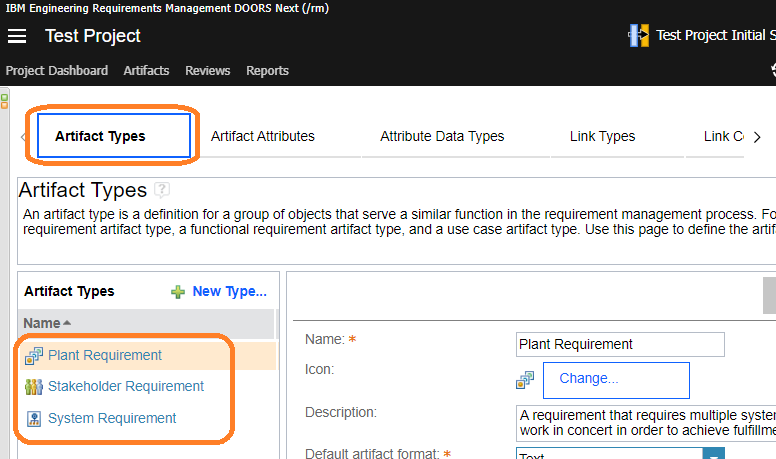

4. Generate/manage tokens on Jazz/DNG dev server

5. log into [this site to get a token](https://jazzelmdev1.inl.gov:9643/oidc/endpoint/jazzop/personalTokenManagement).

6. Click on "_Add New_" and select "_app-token_" to generate an authentication token
   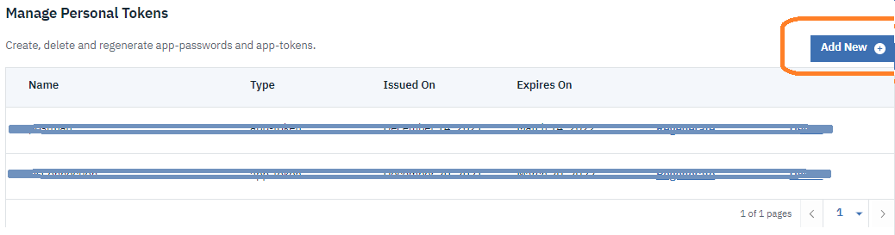
   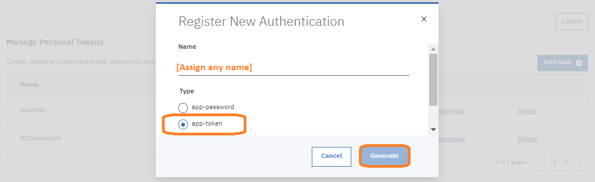

_Note:_ To generate an authentication token on Jazz/DNG in production, [use the link instead](https://jazz.de.inl.gov/oidc/endpoint/jazzop/personalTokenManagement).

## After Creation and Data Received

Once you have successfully created your Jazz Data Source, and data has been received, do not forget to complete the following steps.

1. Navigate to Data -> Type Mapping – this section controls the mapping of your Jazz requirement data to the user-defined ontology stored in your container. 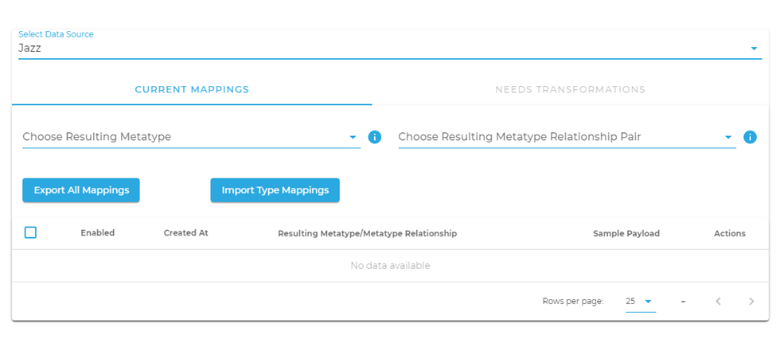)
2. Review any Mappings that require Transformations. Transformations are instructions DeepLynx uses to take your requirements data and change it prior to insertion into the graph-like database. Contact your DeepLynx admin or visit the wiki for more information.
3. Periodically check your Jazz Data Source for errors.