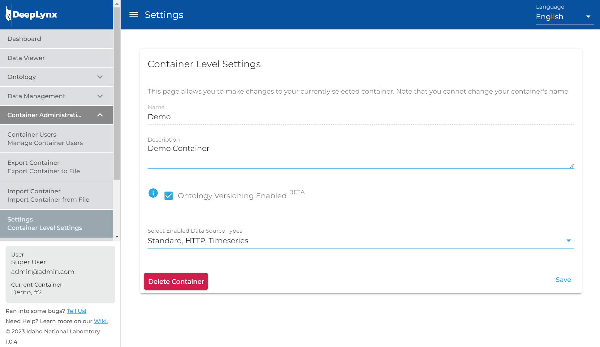
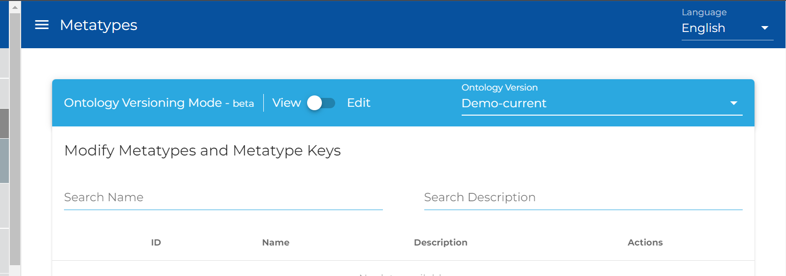
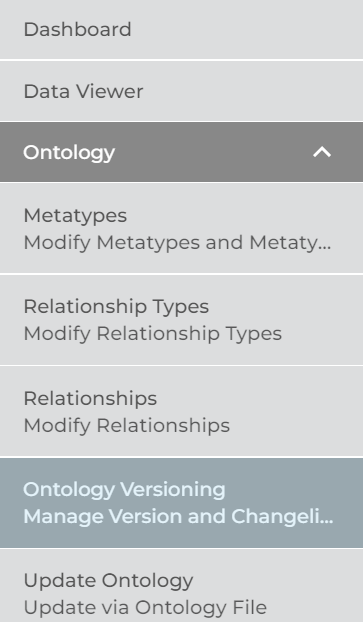
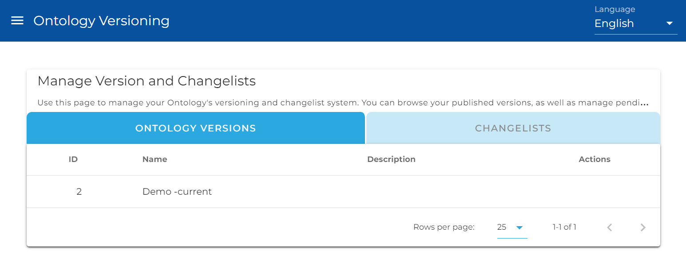
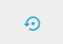
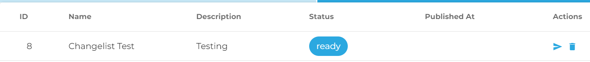
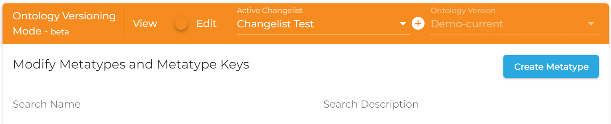

# Ontology Versioning in DeepLynx
## A History
DeepLynx is unique in its ability to store data in graph-like format and under a user-defined ontology. Data has been versioned in DeepLynx since roughly version 0.0.5. Data ingested from sources have their changes tracked and theoretically a user could see what the data looked like at any given point in time. 

However, while data was versioned the ontology it was stored under was not. This led to problems when users might have edited the ontology - removing or requiring new fields for example. These changes would not be tracked and if a user accessed data stored under an old version of a class, they might see deprecated properties, or be lacking required data. There was no way to reprocess data that had come in to fit the new ontology and the type mapping process had to be manually updated to handle changes.

To solve these problems and give users confidence in the accuracy of stored data, versioning was introduced to ontologies stored in DeepLynx. Now when users query data they will always see the class and properties the way they existed when that data was stored. Changes to the ontology are now tracked and managed- and final approval of changes prior to application now falls to the container administrators, not all users. 

This document instructs as to the mechanics behind ontology versioning and how one would use the versioning systems via the included administration web application. 

## Accessing Ontology Versioning
The first step to working with versioned ontologies is to ensure that versioning is enabled for your container. This can be done either at container creation, or via the Container Settings area of the admin web application. See the screenshot below for the exact location (though this may change as the application evolves and this document does not).
 

Once versioning is enabled you will see a few changes. The first is the introduction of a new toolbar above each of the ontology management screens.  This toolbar allows users to toggle between “View Mode” and “Edit Mode” which will be discussed later. This also allows users to browse parts of the ontology from previous versions by selecting which previous version of the ontology they’d like to see on the far right. You’ll also notice that the icons next to entries have all changed to an eye – indicating users can only view the data in the current mode, not edit it.
 

You will also see a new entry on your menu bar to the left. Under Ontology you will find a new section titled “Ontology Versioning” or something similar. The next section deals with the page that you will navigate to upon clicking this menu item.
 

## Ontology Version Management and Changelists
Upon navigating to the new Ontology Versioning section of DeepLynx you should be greeted by the following screen.
 

The Ontology Versioning section consists of two main parts, a list of ontology versions and a list of changelists. Each section allows you to perform certain actions on a changelist or ontology version - if you are authorized to do so. Because explaining each section requires you to know exactly what a changelist and ontology version are, we will now provide definitions for each.

**Ontology Version:** An ontology version is a collection of Classes and their properties, Relationship Types and their properties, and the relationships between classes. Users are unable to edit an existing ontology version.

**Changelist:** A changelist is also a collection of Classes and their properties, Relationship Types and their properties, and the relationships between classes. However, a changelist represents an ontology version that has not yet been approved or applied. Users are free to make any changes they see fit to a changelist prior to sending it out for approval.

### Ontology Versions Section
The Ontology Versions section consists of a simple list of the current and previously published ontology versions. This page allows users to see all versions immediately, or quickly start the rollback process. 

#### Rollback Process
The rollback process for an ontology version is rather simple. Users find the ontology version they would like to return to and select this icon on its entry in the table.

 
Keep in mind that this does not immediately rollback the ontology, rather this creates a changelist that would restore the current ontology version (no matter what it is) to the selected version. This changelist must still go through the same process of approval as all other changelists.
**Note**: Users can browse the actual items in an ontology version by selecting it from the ontology version bar above each of the ontology management portions of DeepLynx. This is explained above and a screenshot has been provided.

### Changelists Section
The Changelists section is more complicated than the Ontology Versions and contains more potential actions to be completed. For the following explanations, please refer to this screenshot of a single entry in the changelist table.
 

**Note**: Unless you are a container administrator, you will only ever see and be able to edit changelists you have created. You will also be unable to approve or reject your own changelist once you’ve sent it to the container administrator for approval. You will, however, be able to apply your changelist once it has been approved.

You will note that this entry has more information than the ontology version, namely the addition of actions and a Status entry.The status entry reflects the current state of the changelist and could be any of the following: `generating`, `ready`, `rejected`, `approved`, `pending`, `published`.

The actions list should be self-explanatory, but if you hover over an icon a help icon should pop up indicating what action that the icon represents. As a non-administrator you will have the ability to send your changelist for approval and apply it after approval. As an administrator you will have the ability to perform all actions on a changelist.

## Editing a Changelist
Once you’ve decided to make changes to the existing ontology you must first select the current ontology and switch to “Edit Mode” using the ontology versioning toolbar on any of the ontology management pages.
 

Once you’ve entered Edit Mode you will need to create a new Changelist. You do that by clicking the plus symbol next to the Active Changelist list. This will generate a changelist based on the current ontology. 

Note: This process can take upwards of five minutes to complete if your ontology is a large or very interconnected one. Changelists in the process of being generated will have the status of “generating” and will not show up in the dropdown for editing. 

Once your changelist has been generated and you’ve selected it, you shouldn’t see any obvious changes apart from the action icon changing from an eye to a pencil and trashcan. This indicates that you can now edit the entries as you see fit. Color coding on the entry itself will indicate whether or not that entry will be created, has been edited, or will be deleted when compared to the current ontology. Side by side view also exist for those entries which have matching counterparts in the existing ontology.
 

## Conclusion
As of version 0.2.0 DeepLynx will have Ontology Versioning as a possible feature for all new and previously created containers. This will allow users to more easily manage their ontology and maintain a historical record of changes without affecting the data that has been stored previously or will be stored in the future. 