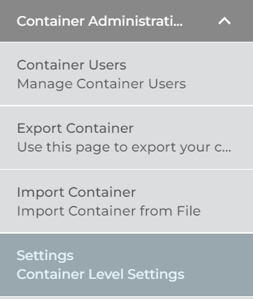
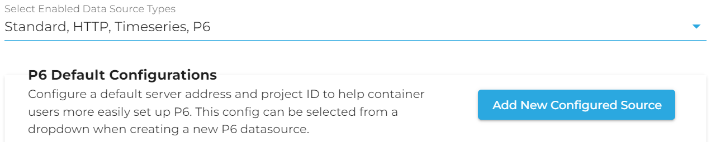
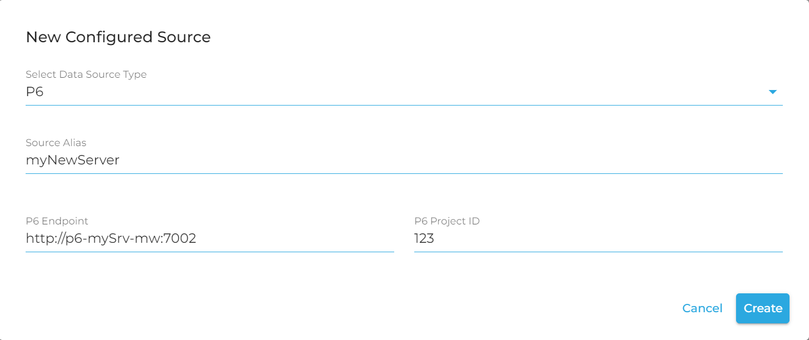
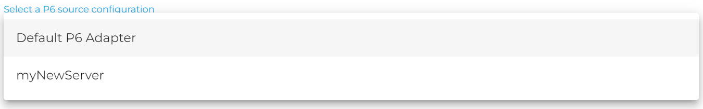
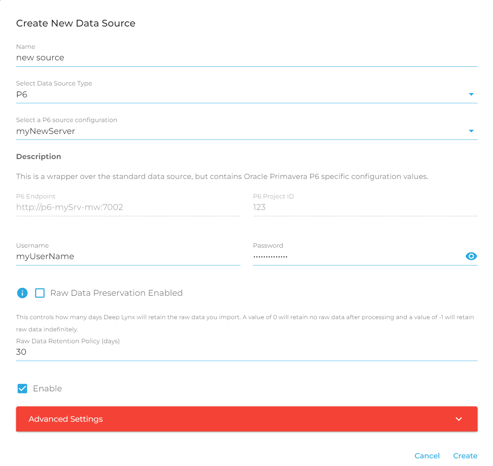

# P6 Adapter Data Source

The P6 adapter is designed to facilitate interaction between DeepLynx and Oracle's P6 Primavera P6. Its purpose is to import P6 scheduling data into DeepLynx. To learn more about the P6 adapter, check out the readme [here](https://github.inl.gov/Digital-Engineering/p6_deeplynx_adapter#p6-deep-lynx-adapter). This article will cover setting up a P6 data source in DeepLynx.

### Configured P6 Sources

You may encounter scenarios in which you want several different connections to the same server but different projects on that server, or you may want to have different data sources connecting to different servers. For ease of access on the user's part, container administrators can create pre-configured sources which auto-fill the P6 endpoint and project ID. In order to create a preconfigured source, follow these steps:

1. Navigate to the "Settings" tab under "Container Administration" in the GUI sidebar
<!--  --> <!-- This is the dark mode screenshot -->
 

2. Select "P6" from the "Enabled Data Source Types" dropdown. You should see a this table pop up:
<!--  --> <!-- This is the dark mode screenshot -->
 

3. Click "Add New Configured Source" and choose "P6" as the data source type. 
<!--  --> <!-- This is the dark mode screenshot -->
 

4. Enter an alias for the configured source. This is the name that will appear when you create a new data source using this config. Enter an endpoint and a project ID, then click "Create".

Once your configuration is created, you can use it to create a new P6 data source as explained in the next section.

### Creating a P6 data source

1. Navigate to Data -> Data Sources. In the upper left-hand corner select the button that says "New Data Source"
2. Name your source and select "P6" as the source type
3. **(optional)** Choose a configured source from the drop down. If at any time during source creation you change your mind, you can select "Default P6 adapter" and restore the default (blank) options.
<!--  --> <!-- This is the dark mode screenshot -->
 

4. Fill in P6 endpoint, projectID, username and password. The username and password should be credentials that can access the P6 server and project specified.
<!--  --> <!-- This is the dark mode screenshot -->
 

5. Enable the data source to start receiving data from the P6 adapter.
6. Click "Create"

### Handling P6 Imports

Once enabled, the P6 data source will _automatically_ begin receiving data from the P6 adapter. No user intervention is required apart from enabling and disabling the data source.

Each adapter cycle, data will be sent to the source. You can check for new imports on the "Imports" tab. Once you have at least one import, you can [create type mappings to map the data](https://github.com/idaholab/Deep-Lynx/wiki/Type-Mapping). Once your type mappings are all created and enabled, data flowing to the source will be translated into nodes and edges. You can see view this data from the "graph" tab.