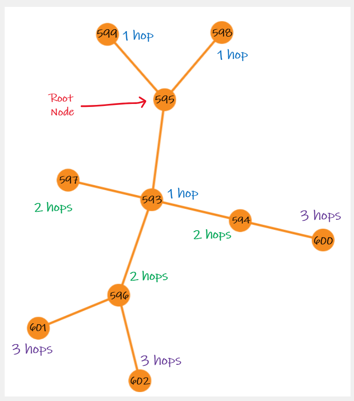

# Using GraphQL to query DeepLynx

DeepLynx ships with the ability to query data that you have ingested in previous steps. This capability is still actively under construction, so if you don't see a needed feature in this write up please reach out to the development team to discuss its absence and whether the feature could be something you add. 

 

This guide assumes basic knowledge of querying using GraphQL. You can find a good tutorial and write-up here - https://graphql.org/learn/. You should pay particular attention to how queries are built, how GraphQL returns only the data you explicitly request, and any documentation specific to the language you hope to use to interact with this functionality.  

#### **Please note that there may be whitespace parsing issues if copying these example queries directly into your API client. It is recommended that you type out the example queries if possible and save them for further use. Comments are also blocked from actual queries so please remove any comments before sending. **
 

## Dynamic GraphQL Schema 

 

In GraphQL, schema is generally defined prior to running the application. The schema determines what kinds of queries can be made, how they're structured, and what functions they access in the program to populate the users results. The first iteration of this functionality followed this pattern, but we found the system to be unwieldy and hard to understand. Instead, DeepLynx dynamically generates a schema each time you interact with the GraphQL endpoint for a given container. When you first start up an instance of DeepLynx, the first GraphQL query sent may take a few seconds due to this schema generation. However, after the first query the schema generation is cached for much faster response times.

 

Currently, the generated schema’s types map 1:1 to a Class in the container you are querying. So for example if your ontology had the Car, Maintenance, and Entry Classes – your GraphQL Schema would also have a type for Car, Maintenance, and Entry. These types are used for querying nodes with these specific Classes. More information on how to accomplish these queries can be found in the next major section. 

 

## Introspection 

You can use introspection at any time to get a complete list of all potential types, and other information, at any time. This is useful as your schema might be different from another user’s based on the container you are querying. This is also helpful because we must perform a slight conversion on your Class names to make them work with GraphQL – and introspection allows you to see exactly how we might have named your custom Class. 

 

Much like normal queries, you would POST your introspection GraphQL query to `{{yourURL}}/containers/{{containerID}}/data` - and much like normal queries, your POST body should be a JSON body with the following two fields - `query` and `variables`. `query` is an escaped string containing your GraphQL query. `variables` is a JSON object containing any variables which were included in your query.  

 

More information on formatting a query can be found here - https://graphql.org/learn/serving-over-http/. 

 

Here is an example introspective query - this one simply returns a list of all possible GraphQL types by name. 

 

``` 
{ 
  __schema { 
    types { 
      name 
    } 
  } 
} 
``` 

 

**Note:** Not all types that are returned by this query are Classes. Some might be native GraphQL types, or enumerable types needed by a Class. With the updated query layer, there will also be the wrapper types `metatypes` (for classes), `relationships`, and `graph_type`, as well as a type for each relationship in the ontology. When in doubt, refer back to the container’s ontology to differentiate between what’s a standard GraphQL type, what's a relationship, and what’s a Class. 

 

 

## Writing Queries 

**Please keep in mind that this is actively under construction, meaning things may change slightly and new features may be added. We will endeavor to keep this guide up to date, but if in doubt please contact the development team.** 

 

Currently (3/25/22), there are three categories in which a user can query in GraphQL. Theses are `metatypes`, in which you can request all nodes of a certain class, `relationships`, in which you can request all edges of a certain relationship, and `graph`, in which you can specify a "root node" and "depth" and get all node-edge-node objects in the graph structure that are `n` layers away from the root (where `n` is the depth specified).

Using a different endpoint, users may also query timeseries data using GraphQL. For more information, please visit [this article](Timeseries-Data-Sources#via-the-rest-api).

We will not spend a large amount of this guide on *how* to make a GraphQL request. We feel this topic is covered well in other guides, as well as the [official documentation]( https://graphql.org/learn/serving-over-http/). We follow all standard practices in how a GraphQL query is structured as a JSON object for POSTing to an HTTP endpoint. This guide also assumes that while we display a GraphQL query in its object form, it must be encoded as a string and included in a JSON object as the `query` property.  

 

The **most important thing** to remember is that the endpoint to which you send all GraphQL queries (via HTTP POST request) is the following: 

 

`{{yourURL}}/containers/{{yourContainerID}}/data`  

## Querying Classes

### Querying for Nodes based on Class 

The primary objective of querying `metatypes` is to allow a user to swiftly retrieve a list of all nodes of a given Class and which match a set of filters based on that Class’s properties.  

 

The following steps will demonstrate how a user might query and receive nodes of the Requirement type.  

 

A user must know the name of the GraphQL type for “Requirement”. This is done most easily by running the introspective query listed earlier in this page and searching for a type by, or close to, that name. In this case the name of the GraphQL type should be the exact same – “Requirement”. **Note: Class names that consist of more than one word will have their spaces replaced by the `_` character. So “Maintenance Entry” would become “`Maintenance_Entry`” in the GraphQL schema. A class whose name starts with a number will have `_` prepended to its name. So “1 Maintenance” would become “`_1_Maintenance`”.**  

 

**Optional** - Just like on the main GraphQL schema, you can run an introspective query on the “Requirement” type to see what fields may exist for you to request and query against. The following query illustrates how to accomplish this.  The fields returned from this query represent all valid fields upon which you can filter or request, as well as their datatypes.

``` 
{ 
    __type(name:"Requirement"){
        name
        fields{
            name
            type{
                name
                kind
            }
        }
    }
}
``` 

You might see the following response (explanation of fields are in comments next to fields) 

``` 
{ 
    "data": { 
        "__type": { 
            "name": "Requirement", # represents which Class you queried 
            "fields": [ 
                { 
                    "name": "_record", # this is a special object which 
                    "type": {          # contains metadata about the object  
                        "name": "recordInfo", 
                        "kind": "OBJECT" 
                    } 
                }, 
                { 
                    "name": "type", # name of the field itself
                    "type": { # datatype of the field
                        "name": "String",  
                        "kind": "SCALAR" 
                    } 
                }, 
                { 
                    "name": "active", 
                    "type": { 
                        "name": "Boolean", 
                        "kind": "SCALAR" 
                    } 
                }, 
                { 
                    "name": "id", 
                    "type": { 
                        "name": "Float", 
                        "kind": "SCALAR" 
                    } 
                } 
            ] 
        } 
    } 
} 
``` 

We can further interrogate the `_record` objects (and any other fields of the kind `OBJECT`) using another introspective query based on the type name of these objects:

```
{ 
    __type(
        name: "recordInfo"  #name field of "_record" type above
    ){ 
        fields{
            name
            type{
                name
            }
        }
    }
} 
```

This will allow us to see which sub-fields may be queried in these `OBJECT`-typed fields.

### Valid Class Field Names

The Class field names generally map directly to your Class's properties. However, in this case, the names are taken from the Class Property’s "property name" field, not the name of the Class Property itself. So, in this case, the Requirement Class has a field named “Active” and that field's property name is “active” – thus “active” is what you would use to request that field in the return object.

 

Once a user knows the Class they’re querying for and the possible fields, they can then craft the query. Remember that GraphQL **only returns the data you explicitly request**. This means that if you leave a field off your request, the return value will also omit this field. 

 

The query below will request **all** possible fields for the “Requirement” Class – comments next to the query help explain each part. 
**NOTE: there is an extra `metatypes` wrapper around this query as compared to the original query structure. Adding this layer around your Class queries will specify to GraphQL that you are searching on class (known as metatype in graphQL) and not class relationship.**

```
# NOTE THAT COMMENTS ARE BLOCKED FROM QUERYING PROD. PLEASE REMOVE COMMENTS.
{
    metatypes{ # specify that we are querying classes (aka metatypes)
        Requirement { # name of the class being queried for
            type   # these fields map to the Class's properties and 
            id     # match those returned from the introspective query 
            name
            _record { # special object with metadata about the node
                id    # itself, such as its DeepLynx id, etc 
                data_source_id 
                original_id 
                import_id 
                metatype_id     # class ID
                metatype_name   # class name
                created_at 
                created_by 
                modified_at 
                modified_by 
                metadata 
            }
        }
    }
}
```

### Filtering Results 

There are many cases where, instead of simply listing all the instances of a given class, the user will want to filter their results to meet certain criteria. Filtering is easily broken down by fields, with the argument as an object as follows

```
{
    metatypes{ // classes are known as metatypes in graphQL
        Requirement(name: {operator: "eq", value :"M21 - Total Cesium Loading"}){
            id
            name
            type
            basis
        }
    }
}
```

This query would return all requirements with the specified name from DeepLynx, as well as their id, type, and basis.

#### Using Operators

The object portion of the query actually consists of two parts: a search operator, and the data to search on. The search operators are as follows:

| Operator | Description | Returns | Example |
| -------- | ----------- | ------- | ------- |
| `eq` | Equals or equal to. This is the implicit behavior. | All nodes with specified fields matching the expression | (name: "eq M21 - Total Cesium Loading") |
| `neq` | Non-equal or not equal to. | All nodes except those with specified fields matching the expression | (name: "neq M21 - Total Cesium Loading")
| `like` | Matches results against a passed-in pattern. Uses wildcard `%` for any number of characters and `_` to match 1 character. Wildcard behavior mimics that of [Postgres](https://www.postgresql.org/docs/9.3/functions-matching.html). | All nodes whose specified fields match the given pattern | (name: "like %M21%") searches for "M21" anywhere in the name |
| `in` | Matches one result from an array of options. | All nodes whose specified fields match one option in the array | (id: "in 179,306") |
| `>`, `<` | Check if a numerical field is less than or greater than a certain value. **Please note that >= and <= are not currently supported.** | All nodes whose specified fields are greater than or less than the given value | (id: "> 200") |

#### Filtering on Multiple Fields

There will likely be situations in which you want to filter on multiple fields within a class. This is also possible through GraphQL. To filter on multiple fields, simply separate the fields with whitespace like so:

```
{
    metatypes{ // classes are known as metatypes in graphQL
        Requirement(
            id: {operator: ">" value:"200"}
            name: {operator: "like" value: "%M21%"}
        ){
            id
            name
            type
            basis
        }
    }
}
```

This query would return all requirements whose id matches the condition "> 200" and whose name contains the string "M21". This behavior mimics that of an AND conjunction. Support for OR is not currently available.

### Filtering on Record Information

As was covered in a previous section, each node of a certain class will contain metadata about the node record as stored in the `_record` field:

```
# NOTE THAT COMMENTS ARE BLOCKED FROM QUERYING PROD. PLEASE REMOVE COMMENTS.
{ 
    metatypes{ // classes are known as metatypes in graphQL
        Requirement { 
            _record { # contains metadata about the node
                id    # itself, such as its DeepLynx id, etc 
                data_source_id 
                original_id 
                import_id 
                metatype_id     # class ID
                metatype_name   # class name
                created_at 
                created_by 
                modified_at 
                modified_by 
                metadata
            } 
        } 
    }
} 
```

This data will be returned according to what was requested, just like other fields in GraphQL syntax. There are a few sub-fields within this record information which can be queried on. They are: `id`, `data_source_id`, `original_id`, `import_id`, `page`, and `limit`.

To query on a sub-property of `_record`, the syntax is as follows:

```
{
    metatypes{ // classes are known as metatypes in graphQL
        Requirement(
            _record: {id: {operator: ">", value:"200"}}
        ){
            _record{
                data_source_id
                original_id
                import_id
            }
            name
            type
        }
    }
}
```

The main difference here is that, because `_record` is an Object, its sub-properties are queried using an additional set of curly braces (`{}`) to specify the sub-field. You can also query for multiple sub-fields just like with a normal query:

```
{
    metatypes{ // classes are known as metatypes in graphQL
        Requirement(
            _record: {
                id: {operator:">" value: "200"} 
                data_source_id: { operator: "eq" , value :"2"}
            }
        ){
            ... <fields>
        }
    }
}
```

### Limiting returned records

You may use the `_record: { limit: n }` filter to limit the number of results that are returned from your query. This works for both graph data and timeseries data. Here is an example: 

```
{
    metatypes{ // classes are known as metatypes in graphQL
        Requirement(
            _record: {
                limit: 10
            }
        ){
            id
            name
        }
    }
}
```

This query would return only 10 requirements with their id and name.

### Querying on Edges

To query all nodes with a certain relationship to other Classes, you can use the `_relationship` object in your filter parameters. The syntax is as follows:

```
metatypes{ // classes are known as metatypes in graphQL
    <Class Name>(
        _relationship: {
            <relationship name>: {
                <Destination Name>: true
            }
        }
    )
}
```
Any nodes without the specified relationship type will not be returned. For example, given this list of `Trigger` nodes:

```
{
    "data": {
        "metatypes": {
            "Trigger": [
                {
                    "id": "123",
                    "name": "Asset Trigger"
                },
                {
                    "id": "456",
                    "name": "Non-Asset Trigger"
                }
            ]
        }
    }
}
```
Then the following query would return only the asset trigger:

```
{
    metatypes{ // classes are known as metatypes in graphQL
        Trigger(
            _relationship: {
                references: {
                    Asset: true
                }
            }
        ){
            id
            name
        }
    }
}


==================RESULTS==================
{
    "data": {
        "metatypes": {
            "Trigger": [
                {
                    "id": "123",
                    "name": "Asset Trigger"
                }
            ]
        }
    }
}
```

### Edge Introspection

Upon introspection of a class, you can see that there is a _relationship object with its own special type, following the naming convention `<ClassName>_relationshipInfo`. This type contains information about which possible relationships can be included in an edge filter.

```
...
{
    "name": "_relationship",
    "type": {
        "name": "Trigger_relationshipInfo"
    }
},
...
```
To see the possible relationships, you can perform an introspective query as follows:

```
__type(name:"Trigger_relationshipInfo"){
    name
    fields{
        name
        type{
            name
        }
    }
}
```
This will return the possible relationships for that class:

```
...
{
    "name": "generatedBy",
    "type": {
        "name": "Trigger_destinationInfo"
    }
},
{
    "name": "child_of",
    "type": {
        "name": "Trigger_destinationInfo"
    }
},
...
```
Each `<ClassName>_destinationInfo` object can be further interrogated to see the possible destination classes:
```
__type(name:"Trigger_destinationInfo"){
    name
    fields{
        name
    }
}
```

This will return all possible class destinations:
```
...
{
    "name": "Alarm",
    "type": {
        "name": "String"
    }
},
{
    "name": "DataItem",
    "type": {
        "name": "String"
    }
},
{
    "name": "Asset",
    "type": {
        "name": "String"
    }
},
...
```

## Querying Relationships

Much like DeepLynx has the ability to query nodes based on Class with the `metatypes` wrapper, it also now supports the ability to query edges based on Relationship with the `relationships` wrapper. This will not be explained in great detail, since the conventions for this facet of querying are nearly identical to querying on a class. For example, to see all edges of the relationship `references`, you could execute the following query:

```
{
    relationships{
        references{
            _record{
                id
                relationship_name
                origin_id
                destination_id
            }
        }
    }
}
``` 
This would return the edge id, origin, and destination along with the relationship name for only edges of the relationship type `references`.

To run an introspective query on `_record` information for a relationship, you can look at the `edge_recordInfo` type:
```
{
    __type(name:"references"){
        fields{
            name
            type{
                name
            }
        }
    }
}
```

## Querying Graphs

The `graph` wrapper allows users to query the graph-like structure of DeepLynx with nodes and edges combined. Each edge has two nodes on either side of it, and these node-edge-node pairs can branch out in complex structures. In order to return this structure and filter through it, there must be a root node and depth specified. From this root node span any number of node-edge-node pairs, and for `n` levels of depth, `n` hops away from the root will also be returned. As this is a somewhat complex scenario to explain textually, see the diagram below for an example of a root node with id `595` and a depth of `3`:



In order to return the data of this graph-like structure, queries can be executed with the following syntax:

```
# NOTE THAT COMMENTS ARE BLOCKED FROM QUERYING PROD. PLEASE REMOVE COMMENTS.
{
    graph(  # the filters below are required for the graph query
        root_node: "595"    # the id of the root node
        depth: "3"          # number of layers deep to recursively search on
    ){
        ... fields
    }
}
```
### Introspection to Return Graph Fields

In order to introspectively discover the possible fields for return, you can query on the `graph_type` object as follows:

```
{
    __type(name: "graph_type"){
        fields{
            name
        }
    }
}
```
The following unique fields can be queried on for origin, edge and node (put into a query here for convenience):
```
# NOTE THAT COMMENTS ARE BLOCKED FROM QUERYING PROD. PLEASE REMOVE COMMENTS.
{
    graph(  # the filters below are required for the graph query
        root_node: "595"    # the id of the root node
        depth: "3"          # number of layers deep to recursively search on
    ){
        # reflect properties of Classes/Relationships
        origin_properties           
        edge_properties             
        destination_properties      

        # origin information
        origin_id
        origin_metatype_id          # origin class ID
        origin_metatype_name        # origin class name

        # edge information
        edge_id
        relationship_pair_id        # relationship (class-type-class) id 
        relationship_id             # relationship type id
        relationship_name           # relationship type name


        # destination information
        destination_id
        destination_metatype_id     # destination class ID
        destination_metatype_name   # destination class name

        # graph metadata
        depth               # number of layers removed from origin node
        path                # path of nodes to get to destination id
    }
}
```
This metadata can also be searched on for each (`<name>` can contain `origin`, `destination` or `node`)
```
<name>_data_source
<name>_metadata
<name>_created_by
<name>_created_at
<name>_modified_by
<name>_modified_at
```

### Example Query

Putting this all together, the following query could be made:
```
{
    graph(
        root_node: "595"
        depth: "3"
    ){
        depth
        origin_id
        origin_metatype_name        # origin class name
        edge_id
        edge_relationship_name
        destination_id
        destination_metatype_name   # destination class name
    }
}
```
This would return basic information regarding ID and Class/Relationship for each node 3 layers deep in the structure:
```
{
    "data": {
        "graph": [
            {
                "depth": 1,
                "origin_id": "595",
                "origin_metatype_name": "Material",
                "edge_id": "3",
                "edge_relationship_name": "inheritance",
                "destination_id": "593",
                "destination_metatype_name": "Asset"
            },
            ...
            {
                "depth": 2,
                "origin_id": "593",
                "origin_metatype_name": "Asset",
                "edge_id": "1",
                "edge_relationship_name": "references",
                "destination_id": "594",
                "destination_metatype_name": "Trigger"
            },
            ...
        ]
    }
}
```
Notice that the sample object with a depth of 2 has its `origin_id` as 593, which is the `destination_id` of the depth 1 object.

### Filtering on Class or Relationship

In order to whittle down results to match only a specified Class or Relationship, filters have been provided on Class Name/ID and Relationship Name/ID as follows:
```
# NOTE THAT COMMENTS ARE BLOCKED FROM QUERYING PROD. PLEASE REMOVE COMMENTS.
{
    graph(
        root_node: "595"
        node_type: {        # filter nodes by class
            name: "Asset"   # could use id:"class ID" instead
        }
        edge_type: {        # filter edges by relationship
            id: "777"       # could use name:"relationship name" instead
        }
        depth: "3"
    ){
        depth
        origin_id
        origin_metatype_name        # origin class name
        edge_id
        edge_relationship_id
        edge_relationship_name
        destination_id
        destination_metatype_name   # destination class name
    }
}
```
This would return only records that contain both an `Asset` class and the `inheritance` relationship:
```
{
    "data": {
        "graph": [
            {
                "depth": 1,
                "origin_id": "595",
                "origin_metatype_name": "Material",
                "edge_id": "3",
                "edge_relationship_id": "777",
                "edge_relationship_name": "inheritance",
                "destination_id": "593",
                "destination_metatype_name": "Asset"
            },
            {
                "depth": 2,
                "origin_id": "593",
                "origin_metatype_name": "Asset",
                "edge_id": "4",
                "edge_relationship_id": "777",
                "edge_relationship_name": "inheritance",
                "destination_id": "597",
                "destination_metatype_name": "Component"
            }
        ]
    }
}
```
Note that `Asset` can be either the origin or the destination. If you want to search for a class in only the origin or destination position, simply search for `<location>_<property>` where location can be `origin` or `destination` and property is `id` or `name`. For example, to search only for relationships where Asset is the `destination`(outer node), you could type:
```
{
    graph(
        root_node: "595"
        node_type: {       
            destination_name: "Asset"   # could also be destination_id
        }
        edge_type: {
            name: "inheritance"
        }
        depth: "3"
    ){
        depth
        origin_id
        origin_metatype_name        # origin class name
        edge_id
        edge_relationship_name
        destination_id
        destination_metatype_name   # destination class name
    }
}
```
This would return the following object where `Asset` is the destination class while filtering out any nodes with `Asset` as the origin.
```
{
    "data": {
        "graph": [
            {
                "depth": 1,
                "origin_id": "595",
                "origin_metatype_name": "Material",
                "edge_id": "3",
                "edge_relationship_name": "inheritance",
                "destination_id": "593",
                "destination_metatype_name": "Asset"
            }
        ]
    }
}
```

## Querying Timeseries Data

For more information on querying timeseries data, check out the [Timeseries Data Sources](https://gitlab.software.inl.gov/b650/Deep-Lynx/-/wikis/Timeseries-Data-Sources#via-the-rest-api) resource from the wiki.