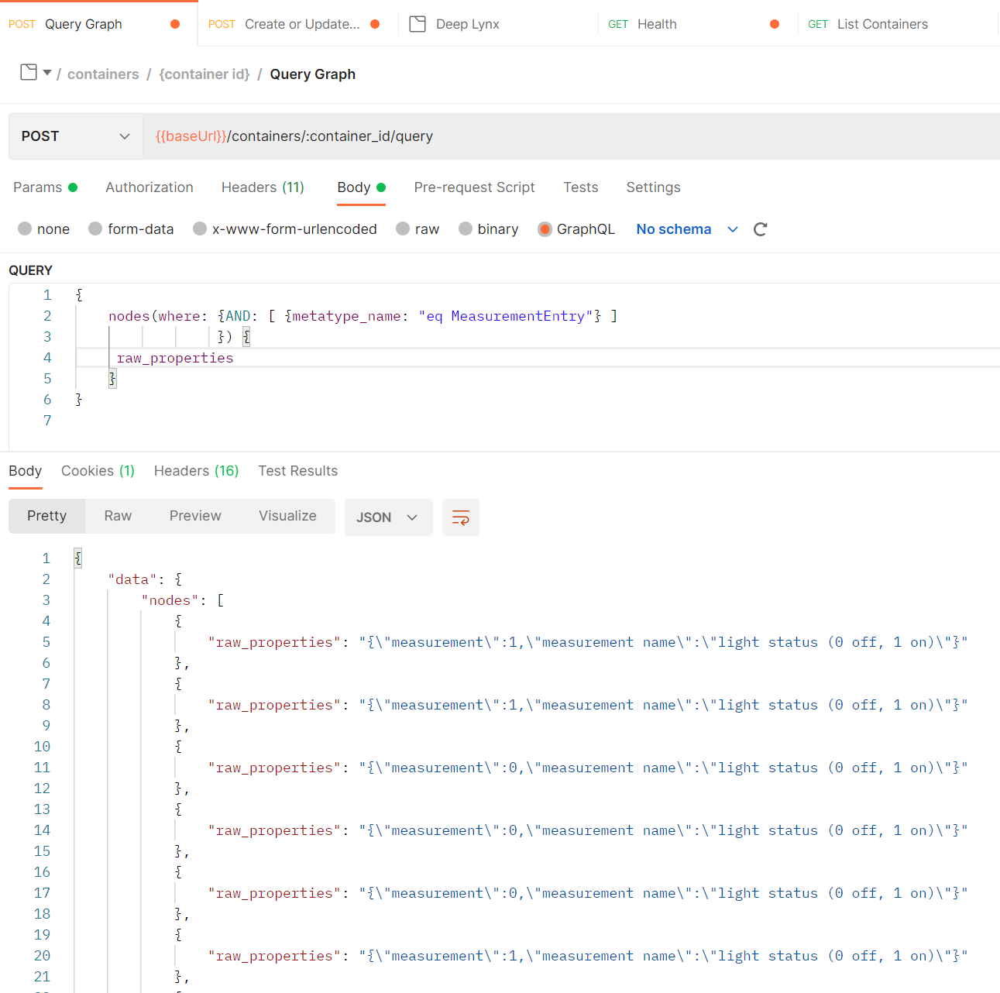
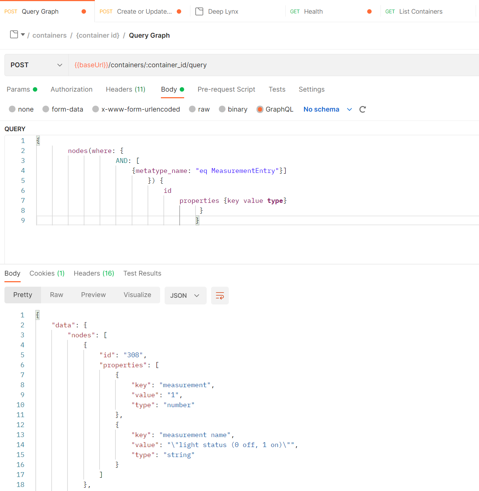

## Querying **LEGACY**

This article contains information referring to the legacy method of querying data. While this option is still available, we **highly** recomend instead using the newer method [found here](Querying-Data-with-GraphQL).

Querying data from DeepLynx is possible through the use of a GraphQL enabled endpoint. Using GraphQL a user can retrieve nodes, walk the graph, and query data based on different requirements. In order to facilitate easy querying, we've listed a few general queries, and the general method by which data is retrieved from DeepLynx. Please query the endpoint for information on what fields are available on what types. Since those might change frequently we will not take time here to illustrate any of the fields unless they accept arguments or are unique in the response they send.

<br>

#### _Note on Manual Querying_
When querying the GraphQL enabled endpoint manually, using tools such as Postman or cURL, your "query" must be wrapped in a json payload. The payload must have a parameter named "query" who's value is an escaped string representing your GraphQL query. Most tools do this formatting automatically, but so you can see how this would be done if you had to do it all by hand, here's an example.

```
{
  query: "{\r\n nodes {\r\n id\r\n }\r\n}"
}
```

While you _could_ send a raw body of text you must ensure that the content type is not set to `application/json` or `application/graphql` if you expect this to work correctly.


#### Fetching nodes or an individual node
______
```
// list by single node id
{
    nodes(nodeID: "id") {
     {list set of properties desired to retrieve} 
     outgoing_edges - incoming edge connections, can query deeper to fetch the actual nodes as well
     incoming_edges - outoing ege connections, can query deeper to fetch the actual nodes as well
    }
}

// list by group of ids, notice how we have to use the "where" filter parameter
{
    nodes(where: {AND: [ {id: "in id1,id2,id3"} ] }) {
     {list set of properties desired to retrieve} 
    }
}
```

#### Fetching nodes with filter
Filter queries are accomplished by passing in a filter object to the `parameter` on supported queries. The filter object consists of two properties, AND and OR. AND and OR should be an array of filter objects, the shape of that object dependent on the query you're currently attempting to filter. See the schema or query it dynamically to find out which input types are acceptable for any given situation.

Note that the follow operators are acceptable on fetching with a filter

| Operator | Description|
| ------- | ------ |
| `eq` | equals or equal to|
| `neq` | non-equals or not equal to|
| `like` | matches results against a passed in pattern. This pattern matching mimics Postgres's pattern matching.
| `in` | provided with an enumerable such as an array, or a comma separated string, match all results from passed in value|


Here are a few examples of using the filter type for the nodes resolver. Apart from this resolver, you can pass in a `where` filter on the `incoming_edges, outgoing_edges` fields of the return from the node query. 
______
```
// filter by class name/id - note that classes are known as metatypes in graphQL
{
    nodes(where: {AND: [ {metatype_name: "eq name"} ]
                  OR:  [ {metatype_id: "eq id"} ] }) {
     {list set of properties desired to retrieve} 
    }
}


```
<p>
<details>

<summary>Raw Properties Example: </summary>



</details>

</p>


<p>
<details>
<summary>Properties Example: </summary>



</details>

</p>

```
// filter by properties - slightly complex as it deals with a properties object
{
    nodes(where: {
        AND: [
            {properties: [
            {key: "flower" value:"Daisy" operator:"eq"}
            ]}
            ]
    }) {
       {list set of properties desired to retrieve}
    }
}


// filter by properties (nested) - by using dot notation you can filter by nested
// keys on the properties object
{
    nodes(where: {
        AND: [
            {properties: [
            {key: "key1.key2" value:"Daisy" operator:"eq"}
            ]}
            ]
    }) {
       {list set of properties desired to retrieve}
    }
}
```

#### Filtering returned node's edges 
When requesting that your query returns a node's incoming or outgoing edges you may also pass in a filter. The query will filter the node's edges to show you only those edges that matched your filter. This is a very common query when attempting to walk the graph.


```
// filter by edge properties
{
            nodes(nodeID: "${nodeID}") {
                incoming_edges(where: {
                AND: [
                    {properties: [
                    {key: "flower" value:"Daisy" operator:"eq"}
                    ]}
                    ]
            }) {id}
            }
}

// filter by edge's relationship name
{
            nodes(nodeID: "${nodeID}") {
                incoming_edges(where: {
                AND: [
                    {relationship_name: "eq parent" }
                    ]
            }) {id}
            }
}
```


#### Fetching files and files with filter
Here are a few other examples, this time we're querying the file storage system of DeepLynx, not the graph system. The change is subtle.


______
```
// list by single file id
{
    files(fileID: "id") {
     {list set of properties desired to retrieve} 
    }
}

// list by group of ids, notice how we have to use the "where" filter parameter
{
    files(where: {AND: [ {id: "in id1,id2,id3"} ] }) {
     {list set of properties desired to retrieve} 
    }
}

// filter by file name/id
{
    files(where: {AND: [ {file_name: "eq name"} ]
                  OR:  [ {id: "eq id"} ] }) {
     {list set of properties desired to retrieve} 
    }
}
```