# Querying Timeseries and Tabular Data in DeepLynx

DeepLynx's "Timeseries 2" feature was recently implemented in DeepLynx. This feature allows users to upload and query tabular data. In the past, special data sources were required for DeepLynx to be able to ingest and process timeseries data within DeepLynx. There were several limitations to this approach, including a steep learning curve for creating these special data sources and difficulties related to large datasets- those with high dimensionality (lots of columns) and/or high volume (lots of rows). Timeseries 2 aims to solve both of these issues by providing **a simple means for uploading and querying files** as well as **querying files directly within object storage** which will cut down on latency and enable higher throughput for tabular querying and processing. Unlike previous iterations of timeseries processing in DeepLynx, Timeseries 2 enables users to use, process and query timeseries data using **standard datasources**, reducing complexity and flattening the learning curve.

This wiki page aims to illustrate the process by which users can perform various actions using Timeseries 2, including **file uploads**, **schema description**, and **querying**. Currently there is no User Interface for Timeseries 2, but there are plans to include a UI as part of a larger effort to re-vamp the DeepLynx GUI in coming months. As such, this guide will instead use screenshots from a graphical API client to illustrate these processes.

### Storage Options

There are two storage options currently available for timeseries use in DeepLynx: `filesystem` and `azure_blob`. You can configure your storage type by adjusting the `FILE_STORAGE_METHOD` variable in your `.env` file. NOTE that if you are using a dockerized instance of DeepLynx (run using `docker compose up`, your storage method will be pre-configured for you. Additionally, on local development instances of DeepLynx, `FILE_STORAGE_METHOD` is automatically defaulted to use `filesystem`; this section simply aims to educate and inform on other storage options for testing and development purposes.

#### `filesystem`

Filesystem uses a directory on your local machine as your large object store for DeepLynx. By default, this directory is set to the `storage` directory in the DeepLynx codebase, which is ignored by git. You can change where your files are stored by adjusting the `FILESYSTEM_STORAGE_DIRECTORY` variable in your `.env` file.

#### `azure_blob`

Azure blob storage leverages Microsoft Azure's blob storage capabilities. To use either `azure_blob` option, set `FILE_STORAGE_METHOD` to `azure_blob`. By default, the Azure Blob "container name" is set to `deep-lynx`. If you for some reason wish to change this, you can do so by setting the `AZURE_BLOB_CONTAINER_NAME` variable in your `.env` file.

##### `azurite`

If you wish to emulate Azure locally (using Microsoft Azurite), you will need to do the following:
1. Download azurite docker image: `docker pull mcr.microsoft.com/azure-storage/azurite`
2. Run the container: `docker run -p 10000:10000 mcr.microsoft.com/azure-storage/azurite azurite-blob --blobHost 0.0.0.0 --blobPort 10000`
3. Azurite ships with a default connection string. Paste the following string into the `AZURE_BLOB_CONNECTION_STRING` variable in your `.env` file: `"DefaultEndpointsProtocol=http;AccountName=devstoreaccount1;AccountKey=Eby8vdM02xNOcqFlqUwJPLlmEtlCDXJ1OUzFT50uSRZ6IFsuFq2UVErCz4I6tq/K1SZFPTOtr/KBHBeksoGMGw==;BlobEndpoint=http://127.0.0.1:10000/devstoreaccount1;"`
4. You will need to run `yarn run build:dev` to get the underlying Rust code to work with the azurite environment, as there are certain policies (such as using http) which are exclusively used for azurite and therefore exclusively available in the non-production build.

##### `azure cloud`

Alternatively, you can connect to an actual cloud instance of azure- this is how many deployed instances of DeepLynx operate. If you do so, ensure your connection string looks something like this:
`"DefaultEndpointsProtocol=https;AccountName=12345;AccountKey={REDACTED};EndpointSuffix=suffix.website.com"`

Unlike for azurite, you should use `yarn run build` to build DeepLynx for this configuration.

### File Upload

If you want to follow along with this tutorial, please download the attached files from this [zip file](https://github.com/idaholab/Deep-Lynx/issues/326):
`1million.csv`: this file contains a million rows and will be used to demonstrate data interpolation/data thinning. Being 1 million rows, it will also be used to illustrate Timeseries 2's performance with high-volume files.
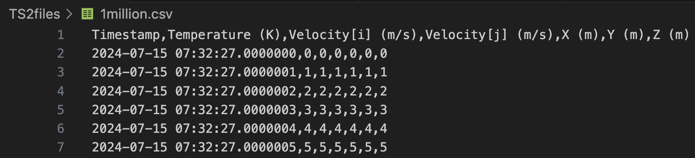

`device_a_temperature.csv`: this file contains timeseries data including a timestamp and temperature readings.
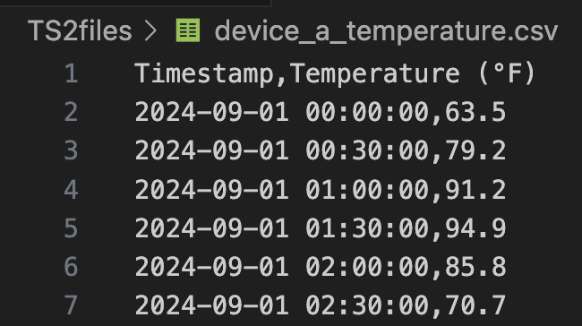

`device_b_humidity.csv`: this file contains timeseries data including a timestamp and humidity readings. This file will be joined to the `device_a_temperature` file to demonstrate Timeseries 2's join capabilities.
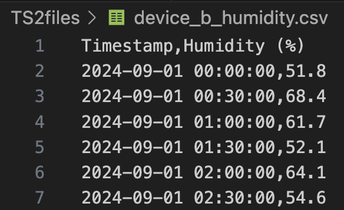

Note that the **data source you upload to can be a standard datasource**, not a timeseries-specific source. This will enable you to ingest data using a similar path as your graph-based data. This also allows you to upload a wide variety of timeseries data structures using the same source instead of needing to create a new source for each new timeseries structure.

In order to upload files to Timeseries 2, send a POST request to `{{baseUrl}}/containers/:container_id/import/datasources/:data_source_id/files/timeseries` with a multipart-form body to DeepLynx, like so:

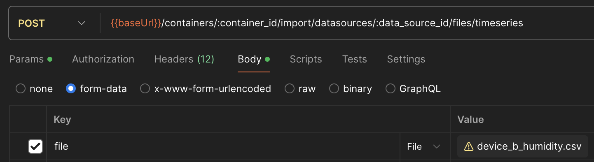

Additionally, you can request a schema description as a part of the file upload by adding the query parameter `?describe=true` to the request. This will send a schema description request to DataFusion. To view the resulting schema description, see the next section.

### Schema Description

One of the features of the new timeseries system is schema description. There may be several instances in which a user would want to get a description of their file(s) before quering. For example, a user may not be the original uploader of a given file and therefore may be unfamiliar with its contents. Or there could be multiple files or a file from long ago and the user may want to familiarize themselves with the column names and datatypes before querying. There are a few different ways to initiate a describe request.

One such method was previously mentioned- adding the `?describe=true` query param to a file upload. This comes in handy when you want the schema description to be available immediately after file upload. There may be other instances when you want to initiate a describe retroactively- in that case, you can POST to the following endpoint: `{{baseUrl}}/containers/:container_id/import/datasources/:data_source_id/reports/query?describe=true` with an array of `file_ids` in the json body, like so:

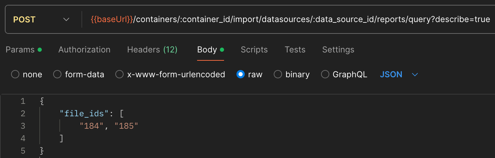
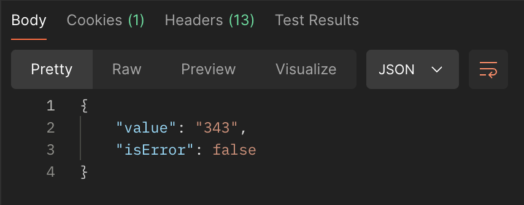

This will return a report_id (provided there is no error), like the one shown in the screenshot above, which you can use to [check on the status of your request](#report-statuses), or you can try querying the file description directly as shown below.

To see the description results, simply send a GET to the following endpoint: `{{baseUrl}}/containers/:container_id/import/datasources/:data_source_id/files/:file_id/description`. If a describe has not occurred or has not completed, you will get a 404, and you should probably check the report status. Otherwise, you will see something like this (this is the schema description for the `device_a_temperature` file):

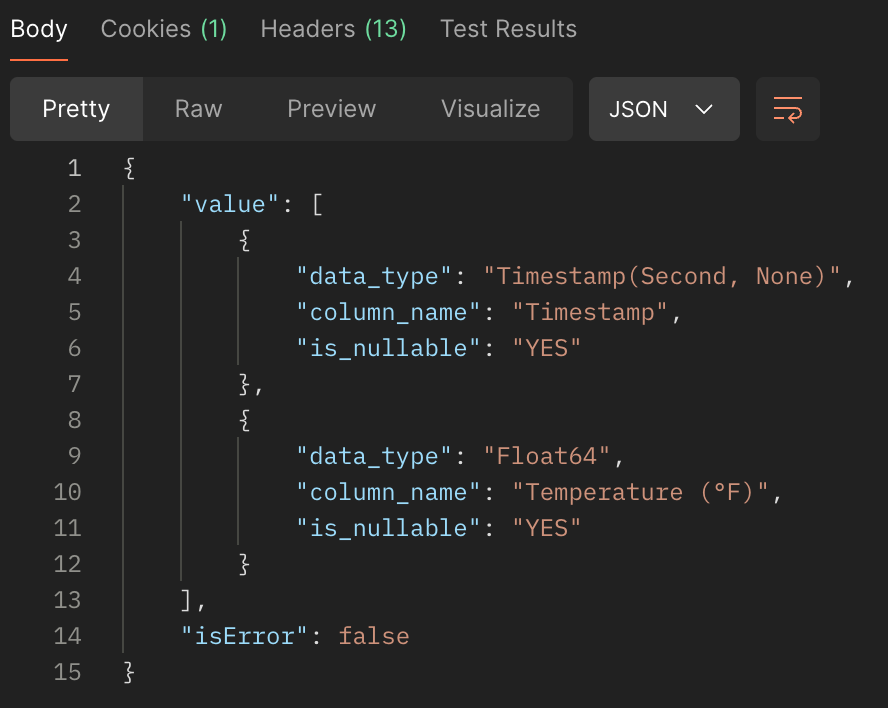

### Querying

Queries can be sent using by POSTing to the `{{baseUrl}}/containers/:container_id/import/datasources/:data_source_id/reports/query` endpoint with a body structure like this:

```
{
    "query": "SELECT * FROM table_123",
    "file_ids": ["123"]
}
```

Table names will always be in the format `table_<fileID>` (as long as it the file registered as a timeseries-compatible file; [see this section](#file-upload) for more info). However, in many cases you're going to want a more complex query than a simple `SELECT *`. Below we illustrate a few example usecase queries:

#### Example 1: Record Interpolation

One use case users may be interested in is selecting a subset of their records in order to thin out results for a graph while still capturing trends. Here is an example of one such query (using `1million.csv`). Say we want to select only every 100th record. The following would go into the `query` field:

```
{
    SELECT * 
    FROM (
        SELECT *, ROW_NUMBER() OVER (ORDER BY \"Timestamp\") AS rownum FROM table_182
    ) AS t 
    WHERE t.rownum % 100 = 0 
    ORDER BY t.\"Timestamp\"",
}
```

Note that column names are encased within escaped double quotes (`\"`). This enables the csv's initial labels to be maintained, even if they contain illegal characters or spaces. Once the query is requested, you can [request the status](#report-statuses) and [download the results](#downloading-results) and you will see something like this:

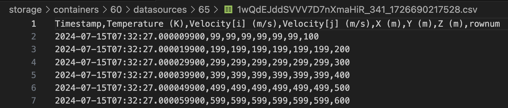

Notice that all the values end with "99", indicating that every 100th record has successfully been returned.

#### Example 2: File Joins

There will be many cases in which it would be useful to query information from multiple files- like in our `device_x` files. One file contains sensor readings of the temperature, while the other contains information about humidity. We can join on timestamp like so in order to see both sets of readings side by side:

```
    SELECT temp.\"Timestamp\", temp.\"Temperature (°F)\", hum.\"Humidity (%)\" 
    FROM table_184 temp 
        JOIN table_185 hum 
            ON temp.\"Timestamp\" = hum.\"Timestamp\"
```

This query would yield the following results, with temp and humidity side by side:

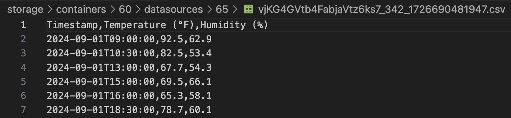

### Report Statuses

To check the status of your describe or query request, send a GET request to the following address: `{{baseUrl}}/containers/:container_id/import/datasources/:data_source_id/reports/:report_id` using the report ID returned from your initial request. If it is still processing, you will see something like this:
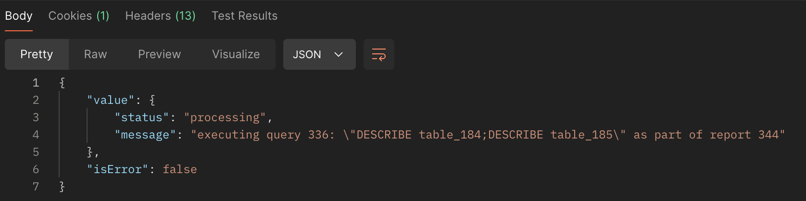

If there was an error, you will see an `error` status with the corresponding error message, for example:

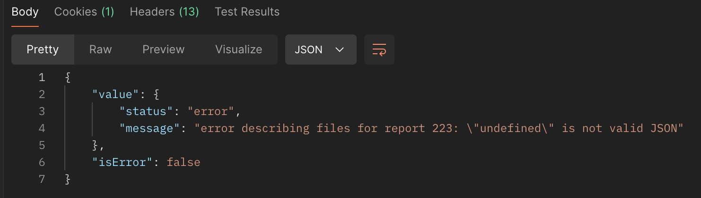

However, in most cases should see that the request has already been completed, like so (for describe):

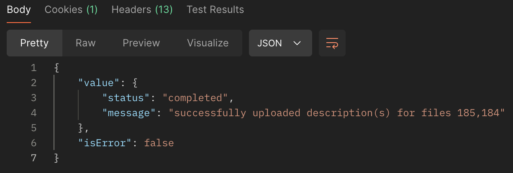

or like so with the path to [download your results](#downloading-results) (for queries):

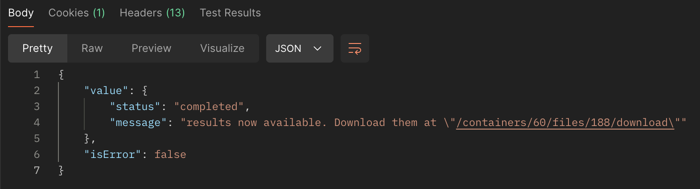

### Downloading Results

One of the benefits of the new Timeseries 2 system is that result files will be uploaded directly to file storage. The rust module handling Timeseries 2 requests then returns file metadata to DeepLynx so users can access the results. Result files can be downloaded and viewed using the same endpoint that is used for all other downloads. This can be done by sending a GET to this address: `{{baseUrl}}/containers/:container_id/files/:file_id/download`. The file ID for a given report will be captured in the return of [GET report status](#report-statuses). Results files currently are all in CSV format, meaning you can download them and access the raw result CSV directly on download:

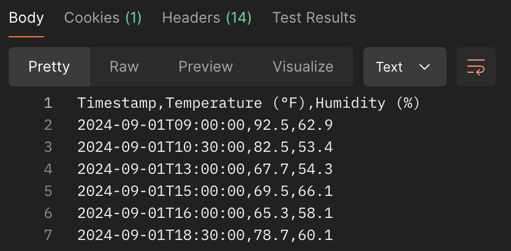

Files can also be downloaded in blob format from the GUI under "Data"/"File Viewer". The file name will always be in the format `report_<reportID>_<timestampInMS>`:


