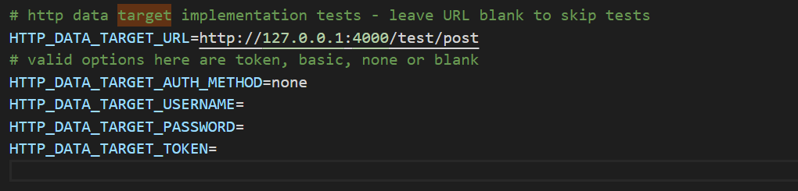

Tests can be run by changing directory to your DeepLynx folder and running `npm run test`.  
This runs the suite of tests specified in the package.json configuration file (by default it runs them all).  

## Testing http_data_target_impl
### Test Specific Requirements
- External API with network available URL (an endpoint for testing can be set up using the readme in [THIS REPO](https://gitlab.software.inl.gov/b650/deep-lynx-api-testing))  
### Testing Process 
To test the http implementation of data targets you will need to:  
- ensure that your API is available and ready  
- edit the src\tests\.env and specify a HTTP_DATA_TARGET_URL

(Note: the endpoint in the image above is to be used only if you have decided to setup your own API using the repo specified in the "Test Specific Requirements" above.)  
- run `npm run test`  
With the environmental variable set, the test script will now run the http data target impl test.