# DeepLynx Timeseries Data Storage and Querying Capability

## History and Reasoning

As of the 0.4.20-rc release, DeepLynx's ability to store and query Timeseries data has changed slightly.

We found that the current method of timeseries data storage was not rapid enough to handle very large data streams in a relatively quick manner. This caused data ingestion issues as the pipeline could become saturated by timeseries data. When you have to chunk each piece of data, fetch its mappings and transformations, and then take that data and insert it into the database you start to run into high times for processing.

We recognized early on that timeseries data rarely changed structure or naming schemes, and that petabytes of data could have the exact same structure for each individual reading. We were wasting valuable cycles running and checking transformations against data that really didn't need more than an initial structure presented to the system. We also recognized that the timeseries data was confusing and that the attachement to nodes was spotty at best. These reasons and more prompted us to redesign timeseries data storage.

Instead of sending your timeseries data to the same data source as graph data, now you must create a Timeseries Data Source. Each of these Data Sources provide a receptacle for timeseries data, with the structure defined beforehand. Declaring structure upfront, or from an initial file, allows us to more rapidly ingest and process timeseries data.

## How Timeseries Storage Works


Above is a brief diagram outlining at least the basic changes to the Data Source system. Now, in order to ingest timeseries data users must first create a Data Source whose type is `timeseries`. As part of that creation process users teach DeepLynx the shape of the timeseries data flowing into that source. Below are instructions on how to create the data source and perform that initial data mapping.

## Creating a Timeseries Data Source

In order to ingest timeseries data you must first create a Timeseries Data source. Navigate first to the Data Sources page.

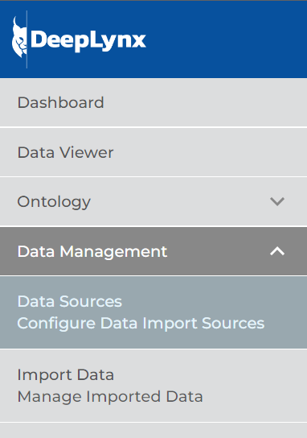

Now you should see a screen similar to the one below. Click the button for "New Data Source"

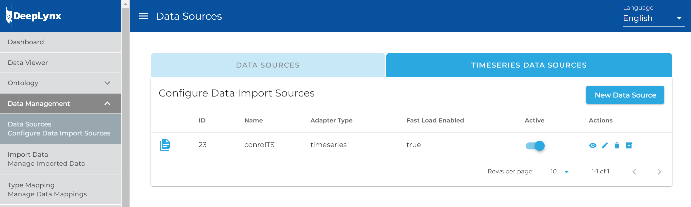

In the following modal, select the Timeseries option to begin the process.

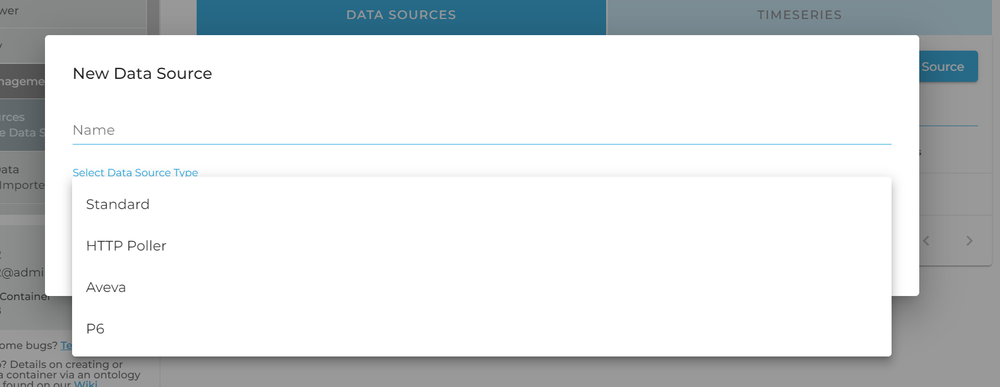

Selecting this option will present you with the following screen. Don't let this overwhelm you, we will walk you through the whole process.

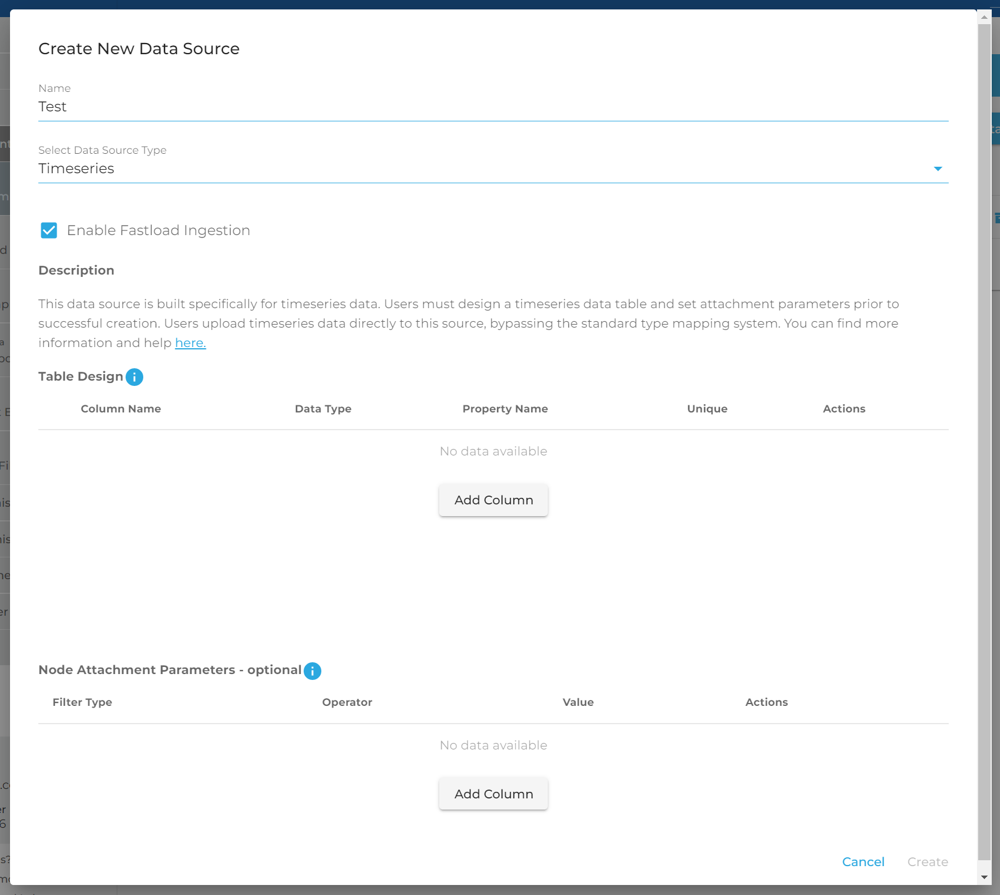

You should see two distinct sections: Table Design and Node Attachment Parameters. We will explain both in detail.

#### **Table Design**

You must design the database table in which your timeseries data will be stored in. This portion of the GUI is designed to reflect a literal database table which will be created after you save this source. **Note: you cannot currently edit this table after creation, only delete and recreate so be sure of your structure prior to saving.**

A timeseries table must have at least two columns, so click the "Add Column" button twice.

You will notice that the first column's data type is selected for you and greyed out. For timeseries data to be stored and this table created, we must include a "Primary timestamp". This is the absolute timestamp of your entry. When searching based on time, this is the field you would use to handle ranges. Name your column and select the key from the payload which contains your timestamp. A primary timestamp can be either a number, number64, or date.

**Date:** If you select this type you will see there is an additional field for columns with the date type in a drop down.

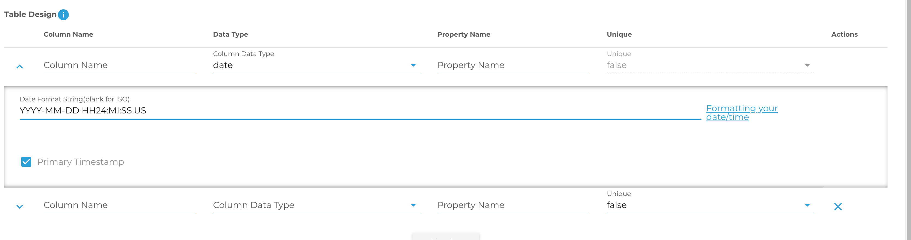
<!-- 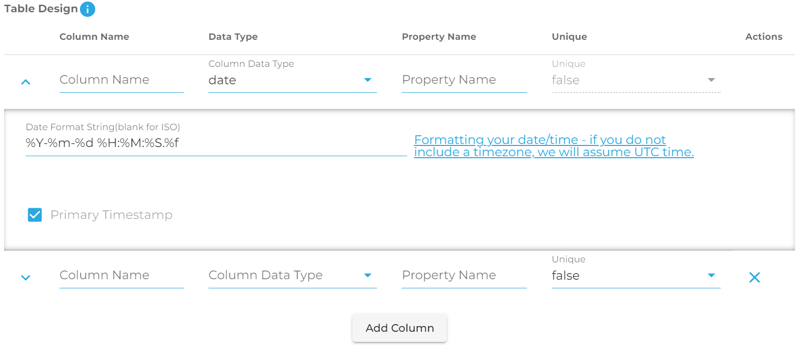 -->

This is the format value. You must tell DeepLynx how your time is formatted so that we can parse it correctly. If your timestamp is already in ISO format, you can safely ignore this. If it is not – you must provide a template string telling DeepLynx how your timestamp is formatted.

For example – the timestamp "2022-03-30 08:39:40" can be represented as "YYYY-MM-DD HH:MI:SS". You can find more information on what consists of a valid time format string [here](https://www.postgresql.org/docs/current/functions-formatting.html#FUNCTIONS-FORMATTING-DATETIME-TABLE). **Note:** This is a valid format string for the Postgres database function for parsing time from a string.

**Number/Number64:** If you select this option you will see that this field too has an additional value in a dropdown: Chunk Interval\
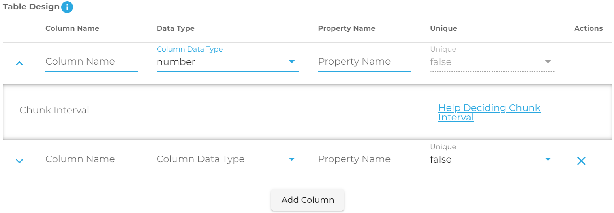We use TimescaleDB for our timeseries storage. As such, when you select a non-timestamp to serve as the primary key in your table you must tell the program how it should decide to partition and chunk your data. For example, if the data you have ranges between 1 and 1,000,000,000, and for each number there is only one value, you might decide to chunk it every 100,000 values. You need to think about how much data you'll have in each portion of your range and decide the value. Help can be found [here.](https://docs.timescale.com/timescaledb/latest/how-to-guides/hypertables/about-hypertables/#hypertable-partitioning)

Now that you've completed the primary timestamp field, you can add as many additional columns to your table as you'd like. For each column you must specify a unique name, a data type, and which property name from the payload you will be sending. For example given a JSON object like:

```plaintext
{Time: "timestamp", Value: "value"}
```

Or a CSV like:

```plaintext
Time, Value
timestamp,value
```

You might design your table like this - note the difference between column and property name. Property name refers to where the value exists in your payload and how it's named - it acts like a mini mapping for DeepLynx to know what column in your table that value belongs to.

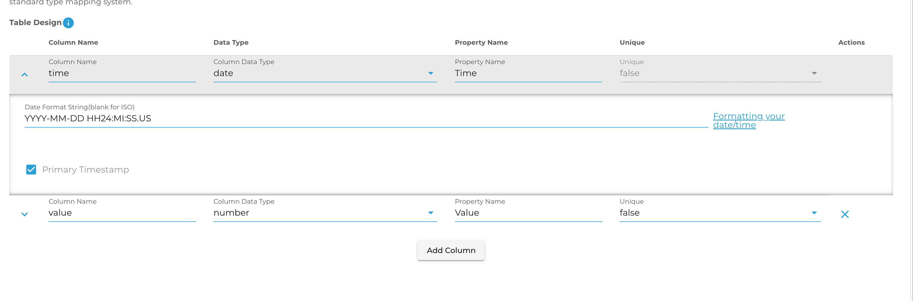
<!--  -->

Once you've completed your table design, you may also add conditions and change configuration options – each of these functions identically to transformations that produce edges or nodes and are completely optional.

Once you've saved your transformation and enabled your type mapping, retained data and new data flowing to your data source should be mapped and sent into the proper timeseries table.

#### Node Attachment Parameters

Timeseries data and storage is useful in and of itself, but where it this system shines is in the ability to associate a node with a given set of timeseries data. For example, if you have a set of nodes representing a sensor net - using this method you could create a timeseries data source for each or all of the sensors, and then tell DeepLynx to associate your new Timeseries Data Source with the nodes of your choice.

This table allows you to add filters to indicate to DeepLynx what nodes should be matched up to this data source. You may have multiple filters, but they will be applied using AND - not OR (support for specifying complex conditions will eventually be added).

Here is an example showing that our new data source should be associated with every node from a specific data source and matching a specific Class.

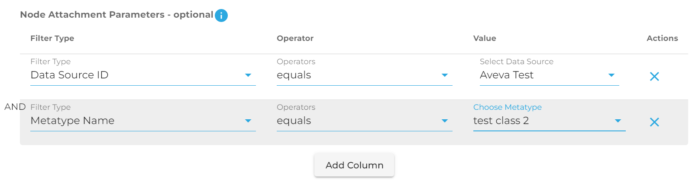

**Note:** Unlike the table design, you can edit these conditions at any point in time. The associations will then be updated automatically.

## Ingesting Timeseries Data

Timeseries data is ingested exactly the same way as standard data - by POSTing data or a file to:

```
/containers/:containerID/import/datasources/:sourceID/imports
```

You may send an array of JSON objects, a csv file, a JSON file whose root object is an array of objects, or an XML file (note that XML is untested with timeseries data). DeepLynx will then note that it's processing data for a timeseries data source, and will act accordingly. 

During processing DeepLynx will attempt to map your data using the Property Name for each column that you specified in table creation. Additional, unmapped values will be ignored. Null or missing values will be ignored.

## Querying Timeseries Data

### Via the UI

Basic query functionality has been provided via the Admin Web App for querying and displaying timeseries data. All functionality pictured below is enabled by the REST api functionality explained in the next section.

Currently all timeseries data is attached to nodes. The first step is to navigate to the Data Query portion and run a query which will return the node timeseries data is attached to.

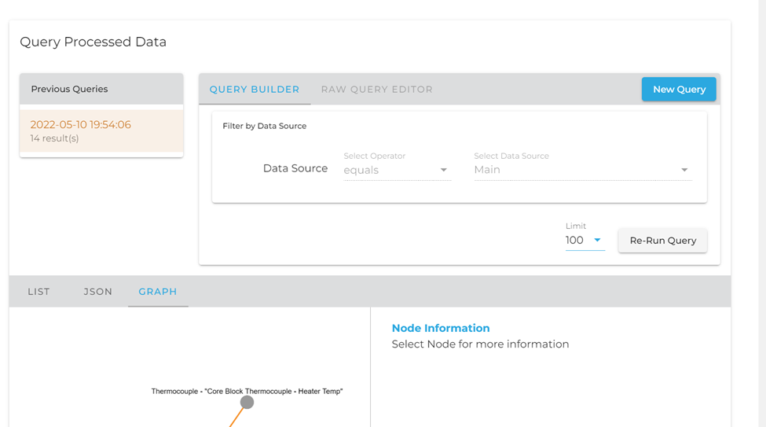

Currently the timeseries information is only available when selecting a node through the graph view.

Select a node, on the right-hand side of the graph view you should see the following sections – with Timeseries being the last in the list.

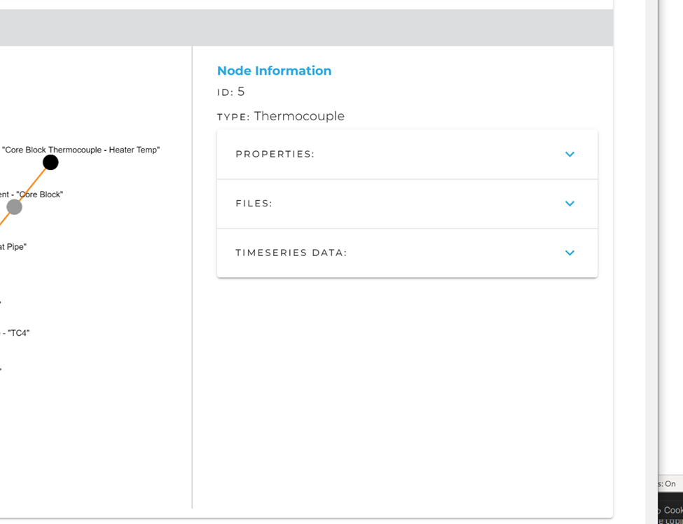

Once you have selected a node, you can click on the Timeseries Data drop-down to find this menu.

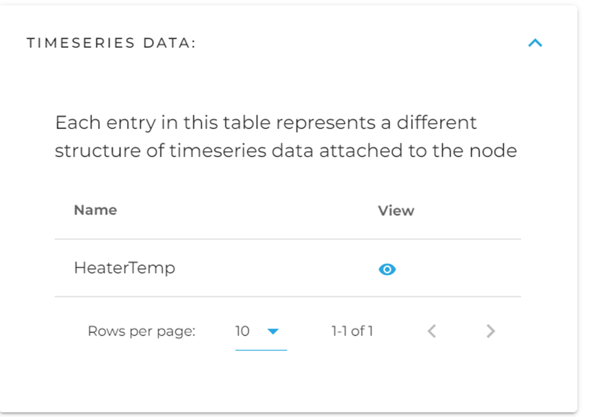

A node might have various kinds of timeseries data attached to it, each listed here. You will notice that the name reflects the same name you gave your data source created in the previous step. This is important to note and will allow you to more easily manage the different timeseries data attached to a node.

Click the eye to bring up the search and visualization layer for timeseries data on that node.

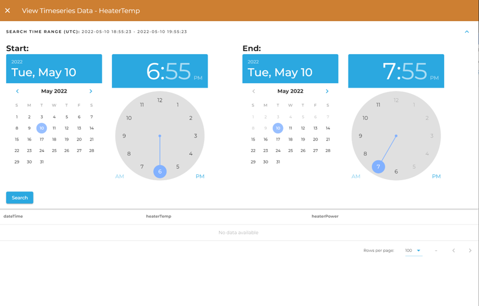

Currently only basic time search functionality on the primary timestamp is supported. You may select a date range and have your data returned from within that time range. More features are slated to be added, and more features exist on the REST endpoint than what are available on the Admin Web App.

Once you've selected your time range, click "Search". After you've searched you can page through the data using the table controls, as well as order the data based on any of the columns available to you.

### Via the REST API

There are two different endpoints by which you can POST your GraphQL queries for timeseries data. One of these methods, much like through the Admin Web App, is by knowing what node your timeseries data is attached to and using an endpoint which contains that node: `{{yourURL}}/containers/{{containerID}}/graphs/nodes/{{nodeID}}/timeseries`. 

If you do not know the ID of the attached node, or if your timeseries data is not attached to a node, you can instead query the datasource directly with this url: `{{yourURL}}/containers/{{containerID}}/import/datasources/{{dataSourceID}}/data`. Using either of these methods to query your timeseries table should yield the same results.

**Dynamic GraphQL Schema**

In GraphQL, schema is generally defined prior to running the application. The schema determines what kinds of queries can be made, how they're structured, and what functions they access in the program to populate the users' results. The first iteration of this functionality followed this pattern, but we found the system to be unwieldy and hard to understand. Instead, DeepLynx dynamically generates a schema each time you interact with the GraphQL endpoint for a given container and node.

Currently, the generated schema's types map 1:1 to the timeseries data structure attached to a node. So, for example if a node contains timeseries data in two different formats, one named HeaterTemp and the other HeaterPower, you will able to query those two different structures differently. More information on how to accomplish these queries can be found in the next major section.

**Introspection**

You can use introspection at any time to get a complete list of all potential types, and other information, at any time. This is useful as your schema might be different from another user's based on the container and node you are querying. This is also helpful because we must perform a slight conversion on your Transformation/Timeseries Table names to make them work with GraphQL – and introspection allows you to see exactly how we might have named your custom type.

Much like normal queries, you would POST your introspection GraphQL query to either `{{yourURL}}/containers/{{containerID}}/graphs/nodes/{{nodeID}}/timeseries` or `{{yourURL}}/containers/{{containerID}}/import/datasources/{{dataSourceID}}/data` - and much like normal queries, your POST body should be a JSON body with the following two fields - query and variables. query is an escaped string containing your GraphQL query. variables is a JSON object containing any variables which were included in your query. **The only difference between these endpoints is that all datasources are queried as `Timeseries` under the datasource endpoint.**

More information on formatting a query can be found here - <https://graphql.org/learn/serving-over-http/>.

Here is an example introspective query - this one simply returns a list of all possible GraphQL types by name.

```plaintext

{ 
  __schema { 
    types { 
      name 
    } 
  } 
} 
```

**Note:** Not all types that are returned by this query are Timeseries types. Some might be native GraphQL types.

Optional - Just like on the main GraphQL schema, you can run an introspective query on your timeseries data type to see what fields may exist for you to request and query against. The following query illustrates how to accomplish this. The fields returned from this query represent all valid fields upon which you can filter or request, as well as their datatypes. The following query:

```plaintext

{
    __type(name:"Timeseries"){
        fields{
            name
        }
    }
}
```

might yield these results:

```plaintext

{
    "data": {
        "__type": {
            "name": "Timeseries",
            "fields": [
                {
                    "name": "_record"
                },
                {
                    "name": "dateTime"
                },
                {
                    "name": "heaterTemp"
                } ...
```

**Writing Queries**

\*\*Please keep in mind that this is actively under construction, meaning things may change slightly and new features may be added. We will endeavor to keep this guide up to date, but if in doubt please contact the development team.\*\*

We will not spend a large amount of this guide on \*how\* to make a GraphQL request. We feel this topic is covered well in other guides, as well as the [official documentation](https://graphql.org/learn/serving-over-http/) . We follow all standard practices in how a GraphQL query is structured as a JSON object for POSTing to an HTTP endpoint. This guide also assumes that while we display a GraphQL query in its object form, it must be encoded as a string and included in a JSON object as the `query` property.

The \*\*most important thing\*\* to remember is that the endpoint to which you send all timeseries GraphQL queries (via HTTP POST request) is one of the following:

To query timeseries data based on the node it's attached to:

`{{yourURL}}/containers/{{yourContainerID}}/graph/nodes/{{nodeID}}/timeseries`
(timeseries graphQL types named according to the corresponding sources)

Or, to query the datasource directly:

`{{yourURL}}/containers/{{containerID}}/import/datasources/{{dataSourceID}}/data`
(timeseries graphQL type always named `Timeseries`)

**Querying Timeseries Data**

The objective of querying timeseries data is to allow the user to swiftly retrieve all timeseries data within a time range and which match a certain set of filters based on the user created timeseries database table's columns.

The following steps will demonstrate how a user will receive timeseries data for a given node which has a timeseries structure named `PrimaryHeatPipe1`.

A user must know the name of the GraphQL type for "PrimaryHeatPipe1". This is done most easily by running the introspective query listed earlier in this page and searching for a type by, or close to, that name. In this case the name of the GraphQL type should be the exact same – "PrimaryHeatPipe1". Note: table names that consist of more than one word will have their spaces replaced by the \_ character. So "Maintenance Entry" would become "Maintenance_Entry" in the GraphQL schema. A transformation table whose name starts with a number will have \_ prepended to its name. So "1 Maintenance" would become "\_1_Maintenance".

Once you know the name of your datasource and the fields to query on (see the **Introspection** section above), you may send a query requesting only the fields you want to see returned. For example, given this query:

```plaintext
{
    PrimaryHeatPipe1 {
        heaterTemp
        dateTime
        …… // the above fields and any additional fields map directly to the column names of the table the user designed
        _record {
            count // total count of all records returned as part of query, regardless of limit and page
        }
    }
}
```

You might see the following response:

```plaintext
{
    "data": {
        "PrimaryHeatPipe1": [
            {
                "heaterTemp": 139.8,
                "dateTime": "1648651239000",
                "_record": {
                    "count": 60
                }
            }, ….
```

Field names will map directly to your column names on the table you created via the transformation.

**Filtering Results**

There are many cases that instead of simply listing results users might need to filter our results based on column information or constraints. Each column in your created table will be available to be filtered upon as well as a \_record object which will allow you to sort by values and limit/page results. Here is a brief demonstration of a query on `PrimaryHeatPipe` that fetches results whose values lie between a certain date range and whose heater temperature is above a certain threshold.

```plaintext
{
    PrimaryHeatPipe (_record: {sortBy: "dateTime",sortDesc: true} dateTime: {
        operator: "between", value: ["2022-03-20", "2022-03-31"]
        } heaterTemp: {operator: ">" ,value: 150}){
        heaterTemp
        dateTime
        _record {
            count
        }
    }
}
```

Please note that for each potential column you must pass an object with the following properties: operator and value. Value may also be an array of values – and the type of this field must match the type of column of your created table. More information can be found when doing an introspective query for your type.

The operator field may contain any of the following values.
| Operator | Description | Returns | Example |
|----------|-------------|---------|---------|
| `eq` | Equals or equal to. This is the implicit behavior. | All timeseries with specified fields matching the expression | (name: {operator: “eq”, value: “test”}) |
| `neq` | Non-equal or not equal to. | All entries except those with specified fields matching the expression | (name: {operator: “neq”, value: “test”}) |
| `like` | Matches results against a passed-in pattern. Uses wildcard `%` for any number of characters and `_` to match 1 character. Wildcard behavior mimics that of [Postgres](https://www.postgresql.org/docs/9.3/functions-matching.html). | All nodes whose specified fields match the given pattern | (name: {operator: “like”, value: “%M21%”}) searches for "M21" anywhere in the name |
| `in` | Matches one result from an array of options. | All entries whose specified fields match one option in the array | (name: {operator: “in”, value: \[“test”, “test2”\]}) |
| `between` | Matches results who’s specified value falls between a user defined range. | All entries who’s value fall between a range , used extensively when querying against the primary timestamp | (dateTime:{operator: "between", value: \["2022-03-20", "2022-03-31"\]}) |
| `>`, `<` , `<=` , `>=` | Check if a numerical field is less than or greater than a certain value. | All nodes whose specified fields are greater than or less than the given value) | (heaterTemp: {operator: “>”, value: 150}) |

**Limiting returned records**

You may use the `_record: { limit: n }` filter to limit the number of results that are returned from your query. This works for both graph data and timeseries data. Here is an example: 

```
{
    metatypes{ // classes are known as metatypes in GraphQL
        Requirement(
            _record: {
                limit: 10
            }
        ){
            id
            name
        }
    }
}
```

This query would return only 10 requirements with their id and name.