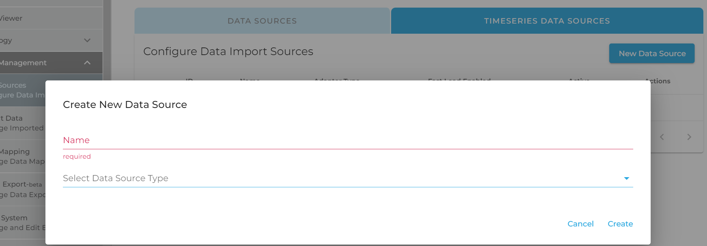
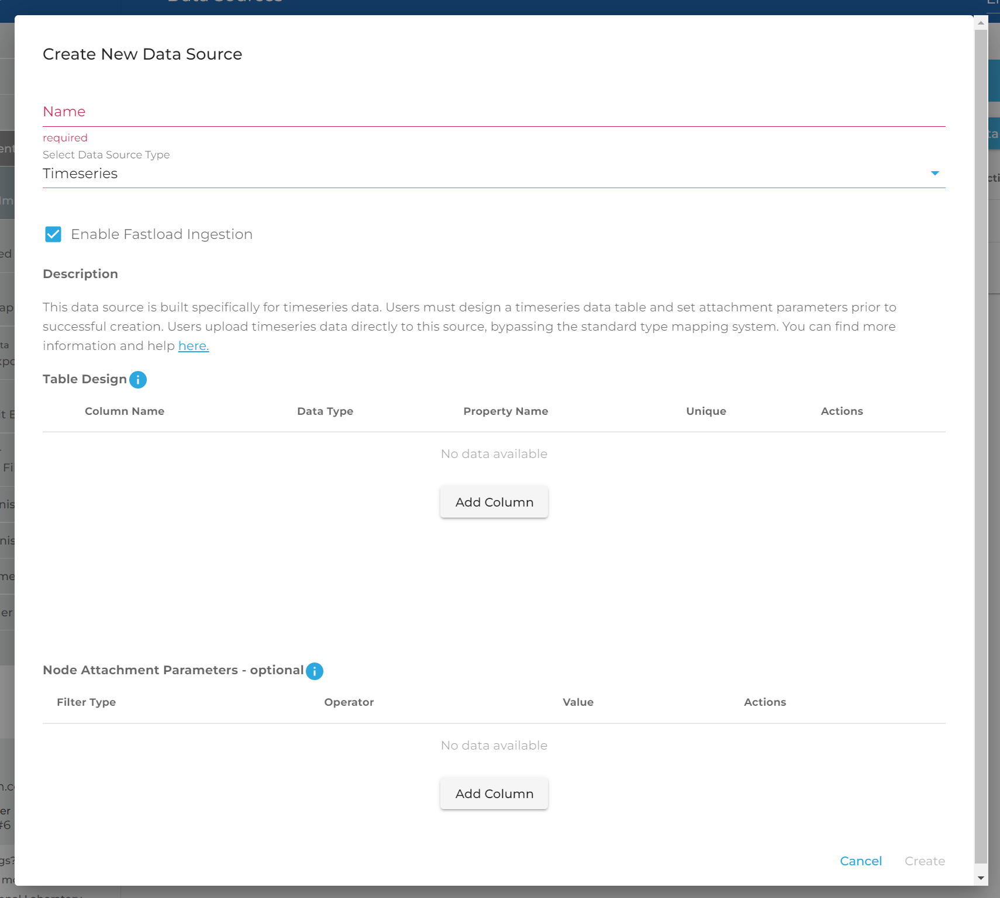
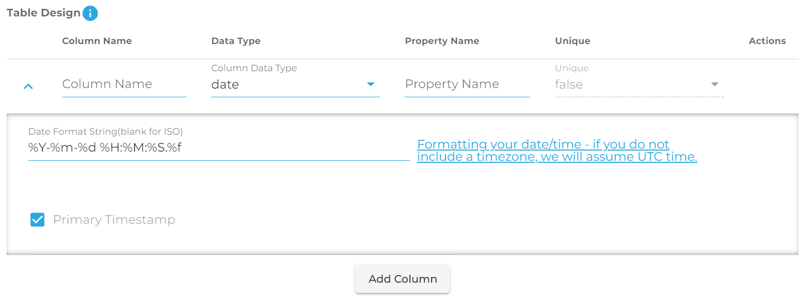
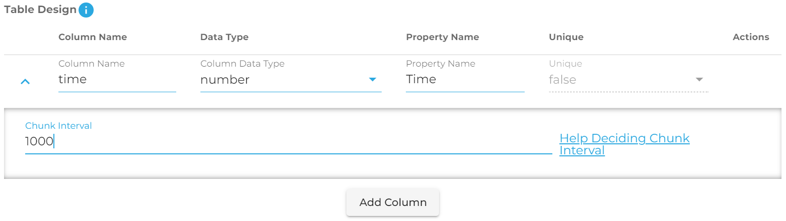
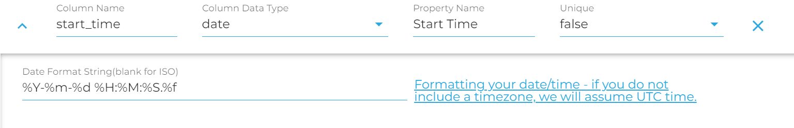
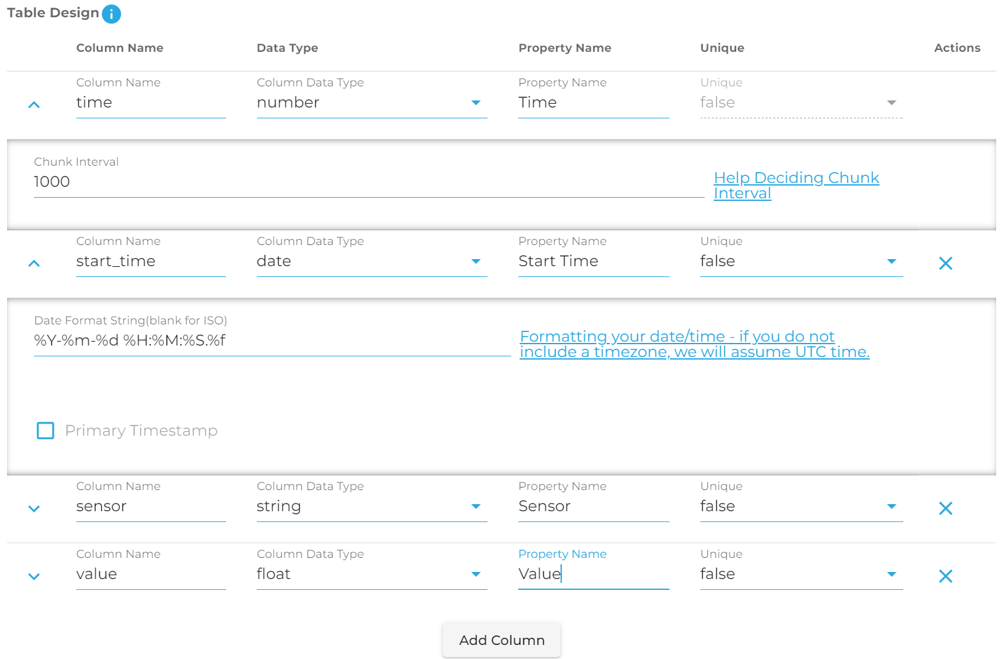
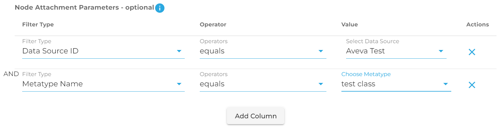
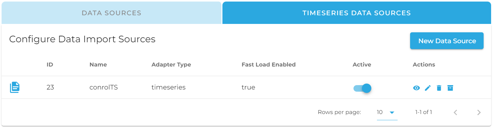

# Creating and Using Timeseries Data Sources

This article will attempt to provide a quick start guide for using timeseries data sources, including the following
elements:
- Creating Timeseries Data Sources through the UI (and best practices)
- Uploading Data to Timeseries Data Sources
- Viewing Timeseries Data in the DeepLynx UI
- Querying Timeseries Data using GraphQL

To view the previous guide on timeseries, which includes some of the history and reasoning behind
DeepLynx's timeseries system, click [here](https://github.com/idaholab/Deep-Lynx/wiki/Timeseries-Data-Sources). For
information on creating timeseries data sources through the API instead of the UI, click 
[here](https://github.com/idaholab/Deep-Lynx/wiki/TimeseriesCreationViaApi).

## Creating Timeseries Data Sources

### Preparing Your Data

In order to utilize DeepLynx's timeseries system effectively, here are some best practices to follow when preparing your
data for ingestion:

- Ensure that your data is stored in JSON, CSV or XML format. If your data is saved in spreadsheet format, for example, save it as a CSV before importing it to DeepLynx.
- If you have several entities generating timeseries data with the exact same structure, consider creating only one timeseries datasource per data structure and using entity ID or some other property to differentiate the data.
  - For example, if I had three sensors producing timeseries data (Sensor A, Sensor B and Sensor C) and they all had the columns "Time" and "Value", I could consider adding a column to my dataset specifying which sensor the data came from. See the screenshot below.
  - 
- If you are using a time interval as your primary key, it is recommended that you also include a timestamp to indicate the experiment start time to differentiate indexes across files. See the screenshot below for an example.
  - 
- Note that the above practices are current workarounds to ensure ideal data uniqueness. There are currenlty methods in development for including sensor ID and start time as metadata when uploading a timeseries file to DeepLynx, but in the meantime these practices should be followed to ensure the best results.

When you create a new timeseries data source in DeepLynx, you are actually creating a new hypertable in the SQL database
to which your timeseries data will be directly copied. This helps with the processing speed of timesries data ingestion,
but it means that there are certain rules which must be followed when creating a new timeseries data source. Note that
you cannot currently edit this table after it has been created, only delete and recreate it, so be sure to double-check
your structure before saving.

The columns in a timeseries data source should reflect the columns of your timeseries csv file or keys in your JSON
object. Using the most recent example above, you could create a new timeseries data source with the columns "Time",
"Value", "Sensor" and "Timestamp" by following the steps below:

### Creating Your Source

Navigate first to the Data Sources page.


Click the "Timeseries Data Sources" tab and select "New Data Source". You should see the following dialog pop up.



Select "Timeseries" as the data source type. Selecting this options will present you with the following screen. Don't let
this overwhelm you, we will walk you through the whole process. You should see two distinct sections: Table Design and
Node Attachment Parameters. We will explain both in detail.



#### Table Design

Select the "Add Column" button to add a column to your timeseries source for each column in your dataset. Your timeseries
data source should always have at least two columns - one to indicate primary key (either a timestamp or indexed interval
by which data is incremented), and one to indicate value. In our case, we will include four columns- time, value, sensor
and start time. We will use "time" as our primary key, and include "start time" and "sensor" as unique columns in order to
ensure that values are read in properly for each experiment start time and sensor ID. Below is a snapshot of what our
test data set will look like.


Let's begin with the first column, "time". Clicking "Add Column" will result in the screen below. Note that for the 
first column, the data type defaults to "date". This is because for your primary key (or primary timestamp), you can 
only have a date or a time index.



In our case, however, we want to use a number as our primary key. When you select a non-timestamp to serve as the primary 
key in your table you must tell the program how it should decide to partition and chunk your data. For example, if the 
data you have ranges between 1 and 1,000,000,000, and for each number there is only one value, you might decide to chunk 
it every 100,000 values. You need to think about how much data you'll have in each portion of your range and decide the 
value. Help can be found [here.](https://docs.timescale.com/timescaledb/latest/how-to-guides/hypertables/about-hypertables/#hypertable-partitioning)
In our case, we will set the chunk interval to 1000.

Note the two similar columns, "column name" and "property name". Column name will be used as the actual column name in
the SQL backend and has validation rules associated with it- it must start with a letter, must contain only lowercase
letters, numbers and underscores, and must be between 2 and 30 characters. You will be notified if your selected column
name does not meet these requirements. Property name is the name of the column in your CSV file or the property name in
your JSON file. In our case, "time" is our SQL column name and Time is our CSV property name. The property name can be
changed later to account for similar data structures with different headers being imported into our data source, but
column name will be set in stone once the source is created.



Next, let's add the "start time" column and talk a bit about unique columns and timestamp formatting. Click the "add column"
button. You can see from the screenshot below that, when you include a date column in your timeseries source, you need to
supply a Date Format String. This string allows DeepLynx to convert your supplied date from a string into a valid timestamp.

**FOR NON-JESTER IMPORTS**, 
you can follow [this link](https://www.postgresql.org/docs/current/functions-formatting.html#FUNCTIONS-FORMATTING-DATETIME-TABLE)
for guidance on how to set up your date format string, or just click the link in DeepLynx when formatting and it will open a
new tab. 

**FOR JESTER IMPORTS**, you must use a different formatting string. *The common, Postgres formatting will not work*. 
Instead use this [formatting guide](https://docs.rs/chrono/0.4.24/chrono/format/strftime/index.html) - which is very similar 
to how you'd parse a string to time in C.

We will also mark the "start time" column as "unique". Marking a column as unique allows it to be used in conjunction with
our primary key to determine row uniqueness. Since our records are made unique by using a combination of experiment start
time, time index and sensor ID, we will use each of these properties together as our composite primary key. Otherwise, there
would not be a way to distinguish between the diffferent "Time" values since the time index (eg 1,2,3,4,5) repeats several
times in our data. This also makes it so that in future imports we don't need to re-label our time index as 6,7,8,9,10,etc
but can instead re-use the time index but with different start times if we so choose, without potentially corrupting our
data.



We can also add the sensor and value columns as we see below. Note that "Sensor" is also marked unique so it can be used
as part of our composite primary key to determine unique data records. Below is a screenshot of what the final "Table
Design" section should look like.



#### Attachment Parameters

Timeseries data and storage is useful in and of itself, but where it this system shines is in the ability to associate a
node with a given set of timeseries data. For example, if you have a set of nodes representing a sensor net - using this
method you could create a timeseries data source for each or all of the sensors, and then tell DeepLynx to associate your
new Timeseries Data Source with the nodes of your choice.

This table allows you to add filters to indicate to DeepLynx what nodes should be matched up to this data source. You may
have multiple filters, but they will be applied using AND - not OR (support for specifying complex conditions will 
eventually be added).

Here is an example showing that our new data source should be associated with every node from a specific data source and
matching a specific Class.



**Note:** Unlike the table design, you can edit these conditions at any point in time. The associations will then be
updated automatically.


## Uploading Timeseries Data

Timeseries data can be ingested via file upload by navigating to the "Imports" page, selecting the "Timeseries 
Data Sources" tab, and uploading a file to your timeseries source as seen in the screenshot below.


Alternatively, your data can be ingested through the API by POSTing data or a file to the following endpoint:
`/containers/:containerID/import/datasources/:sourceID/imports`.


Note that your upload will not have a processing percentage like a typical data upload. To confirm the upload of your data,
you can view it using one of the methods below, or query it by following the instructions in the "Querying Data" section.

## Viewing Timeseries Data

Once you have uploaded your timeseries data, you may view it in the DeepLynx GUI by navigating to the "Data Viewer" tab
and selecting a node that fits the attachment parameters you specified earlier. Click on the appropriate node and you
should see a panel that says "Timeseries Data". Click to expand the panel and click the "View" button, which will lead
you to the timeseries viewer page.


You may also access this page via the Data Sources page or the Imports page. On either page, navigate to the "Timeseries
Data Sources" tab and click the eye icon on the row that has your desired data source. On the imports page, these icons will
all link to the same data source, whereas on the data sources page, each icon links to a separate data source, as seen in the
screenshot below.

<!--  -->



## Downloading Timeseries Data

You can download your timeseries data as a csv by sending a GET request to the endpoint
`/containers/:containerID/import/datasources/:sourceID/download`. You may include `startTime` and `endTime` as query parameters
to limit the resulting csv file to only records within the range of starting and ending times or indexes. Note that this filter
will only apply to your primary key column (first column you created), even if you included other columns as unique as part of
a composite primary key.

## Querying Timeseries Data

Viewing and downloading your timeseries data in the DeepLynx UI is nice for initial exploratory analysis of your data, but
there will likely come a point where you will want to extract your data from DeepLynx for use in another tool. DeepLynx
uses GraphQL to allow you to query your timeseries data sources. There are two different GraphQL endpoints you can hit to
view the data in a timeseries data source: the "Node" endpoint, to see all timeseries data sources attached to a given node,
and the "Source" endpoint, which you can query if you are looking for data in a specific timeseries data source and you know
its ID.

### The Node Endpoint

#### Discovering Attached Datasources

To see all timeseries data sources attached to a certain node, you can send a GET request to the endpoint
`/containers/:containerID/graphs/nodes/:nodeID/timeseries`. If I had three timeseries sources (source A, B and C) attached
to a node, I would see a response like this to my GET request:

```
{
  "value": {
    "Source_A": "123",
    "Source_B": "124",
    "Source_C": "125",
  },
  "isError": false
}
```

As you can see, for each source there is a source name, and the associated ID. You can use the timeseries source ID
to query a source individually (see the next section for details), or you can query all attached sources at once 
using GraphQL on this endpoint.

#### Discovering Source Fields

We can interact with these data sources by sending a POST request to the same URL we just sent a GET to-
`/containers/:containerID/graphs/nodes/:nodeID/timeseries`. In order to see which fields we can query on, we can send a
GraphQL body like the one below. The section like `SourceA_fields` is a GraphQL alias used to distinguish the return type
these objects from one another, since they are each requesting results from the introspective query object `__type`. Within
the parentheses, we are searching for only a specific type: the name of our timeseries source (`__type(name: "Source_A")`).
Then, in the body of the query, we are requesting all available fields within that type, the field's name, and the type
of that field. The query below:

```
{
  SourceA_fields: __type(name: "Source_A"){
    fields {
      name
      type {
        name
      }
    }
  }
  
  SourceB_fields: __type(name: "Source_B"){
    fields {
      name
      type {
        name
      }
    }
  }
  
  SourceB_fields: __type(name: "Source_B"){
    fields {
      name
      type {
        name
      }
    }
  }
}
```

would return the following results for each data source:

```
{
  "data": {
    "Source_A_fields": {
      "fields": [
        {
          "name": "_record",
          "type": {
            "name": "recordInfo"
          }
        },
        {
          "name": "time_index",
          "type": {
            "name": "Int"
          }
        },
        {
          "name": "value",
          "type": {
            "name": "JSON"
          }
        }
      ]
    }
  }
}
```

This result would also be returned for Source_B and Source_C, and if they had different fields than Source_A you might 
see slightly different results. The first field, `_record`, is a metadata object that is auto-inserted for each GraphQL 
object. We can ignore it for now. The other fields, `time_index` and `value`, are our queryable fields for Source_A and 
can be used in a query to retrieve the actual data for our source.

#### Querying your data

Once you know the names of your fields (they will be the same as the column names from your timeseries data source setup), 
you can query each source with a query like the following. This query is also a GraphQL query that can be found by 
POSTing to the same endpoint as before.

```
{
  Source_A {
    time_index
    value
  }
  
  Source_B {
    timestamp
    measurement
    sensor
  }
  
  Source_C {
    time
    item
    position
  }
}
```

Note that in the query above, each source has different fields. Your sources may be different like these ones, or they may
have identical fields to each other. It all depends on how your data was structured and imported. Fortunately, we can query
each of these data structures together if they are all attached to the same node, instead of having to query them all
separately.

#### Filtering data

You can also search for specific values within a given data source by using a parenthesis filter with the following syntax:
`{Source_Name(field: {operator: "eq" value: "value"}){fields}}`, where `Source_Name` is your source name, `field` is the
field you want to query on, `operator` is one of the options below, and `value` is the value you are searching for.
See below the operator table for an example of looking for a specific sensor on Source_B.

| Operator | Description | Returns                                                                        | Example                                                                          |
| -------- | ----------- |--------------------------------------------------------------------------------|----------------------------------------------------------------------------------|
| `eq` | Equals or equal to. | All records with specified fields matching the expression                      | (name: {operator: "eq" value: "M21 - Total Cesium Loading"})                     |
| `neq` | Non-equal or not equal to. | All records except those with specified fields matching the expression         | (name: {operator: "neq" value: "M21 - Total Cesium Loading"})                    
| `like` | Matches results against a passed-in pattern. Uses wildcard `%` for any number of characters and `_` to match 1 character. Wildcard behavior mimics that of [Postgres](https://www.postgresql.org/docs/9.3/functions-matching.html). | All records whose specified fields match the given pattern                     | (name: {operator: "like" value: "%M21%"}) searches for "M21" anywhere in the name |
| `in` | Matches one result from an array of options. | All records whose specified fields match one option in the array               | (id: {operator: "in" value: "179,306"})                                          |
| `>`, `<` | Check if a numerical field is less than or greater than a certain value. **Please note that >= and <= are not currently supported.** | All nodes whose specified fields are greater than or less than the given value | (id: {operator: ">" value: "179"})                                            |
| `between` | Check if a value falls between two values | All records whose property is between the two specified values | (id: {operator: "between" value: "100,200"}) only returns records with ids between 100 and 200 |
| `is null`, `is not null` | Check if a value is null or not null | All records where the specified value is null or not null | (value: {operator: "is not null"}) |
```
{
  Source_B(sensor: {operator: "eq" value: "1"}){
    timestamp
    measurement
    sensor
  }
}
```

This will return only the records for sensor 1 within Source B.

### The Data Source Endpoint

Querying on a specific Timeseries Data Source mostly follows the same rules as above, but with a few slight adjustments.
First, the endpoint is different. To query data on a singular timeseries source, you can POST to the endpoint:
`/containers/:containerID/import/datasources/:sourceID/data`. Additionally, instead of using the data source name,
this endpoint always uses the alias `Timeseries` as its object type. So, if you wanted to query on source A, instead of
this:

```
{
  Source_A {
    time_index
    value
  }
}
```

you would do this, using 123 as the source ID. You can obtain source ID by using the section "Discovering Attached 
Datasources" above, or by using "Listing Timeseries Data Sources" in the section below.

```
{
  Timeseries {
    time_index
    value
  }
}
```

Similarly, use the source name "Timeseries" to run any introspective queries:

```
{
  __type(name: "Timeseries"){
    fields{
      name
      type{
        name
      }
    }
  }
}
```

#### Listing Timeseries Data Sources

To see ALL timeseries data sources, including those that are not attached to any nodes, send a GET request to the
following endpoint:
`/containers/:containerID/import/datasources?timeseries=true`. This is the regular list data source endpoint, but the
`timeseries=true` parameter returns only timeseries data sources. From this endpoint you can retrieve data source ID,
as well as data source name (note that this will be the name that users see but not the GraphQL-friendly name which
replaces spaces and special characters with underscores) and data source config, which contains information on the 
columns in the data source and any attachment parameters it has.