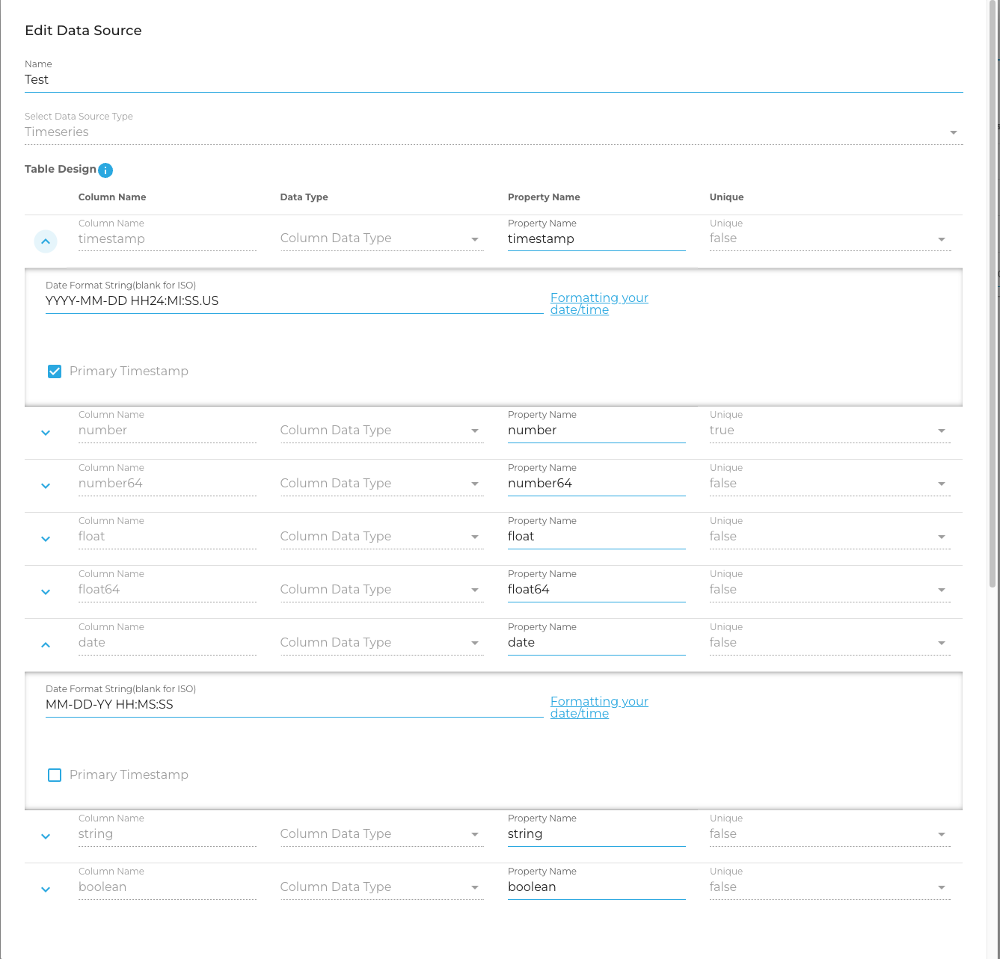
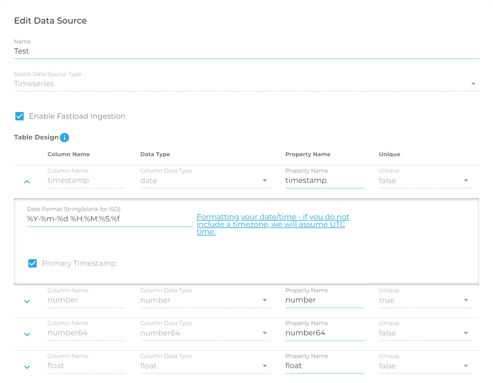
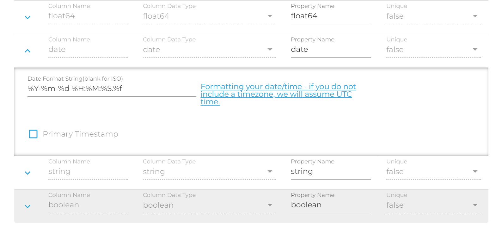
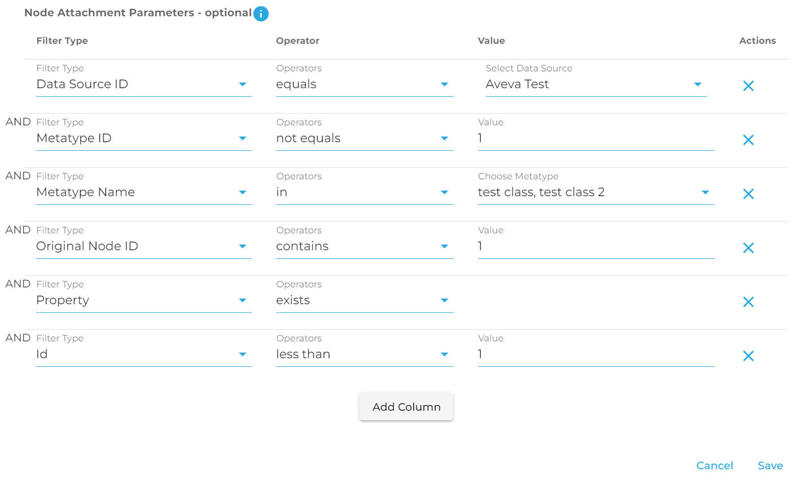

# Timeseries Data Source Creation Via the REST API
This document assumes you have read and understood the [Timeseries Data Source](Timeseries-Data-Sources) completely. Knowing how timeseries functions and how you can accomplish creation via the GUI is essential to understanding how things are accomplished via the REST API. Please take the time to read and understand that document if you have not previously done so.

Oftentimes you will need to create a large number of timeseries data sources, or have them created automatically by a third party program. This document shows you how that might be accomplished. We will walk through how to create and update a timeseries data source correctly. 

## Creation Request

In order to create a data source you must send your creation POST request to `{{baseUrl}}/containers/{{containerID}}/import/datasources`. The creation request must contain the following top-level fields:
- `adapter_type` - string: In this case this will always be `timeseries`
- `container_id` - string: The Container ID you're attempting to create this data source in
- `name` - string: A name for the data source - *Note*: Names are **not** unique, and you could potentially name data sources the same thing
- `active` - boolean: Whether the container should be in an active state upon creation
- `config` - json config object: This will be explained in more detail in the next section. The config section dictates how your timeseries data source should be configured, how the timeseries table should be constructed, and how it should be attached to nodes.

### Config Object

In order to create a timeseries data source the `config` field in your creation request must follow a certain format. You can also always refer to the example below for how this is accomplished. Here is how the object should be created: 
- `kind` - string: This should always be `timeseries`
- `columns` - array of json objects - Below is an explanation of each field. **Note**: You must have at least **1** column in your request. That column should be marked with `is_primary_timestamp` set to true and the `type` set to either `date`,`number`, or `number64`. Additional fields are required for these types, explained below.
  - `is_primary_timestamp` - boolean: You must have at least one column where this is set to true, and you cannot have more than one column with this set to true. This informs DeepLynx that this column should be considered the primary key for the table you are creating. As you cannot have more than one primary key in TimescaleDB, you cannot have more than one primary timestamp
  - `unique` - boolean: You cannot set the primary timestamp as unique, but you may apply this to all other columns. This will set a unique index on whatever columns you choose **plus** the primary timestamp for the table creation. This is how you could enforce unique records across your table. If a record insert fails the unique constraint, it will simply be ignored on insert
  - `id` - uuid *optional* - This field is used for ease of use when using the GUI to manipulate and build the request. It is recommended that you generate a uuid - however it is not necessary to do so.
  - `type` - string - This field defines the type of data being stored in this table. On ingestion, we will attempt to convert your data to match this data type. These types are as follows:
    - date - a date string **Note** if your type is date, you must include an additional field `date_conversion_format_string` with a format string to tell DeepLynx how to interpret your date. You can find instructions here [here](https://www.postgresql.org/docs/current/functions-formatting.html#FUNCTIONS-FORMATTING-DATETIME-TABLE)
    - number - a 32-bit integer (if primary timestamp must also include the field `chunk_interval` and configure it following instructions [here](https://gitlab.software.inl.gov/b650/Deep-Lynx/-/wikis/Timeseries-Data-Sources#table-design)
    - number64 - a 64-bit integer (if primary timestamp must also include the field `chunk_interval` and configure it following instructions [here](https://gitlab.software.inl.gov/b650/Deep-Lynx/-/wikis/Timeseries-Data-Sources#table-design)
    - float - a 32-bit float
    - float64 - a 64-bit float
    - string - a valid UTF8 encoded string
    - boolean - a boolean
  - `column_name` string - this must be a valid PostgreSQL column name - we recommend using this regex pattern to test, you should have no matches `/^[a-zA-Z]\w{1,30}$/)`
  - `property_name` string - This is the column name in a CSV file this column corresponds to, or the JSON property name if you're uploading JSON - DeepLynx will attempt to find data in this column or property when attempting to insert data in this column
- `attachment_parameters` - array of json objects - Below is an explanation of each part of the objects. These objects dictate to DeepLynx which nodes this timeseries data source should be connected to. These filters are run together as an AND statement, meaning that a node must satisfy all requirements in order to be attached to this data source
  - `type` - string - This field indicates the type of filter being applied. The options are listed below:
    - `data_source` - string - DataSource ID
    - `metatype_id` - string - Class ID
    - `metatype_name` - string - Class Name
    - `original_id` - string - Node's original data id
    - `id` - string - Node's DeepLynx ID
    - `property` - string - A specific property on the Node - must additionally supply the `key` parameter dictating the name of the property to run the filter against
  - `value` - any - the value the filter should be run against
  - `operator` - string - A list of operators and how they're used can be found [here](https://gitlab.software.inl.gov/b650/Deep-Lynx/-/wikis/Querying-Data-With-GraphQL#using-operators) - note that we additionally support `<=`,`>=`, and `<>`


## Example

In order to demonstrate how this might be accomplished, below you will find an example JSON payload for a creation request. This payload matches the configuration seen on these two images from the GUI. This should help you understand how these items line up with each other.

### Timeseries table design

<!-- 
 -->

### Node Attachment Filters


### Raw JSON Payload
```json
{
  "adapter_type": "timeseries",
  "active": true,
  "config": {
    "kind": "timeseries",
    "columns": [
      {
        "is_primary_timestamp": true,
        "unique": false,
        "id": "7af5a05b-67d8-491e-969c-f7ce8928d939",
        "type": "date",
        "column_name": "timestamp",
        "property_name": "timestamp",
        "date_conversion_format_string": "YYYY-MM-DD HH24:MI:SS.US"
      },
      {
        "is_primary_timestamp": false,
        "unique": true,
        "id": "d6aabdd5-6015-4cd1-a6a9-08989dd9118f",
        "type": "number",
        "column_name": "number",
        "property_name": "number"
      },
      {
        "is_primary_timestamp": false,
        "unique": false,
        "id": "0f0f8b47-94a5-4087-9fe9-a919e423cfc9",
        "type": "number64",
        "column_name": "number64",
        "property_name": "number64"
      },
      {
        "is_primary_timestamp": false,
        "unique": false,
        "id": "d67aac1e-71b0-4456-8a70-d54965384b74",
        "type": "float",
        "column_name": "float",
        "property_name": "float"
      },
      {
        "is_primary_timestamp": false,
        "unique": false,
        "id": "7d063736-9a80-4815-88ea-611efea40bfb",
        "type": "float64",
        "column_name": "float64",
        "property_name": "float64"
      },
      {
        "is_primary_timestamp": false,
        "unique": false,
        "id": "34537ef2-ea20-441c-b006-08df4d09ca6c",
        "type": "date",
        "column_name": "date",
        "property_name": "date",
        "date_conversion_format_string": "MM-DD-YY HH:MS:SS"
      },
      {
        "is_primary_timestamp": false,
        "unique": false,
        "id": "6f92d209-8a28-4bbc-8ffe-13c8aa7a71af",
        "type": "string",
        "column_name": "string",
        "property_name": "string"
      },
      {
        "is_primary_timestamp": false,
        "unique": false,
        "id": "b19dd22f-0f3d-4906-b65a-602b0d45a286",
        "type": "boolean",
        "column_name": "boolean",
        "property_name": "boolean"
      }
    ],
    "attachment_parameters": [
      {
        "key": "",
        "type": "data_source",
        "value": "1",
        "operator": "=="
      },
      {
        "key": "",
        "type": "metatype_id",
        "value": "1",
        "operator": "!="
      },
      {
        "key": "",
        "type": "metatype_name",
        "value": "one, two",
        "operator": "in"
      },
      {
        "key": "",
        "type": "original_id",
        "value": "1",
        "operator": "contains"
      },
      {
        "key": "property_name",
        "type": "property",
        "value": "1",
        "operator": "exists"
      },
      {
        "key": "",
        "type": "id",
        "value": "1",
        "operator": "<"
      }
    ]
  },
  "container_id": "170",
  "name": "Test"
}
```