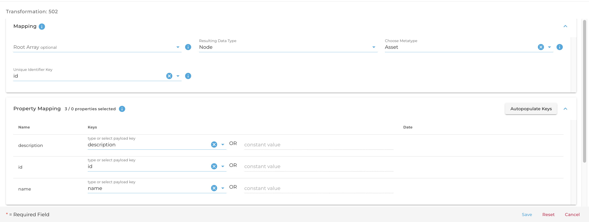
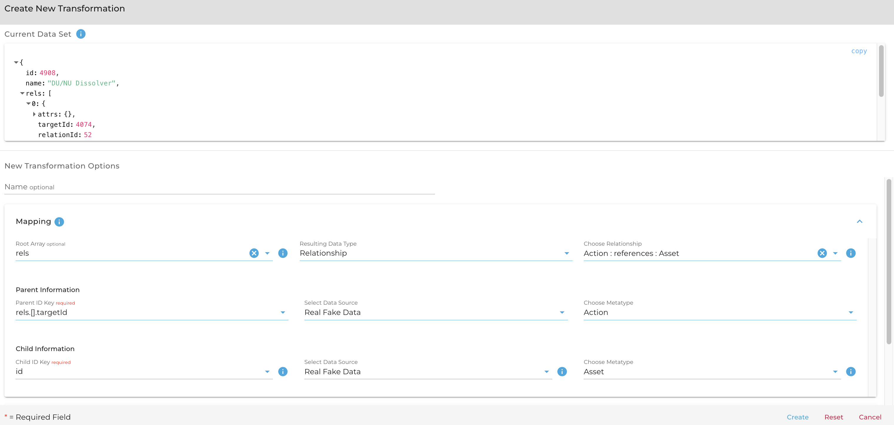

## Creating a Type Mapping Via the REST API

This guide assumes that you have created a datasource and uploaded your data file (or set up the source for import polling). This tutorial will be using the following test data (uploaded as three separate json files) as if it has already been sent to the datasource:

``` {json}
[{
	"number": "A.1.2.2.1",
	"rels": [
		{
			"relationId": 52,
			"targetId": 4074,
			"attrs": {}
		}
	],
	"id": 4908,
	"type": "asset",
	"name": "DU/NU Dissolver",
	"description": ""
}]
-------------------------
[{
    "number": "F.1.1.3",
    "rels": [
        {
            "relationId": 74,
            "targetId": 4882,
            "attrs": {}
        },
        {
            "relationId": 51,
            "targetId": 4908,
            "attrs": {}
        }
    ],
    "id": 4074,
    "type": "action",
    "name": "Dissolve NU/DU Metal",
    "description": ""
}]
-------------------------
[{
	"number": "3.1.1.1.2",
	"rels": [
		{
			"relationId": 73,
			"targetId": 4074,
			"attrs": {}
		}
	],
	"id": 4882,
	"type": "requirement",
	"description": "<p>The process shall provide the capability to accommodate multiple feedstocks for dissolution, separations, and conversion. </p>"
}]
```

### Seeing Unmapped Shapes

In order to properly create each type mapping, we must first know the shapes of our unmapped data. We can find this information by sending a GET request to the following address: `{{baseUrl}}/containers/:container_id/import/datasources/:data_source_id/mappings`. This will show results similar to the following for each object shape:

```
"value": [
        {
            "active": false,
            "id": "325",
            "container_id": "599",
            "data_source_id": "828",
            "shape_hash": "5j3cHgZ6FwAlgRZ4hRrkfnER0KJCnimLa4WoNm7Hb0k=",
            "created_at": "2022-09-26T15:51:46.683Z",
            "modified_at": "2022-09-26T15:51:46.683Z",
            "sample_payload": {
                "id": 4074,
                "name": "Dissolve NU/DU Metal",
                "rels": [
                    {
                        "attrs": {},
                        "targetId": 4882,
                        "relationId": 74
                    },
                    {
                        "attrs": {},
                        "targetId": 4908,
                        "relationId": 51
                    }
                ],
                "type": "action",
                "number": "F.1.1.3",
                "description": "",
                "instruction": ""
            },
            "created_by": "0",
            "modified_by": "0"
        }
    ...
]
```

The important thing to note here is the `id` field which is returned (right under "active" in this example). That ID represents the mapping endpoint which we can send the type mapping information to. Based on the sample payload, you should be able to identify which class matches up with which mapping id.

### Creating a node transformation

Using the mapping ID returned from the results of our previous request, we can POST to this endpoint: `{{baseUrl}}containers/:container_id/import/datasources/:data_source_id/mappings/:mapping_id/transformations` with a body that specifies which classes to map to as well as how the keys from our object will align with class properties. The request body should contain the following top-level fields: 

- `config` - json config object: this object tells DeepLynx how to handle failures when attempting to run this transformation
  - `on_conversion_error` - string: this value can be `fail`, `fail on required` and `ignore` - dictates what DeepLynx should do if it fails to convert a value from the payload to the correct value of a class 
  - `on_key_extraction_error` - string: this value can be `fail`, `fail on required` and `ignore` - dictates what DeepLynx should do if it fails to extra a key from the payload
- `type` - string: The type of record to be generated - can be `node` or `edge`
- `root_array` - string or `null`: This field can be pointed to an array within the payload, if filled the transformation will run for each entry in the specified array of the payload
- `name` - string: *Optional* This is the name of the transformation - not unique across a mapping
- `metatype_id` - string: This can be found by sending a GET request to `{{baseUrl}}/containers/:container_id/metatypes?name={{metatype_name}}`
- `keys` - list of json objects: Each of these objects should contain a `key` corresponding to the original data key, and `metatype_key_id` which can be found by sending a GET request to `{{baseUrl}}/containers/:container_id/metatypes/:metatype_id/keys`.
  - `key` - string: The JSON property key in the payload that should be extracted
  - `metatype_key_id` - string : The ID of a Class Property (aka metatype key) associated with the Class chosen for the transformation
  - `value` - any *Optional if Key is missing* : You can always specify a constant value vs. a key to extract for the mapping
- `unique_identifier_key` - string: This should point to the original data key which uniquely identifies each entity in your dataset.

To create a transformation that looks like this:



You could send something like this:

``` {json}
{
    "config": {
        "on_conversion_error": "fail on required",
        "on_key_extraction_error": "fail on required"
    },
    "type": "node",
    "root_array": "",
    "name": "",
    "metatype_id": "3968",
    "keys": [
        {
            "key": "id",
            "metatype_key_id": "33246"
        },
        {
            "key": "description",
            "metatype_key_id": "33241"
        },
        {
            "key": "name",
            "metatype_key_id": "33244"
        }
    ],
    "unique_identifier_key": "id"
}
```

### Creating an edge transformation

Multiple transformations can be created using the same type mapping ID. The use case for this is if a given import object contains data representing multiple nodes, multiple edges, or a combination of nodes and edges. In our case, the `asset` data shape contains a `rels` array which points to a target id. This target id represents the given Asset's relationship with a certain Action. Much like creating a node transformation, an edge transformation is created by POSTing to the endpoint `{{baseUrl}}containers/:container_id/import/datasources/:data_source_id/mappings/:mapping_id/transformations`. The main difference is the contents of the body. The body should contain the following top-level fields:


- `config` - json config object: this object tells DeepLynx how to handle failures when attempting to run this transformation
    - `on_conversion_error` - string: this value can be `fail`, `fail on required` and `ignore` - dictates what DeepLynx should do if it fails to convert a value from the payload to the correct value of a class
    - `on_key_extraction_error` - string: this value can be `fail`, `fail on required` and `ignore` - dictates what DeepLynx should do if it fails to extra a key from the payload
- `type` - string: The type of record to be generated - can be `node` or `edge`
- `root_array` - string or `null`: This field can be pointed to an array within the payload, if filled the transformation will run for each entry in the specified array of the payload
- `name` - string: *Optional* This is the name of the transformation - not unique across a mapping
- `metatype_relationship_pair_id` - string: This ID can be found by sending a GET request to `{{baseUrl}}/containers/:container_id/metatype_relationship_pairs?name={{origin_metatype_name}}%{{destination_metatype_name}}`
- `origin_id_key` - string: This should be the origin node's original node id - specified by whatever transformation created it
- `origin_data_source_id` - string: This should be the data source ID supplied in the URL
- `origin_metatype_id` - string: This ID can be found by sending a GET request to `{{baseUrl}}/containers/:container_id/metatypes?name={{metatype_name}}`
- `destination_id_key` - string: This should be the destination node's original node id - specified by whatever transformation created it
- `destination_data_source_id` - string: This should be the data source ID supplied in the URL
- `destination_metatype_id` - string: This ID can be found by sending a GET request to `{{baseUrl}}/containers/:container_id/metatypes?name={{metatype_name}}`
- `keys` - list of json objects: Each of these objects should contain a `key` corresponding to the original data key, and `metatype_key_id` which can be found by sending a GET request to `{{baseUrl}}/containers/:container_id/metatypes/:metatype_id/keys`.
  - `key` - string: The JSON property key in the payload that should be extracted
  - `metatype_relationship_key_id` - string : The ID of a Relationship Property associated with the Relationship chosen as part of the pairing for the transformation
  - `value` - any *Optional if Key is missing* : You can always specify a constant value vs. a key to extract for the mapping

To create an edge mapping like this:



You might send a payload like this:

``` {json}
{
    "config": {
        "on_conversion_error": "fail on required",
        "on_key_extraction_error": "fail on required"
    },
    "type": "edge",
    "name": "",
    "root_array": "rels",
    "metatype_relationship_pair_id": "13499",
    "origin_id_key": "rels.[].targetId",
    "origin_data_source_id": "828",
    "origin_metatype_id": "3972",
    "destination_id_key": "id",
    "destination_metatype_id": "3968",
    "destination_data_source_id": "828"
}
```

### Enabling your type mappings

To enable your type mappings (allowing them to be applied and ingest data), send a PUT request to the appropriate type mapping address: `{{baseUrl}}containers/:container_id/import/datasources/:data_source_id/mappings/:mapping_id`. The body of the request should simply be the result of running a GET request against the same endpoint (excluding the `value` and `isError` wrappers), but with the `active` field changed from `false` to `true`. This is the equivalent of checking the "Enable Type Mapping" button in the UI.

