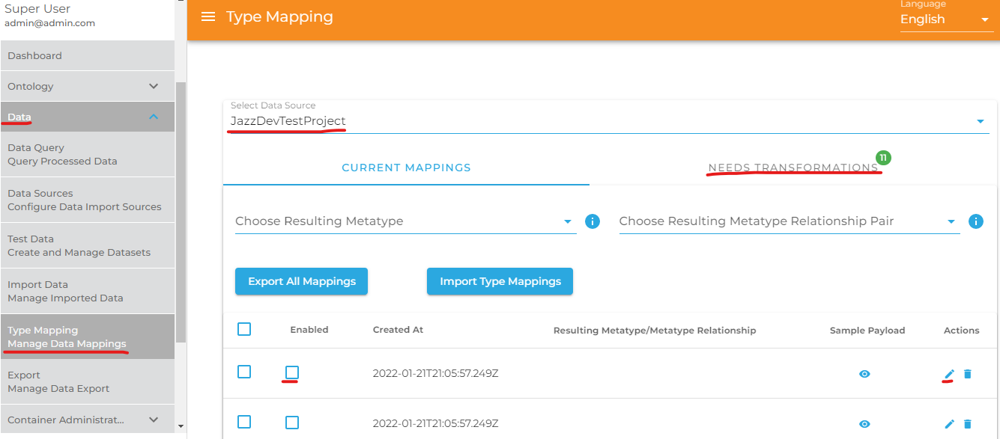
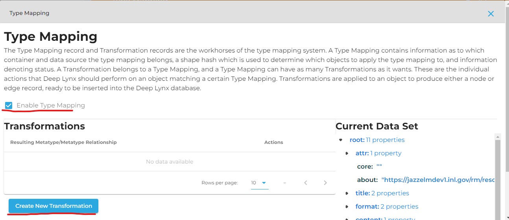
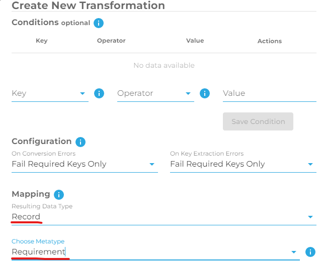
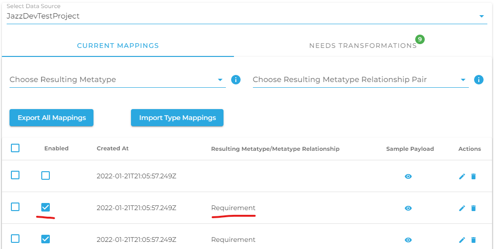

### Create Type Mapping Transformations

For imported data to be inserted into DeepLynx, the system must know how to store it. Because DeepLynx stores data in a structured ontology, you must tell DeepLynx how your data maps to its known Classes and their properties, and Relationships along with their properties. Think of Type Mapping as teaching DeepLynx how to interpret and store your data using its known types.


#### Data Prepared for Type Mapping
It is important to understand how DeepLynx prepares your data for type mapping, and the extent it goes to simplify your data. Currently DeepLynx will accept either a csv, or an array of JSON objects (see Data Ingestion). DeepLynx will then break down that data from those formats into individual records (e.g individual JSON objects or individual rows of your .csv document). It is those individual records which will then be assigned type mappings.
For example – given this data, can you tell how many objects will be created for DeepLynx to map?
```
[
    "11": [
        {
            "format": "Text",
            "core": "_-K3bwTYYEeqPqJ6cXaaMqA",
            "bookorder": 1,
            "section": "1",
            "about": "https://localhost:9443/rm/resources/_-I4ewDYYEeqPqJ6cXaaMqA",
            "title": "Edited Introductions",
            "id": 258
        },
        {
            "format": "Text",
            "core": "_-KSM8DYYEeqPqJ6cXaaMqA",
            "bookorder": 2,
            "section": "1.1",
            "about": "https://localhost:9443/rm/resources/_-I4ewTYYEeqPqJ6cXaaMqA",
            "title": "Purpose",
            "id": 169
        },
    "17": [
        {
            "format": "Text",
            "core": "_-K3bwTYYEeqPqJ6cXaaMqA",
            "bookorder": 1,
            "section": "1",
            "about": "https://localhost:9443/rm/resources/_-I4ewDYYEeqPqJ6cXaaMqA",
            "title": "Edited Introductions",
            "id": 258
        },
        {
            "format": "Text",
            "core": "_-KSM8DYYEeqPqJ6cXaaMqA",
            "bookorder": 2,
            "section": "1.1",
            "about": "https://localhost:9443/rm/resources/_-I4ewTYYEeqPqJ6cXaaMqA",
            "title": "Purpose",
            "id": 169
        }
]
```

The correct answer is two objects, whose primary keys are “11” and “17”.  If this is not desired behavior, and instead you wish DeepLynx to work with the objects contained within the “11” and “17” arrays of the object, you might want to rethink how your present that data to DeepLynx - such as adding a new field to each object which refers to that value and flattening your data.

Here is another set of data – how many objects do you think will be created for DeepLynx to map?
```
[
    {
        "Id": 0,
        "FullId": "=2013286748/3",
        "Name": "/AREA01_CABLE",
        "Type": "GPSET",
        "Operation": "CREATE",
        "ParentId": "=2013286748/1",
        "Transmitted": false,
        "ExportID": 11,
        "Attributes": null,
        "RawAttributes": {
            "NAME": "/AREA01_CABLE",
            "TYPE": "GPSET",
            "LOCK": false,
            "OWNER": "/ALL_AREA01",
            "DESC": "",
            "FUNC": "",
            "SCOSEL": " ALL ZONE WITH ( ATTRIB DESC OF ZONE  EQ 'AREA01CABLE' )",
            ":ACCEPT2D3DDIFFERENCE": false,
            ":MATCHINGENABLED": true,
            ":AVINT_UPDATE_DATE": "",
            ":AVINT_COMMENTS": "",
            ":AVINT_UPDATE_USER": ""
        }
    },
    {
        "Id": 0,
        "FullId": "=2013286748/4",
        "Name": "/AREA01_CIVIL",
        "Type": "GPSET",
        "Operation": "CREATE",
        "ParentId": "=2013286748/1",
        "Transmitted": false,
        "ExportID": 11,
        "Attributes": null,
        "RawAttributes": {
            "NAME": "/AREA01_CIVIL",
            "TYPE": "GPSET",
            "LOCK": false,
            "OWNER": "/ALL_AREA01",
            "DESC": "",
            "FUNC": "",
            "SCOSEL": " ALL ZONE WITH ( ATTRIB DESC OF ZONE  EQ 'AREA01CIVIL' )",
            ":ACCEPT2D3DDIFFERENCE": false,
            ":MATCHINGENABLED": true,
            ":AVINT_UPDATE_DATE": "",
            ":AVINT_COMMENTS": "",
            ":AVINT_UPDATE_USER": ""
        }
    }
```

The correct answer is two objects.

#### Type Mapping and Transformations
The Type Mapping record and Transformation records are the workhorses of the type mapping system. 


**Type Mapping:** A Type Mapping contains information as to which container and data source the type mapping belongs, a shape hash which is used to determine which objects to apply the type mapping to, and information denoting status.


**Transformation:**  A Transformation belongs to a Type Mapping, and a Type Mapping can have as many Transformations as it wants. These are the individual actions that DeepLynx should perform on an object matching a certain Type Mapping. Transformations are applied to an object to produce either a node or edge record, ready to be inserted into the DeepLynx database.


To learn how these two work together, let us look at what happens. Once DeepLynx has accepted and split your data payload up into individual objects, it then attempts to process them. The process loop is as follows:

1.	Shape of the object calculated – DeepLynx will compile and hash the “shape” of your object. It does this by compiling all the property keys (including nested keys) and their types into a string, and then hashing it. This give us a unique string identifier for the “shape” of your object. In the example right above, DeepLynx would create a “shape hash” for each of those objects. 
2.	Type Mapping record assigned or created – Armed with the shape hash from the previous step, DeepLynx will then attempt to find a Type Mapping record with a matching shape hash. If none exists, a new Type Mapping (sans any Transformations) will be created.
3.	Assigned Type Mapping’s Transformations run – Once a Type Mapping record has been found matching the shape of the data, its Transformations are performed on that data. At the end of each Transformation a new node or edge should be generated for insertion into the DeepLynx database.


#### How Transformations work


At its core, a Transformation is a set of conditions and actions to be performed if those conditions evaluate to be true. Conditions can be along the lines of “if this key exists” or “if the wheels key equals 2” and are evaluated against the object the Transformation will be running against. If any of the conditions of a Transformation evaluate to false, then the transformation is aborted.


Once the conditions are evaluated, and are true, the Transformation is then run against the object. A Transformation consists of whether or not the result should be a node or edge (Class or Relationship) and how to build the properties of that node/edge by mapping keys from the original payload to the new node/edge. There is also a section that will determine what action to take if the node/edge you’re attempting to insert already exists.


A Type Mapping can have multiple Transformations, meaning you could potentially end up with multiple node/edge insertions from a single original data object.


### Data is transformed and inserted into DeepLynx

For an Import’s data to be inserted into DeepLynx, each data chunk must be associated with a Type Mapping created above. Type Mappings are constantly being applied to matching data automatically, and requires no user intervention apart from teaching the system through creation of new Type Mapping Transformations. Once an Import’s data is completely mapped, the transformation and insertion process will begin automatically.

### Example Type Mapping in DeepLynx

Data type mapping within DeepLynx can be managed by navigating to the "Data" dropdown box  and selecting "Type Mapping", as shown by the two red lines on the left side in the image below. From here you can select the data source which you would like to type map; please allow some time for the data to load once you have made a selection. The number of remaining required transformations is indicated by the number in the green bubble beside the "Needs Transformation" tab. A list of Class or Relationship entries is shown at the bottom of this image. An unchecked box for "Enabled" indicates that this current mapping needs a transformation which can be manually created by first clicking the pencil under "Actions".



Now on the page shown in the image below, check the box "Enable Type Mapping" and click the buttom "Create New Transformation".



Under Mapping, chose "Record" or "Relationship" in the dropdown box "Resulting Data Type". Then chose the desired record or relationship in the next dropdown box.



Scroll down and select the desired payload keys under the heading "Property Mapping", and be sure the fields are properly mapped. Scroll down to the bottom and click on "Create".

Once a Class or Relationship entry has been properly type mapped, the box is checked under the column "Enabled", as seen in the image below. Notice that the number of "Needs Transformations" has been reduced.

