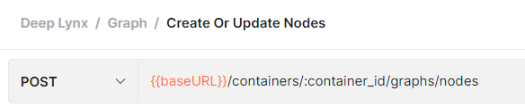
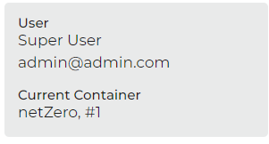
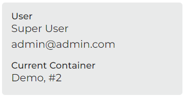
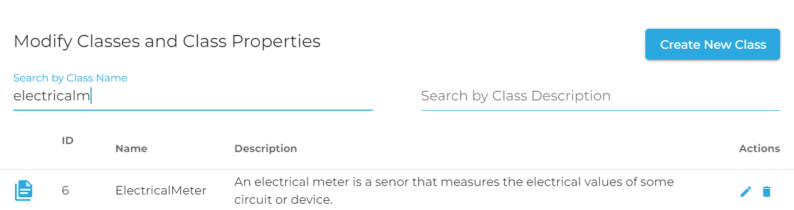
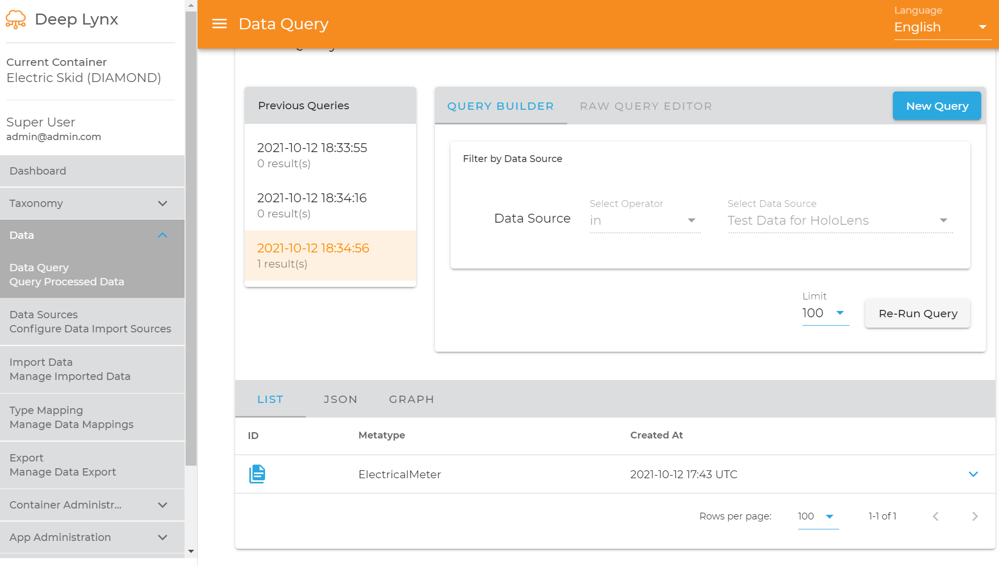
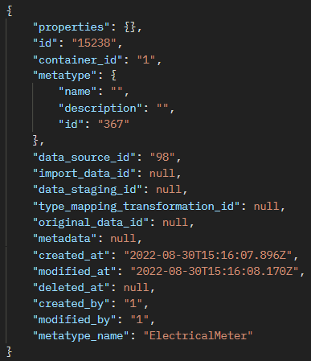

For Standard data sources, you must use the appropriate endpoint to upload your data into DeepLynx. Please note that this is one of two methods for ingesting data into DeepLynx, and that this method is generally avoided. Instead use the automated system of ingestion and Type Mapping described later in this wiki.



To insert data there is a need to fill out a body like below which creates a node with the type of "Sensor" and an original data id of "fk_01".

```
{
    "container_id": "previous created container's id",
    "original_data_id": "fk_01", // optional
    "data_source_id": "previously created Data Source ID",
    "metatype_id": "Sensor Class ID",
    "properties": {}
}
```

In order to do so there are a few steps:

1. The container ID can be gathered by looking at the bottom left-hand corner in the Admin GUI.


<!--  -->

2. The original data ID is simply whatever the key in your original system would be for the record. In this test case there is no originator system.

3. Data Source ID is the id of the data source. In this case it is our Standard data source. This can be gathered by navigating to Data -> Data Sources in the DeepLynx Admin Webapp.


4. Class ID (aka metatype_id) is how it will be mapped into the ontology. In this case I want a ElectricalMeter item. You can find the Class ID by navigating to Ontology -> Classes and searching for your desired Class. You can then copy the ID from the table for said Class. 



5. Next it is time to actually create a node. POST a payload like this to `{{baseURL}}/containers/:container_id/graphs/nodes`:

```
{
    "container_id": "1",
    "data_source_id": "98",
    "metatype_id": "367",
    "properties": {}
}
```

Alternatively, test nodes and edges can be created by following [this guide](Creating-Test-Data-Through-DeepLynx).

6. Let's confirm that a node now exists

If using DeepLynx





If using Postman


