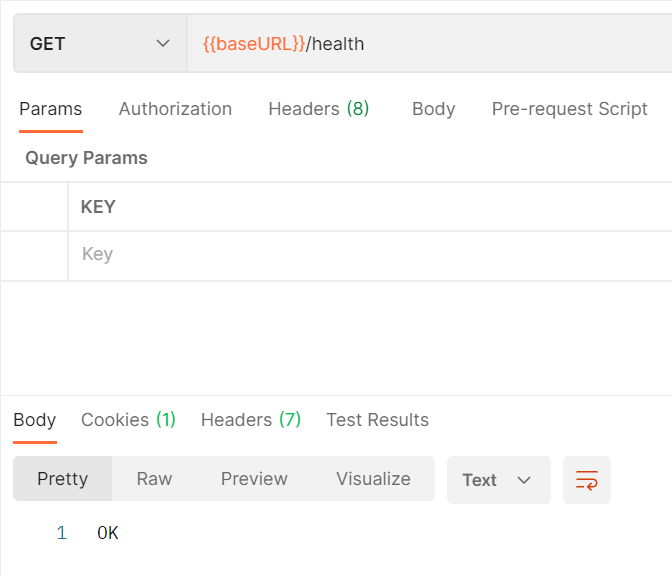
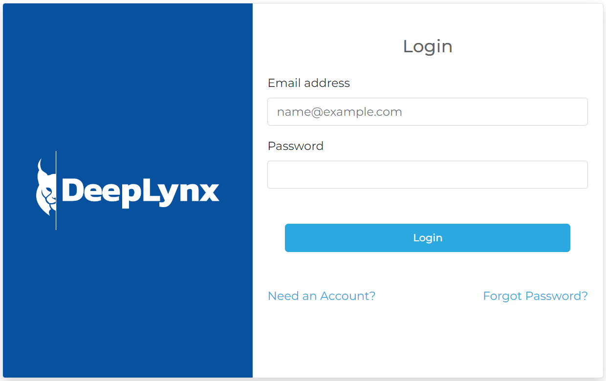
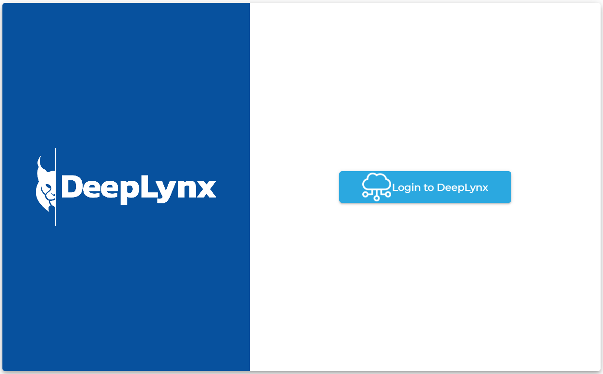

### Verifying DeepLynx is working correctly
Here are a few simple ways you can verify that your installation of DeepLynx is working correctly. 

* Tools like [Postman](https://www.postman.com/) can be used for verifying HTTP response/requests and [TablePlus](https://tableplus.com/) or [PgAdmin](https://www.pgadmin.org/) can be used when verifying database structure or values.

* Postman (or a similar tool) can be used to send a simple GET request to your DeepLynx instance's health check endpoint. This is located at `{host}/health` and should return a 200 OK HTTP status response and a string denoting current version if DeepLynx is up and running correctly. (You can find where DeepLynx is exposing its HTTP server by checking the `ROOT_ADDRESS` and `SERVER_PORT` environment variables - by default it should be `localhost:8090`). 

* Navigate to your DeepLynx's login page (default is http://localhost:8090/oauth). If you had your environment variables instruct DeepLynx to create a default User, attempt to login with said User. The default email address and password are "admin@admin.com" and "admin".

* If you're using the bundled admin web gui navigate to `{{your base url}}` - you should see  the following screen 
