DeepLynx now supports the ability to connect directly to a datasource via the web socket protocol. This article walks you through how to make a web socket connection to both standard and timeseries datasources. The screenshots included in this article are from a websocket connection in [Postman](https://www.postman.com/). If you are following along in Postman, this article assumes that you have created a workspace, which may require you to create a an account.

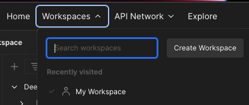

## Setup

### Creating an empty Websocket request in Postman

To create a websocket request, click the "New" button at the top of the left-hand panel in Postman.

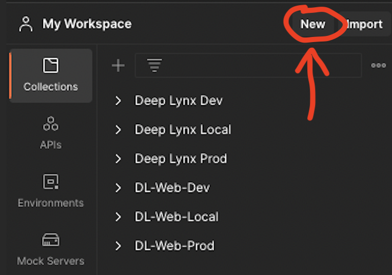

You will see a menu similar to the following. Click "WebSocket Request".

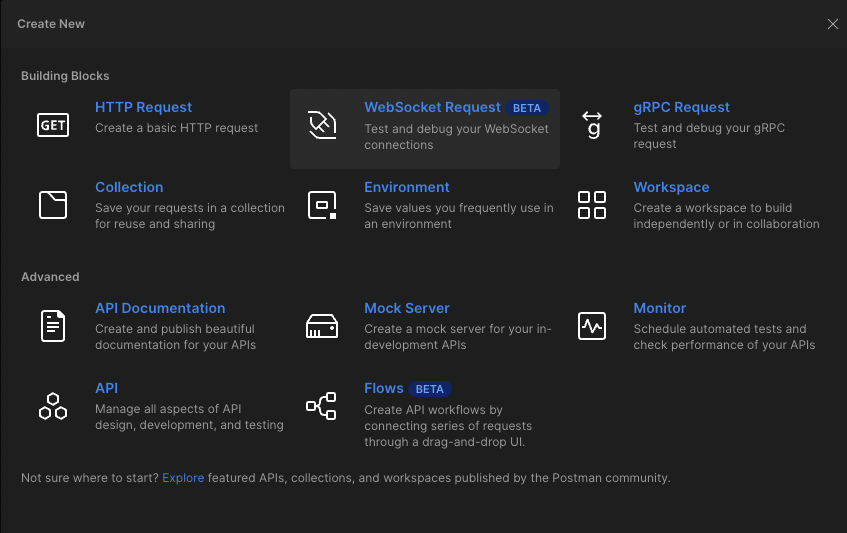

You should be greeted with the following screen.

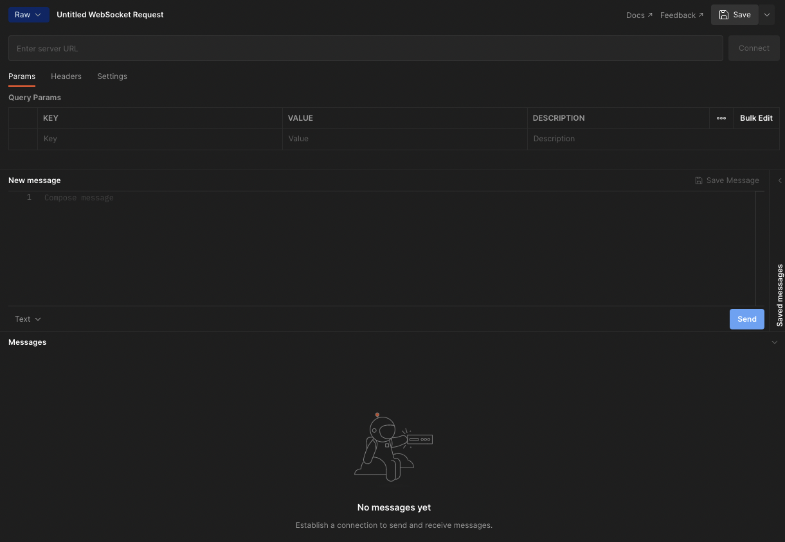

### Websocket URL and headers

In order to create a websocket connection with your DeepLynx instance, there are two main elements needed: The URL and the headers. For the server URL, enter the following:

`{{baseURL}}/containers/{{containerID}}/import/datasources/{{dataSourceID}}`

Where the variables in the URL match the following:

| variable | description | example |
| -------- | ----------- | ------- |
| `baseURL` | The address of your DeepLynx instance. Be sure that the address is prefixed with `ws://` and not `http://` or `https://`. | `ws://localhost:8080` |
| `containerID` | The ID of the container with which you are connecting. | `12` |
| `dataSourceID` | The ID of the data source with which you are connecting. Note that there is no way to distinguish between standard vs timeseries data sources, so be sure that you know which category your data source belongs to. | `15` |

In addition to the URL, you will need to authenticate your request using an API key and secret. **This differs from regular HTTP requests, as those require a token whereas sockets require key-secret pairs.** For more information on generating key-secret pairs (in case you forgot yours or don't have one), check out [this article](Generating-and-Using-API-Keys-Token).

Once you have your key and secret, select the "Headers" tab and enter them into fields entitled `x-api-key` and `x-api-secret` as follows:

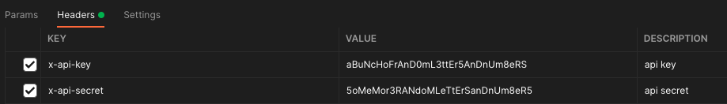

## Checking your connection

In order to establish a connection with your websocket, you can either click the "Connect" button to the right of your server address, or you can simply attempt to send a request.

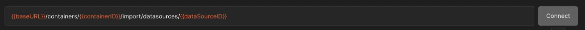

After your first successful connection to the web socket, you should see a response message similar to this:

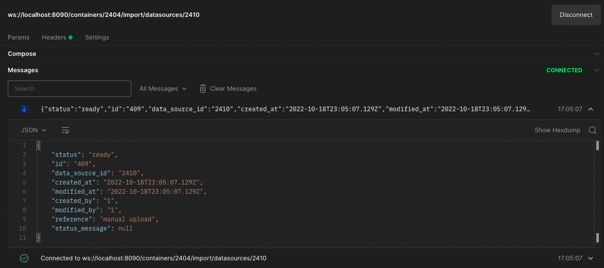

In order to further test connection, you can send a `ping` message to the server by typing `ping` in the "Compose" text field and sending your message. If everything is working as planned, you should recieve a `pong` message in return.

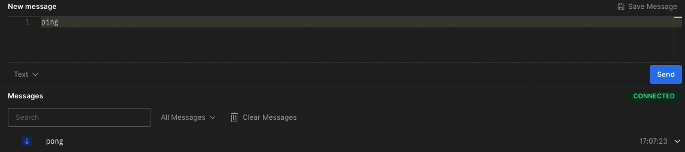

Connection errors could be due to multiple causes. Check out the *Error Handling* section below for more information.

## Standard Data Ingestion

Sending data to a standard data source is simple. Make sure your data is in JSON format and contains an array of objects. For example, if you need to send just a simple payload, such as this:

`{"testKey": "testValue"}`

you must first ensure it is wrapped in brackets, like this.

`[{"testKey": "testValue"}]`

Place your payload in the "Compose" text field (the same place as you sent the `ping` from) and send it. If all worked according to plan, you should see something like this:

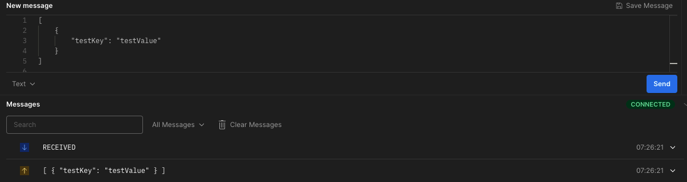

A malformed payload will result in an error message and a connection close to the websocket. For example, using the broken payload below:

```
[
                                            #no opening curly brace
        "name"; "test2",                    #semicolon instead of colon
        "x_variables: ["jmb","krh","kso"],  #no closing quote on key
        "x_axis_name": "initials"           #no comma after key-value pair
        "y_variables": [23, 27, 28,         #no closing bracket on list
        "y_axis_name": ages"                #no opening quote on value
    }
]
```

On our first request, we would see this error:

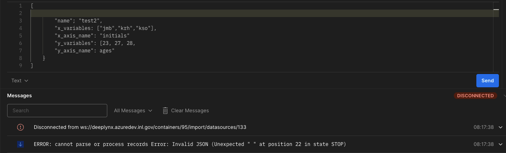

Though the error is not super specific, the closing of the socket gives the user time to review their payload and fix any errors before opening the socket again to send another request. Once the payload is completely free of errors, we should see:

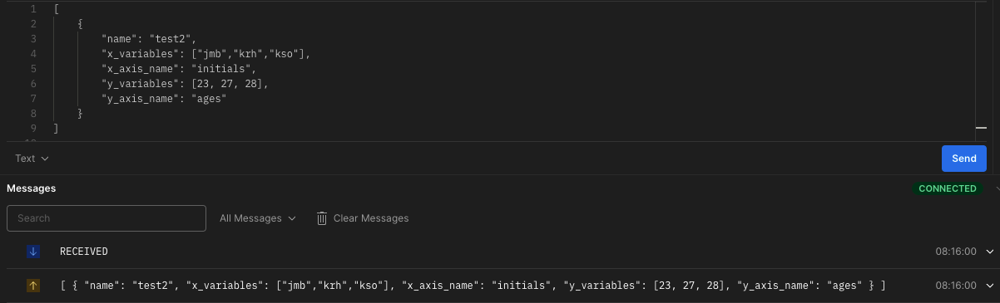

## Timeseries Data Ingestion

### Setup

Timeseries data sources are very similar to standard sources, with the key difference that **timeseries sources expect specific payload keys.** For example, let's say I've created a timeseries datasource with the following columns:

<!-- 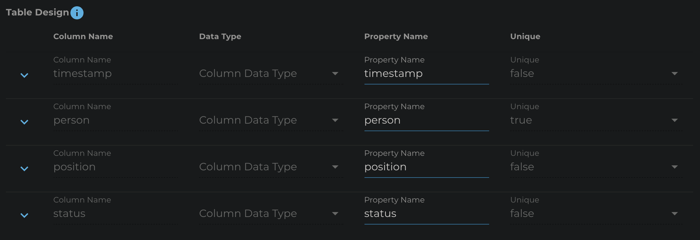 Dark Version -->
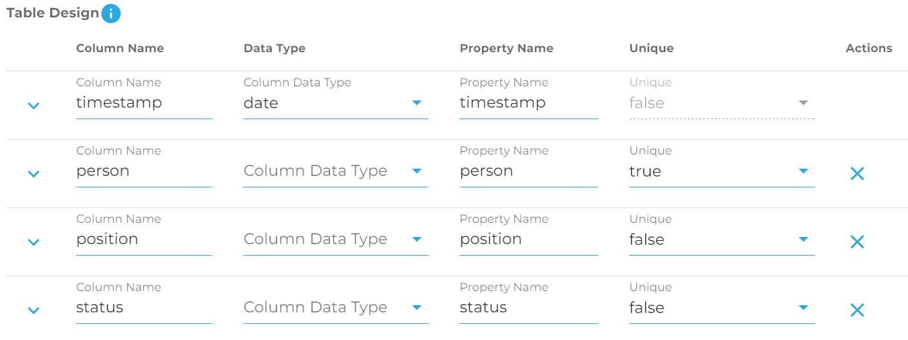


This datasource will only accept records containing at least one of the property names found in this table, where `timestamp` (used as the primary key) is not null. However, instead of sending errors upon receiving data that doesn't fit the table structure, the timeseries datasource will simply acknowledge the receipt of the data without inserting it into the database. Malformed data will still throw an error just like with a standard datasource.

To investigate this, let's go through an example of sending various payloads to our timeseries data source, then verifying the data insertion by sending a GraphQL POST request to `{{yourURL}}/containers/{{containerID}}/input/datasources/{{dataSourceID}}/data`. Note that `yourURL` indicates the `http` address of your target DeepLynx, not the websocket (`ws`) address.

Here is the body of our GraphQL request:

```
{
    Timeseries(_record: {sortBy: "timestamp", sortDesc: true}){
        timestamp
        person
        position
        status
    }
}
```
This query should allow us to see the most recent additions to our timeseries table as well as which fields are null.

### Examples

For the first test, let's use the (newly non-malformed) payload from our the Standard datasource section to exhibit that the timeseries datasource won't ingest any data whose keys it doesn't recognize. Sending the payload:

```
[
    {
        "name": "test2",
        "x_variables": ["jmb","krh","kso"],
        "x_axis_name": "initials",
        "y_variables": [23, 27, 28],
        "y_axis_name": "ages"
    }
]
```

will result in the following message from the web socket:

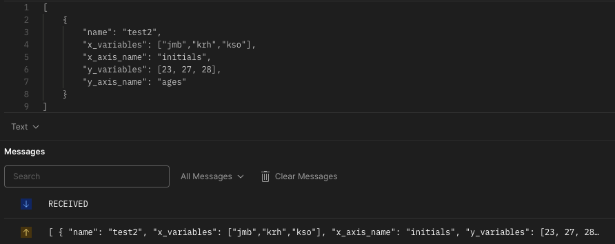

It looks like the message was received, but since none of the fields in this payload match our expected payload keys, we shouldn't see anything when we send our graphQL query:

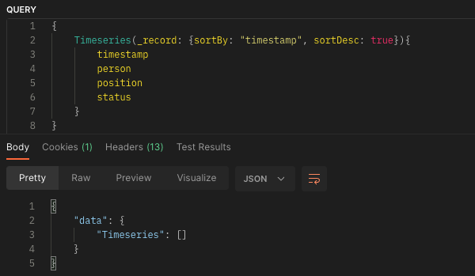

Now let's try sending the same payload but with a timestamp. Recall that the first timestamp key in a timeseries data source is used as the primary key and should be the only required field for data to go through into the database. Using this payload (now including a timestamp):

```
[
    {
        "timestamp": "2022-10-19 14:51:35.085975+00",
        "name": "test2",
        "x_variables": ["jmb","krh","kso"],
        "x_axis_name": "initials",
        "y_variables": [23, 27, 28],
        "y_axis_name": "ages"
    }
]
```

We see these results from our GraphQL query:

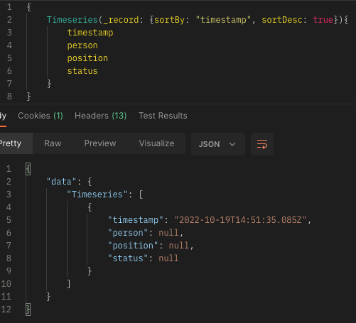

Note that all the fields are null except timestamp. We should see similar results if we add another field that is recognized by the timeseries data source:

```
[
    {
        "timestamp": "2022-10-19 14:53:35.085975+00",
        "person": "Malcolm",
        "name": "test2",
        "x_variables": ["jmb","krh","kso"],
        "x_axis_name": "initials",
        "y_variables": [23, 27, 28],
        "y_axis_name": "ages"
    }
]
```

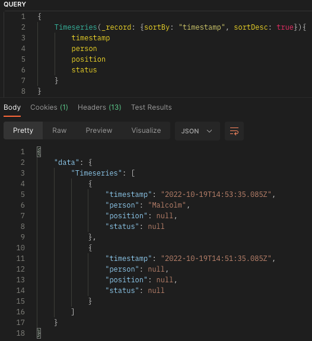

For a more broad overview of Timeseries data and Timeseries querying in DeepLynx, checkout [this link](Timeseries-Data-Sources).

### Error Handling

There are two expected error codes generated from a DeepLynx web socket connection: `401` and `404`. `401` indicates an authorization error and could mean that your key and secret are misconfigured. If you are working locally, this error could also occur as the result of a missing library. Be sure that you are on a branch of DeepLynx which supports websockets and that you have run `npm upgrade` and `npm install` recently to update any new node packages that may be needed.

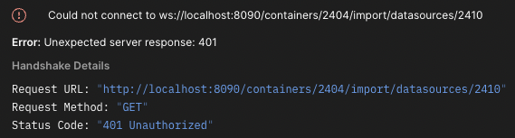

`404` could indicate that your server address points to an invalid endpoint, or that there is an error in your request message.